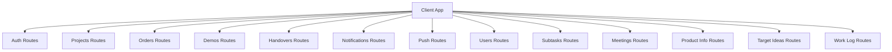
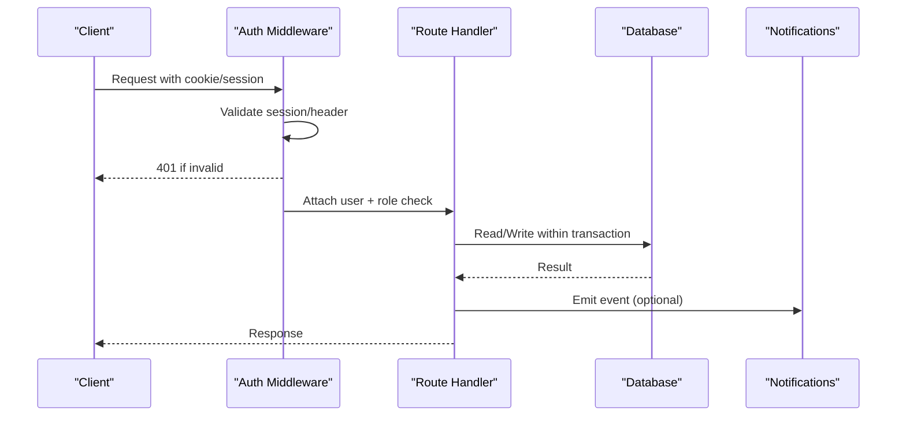
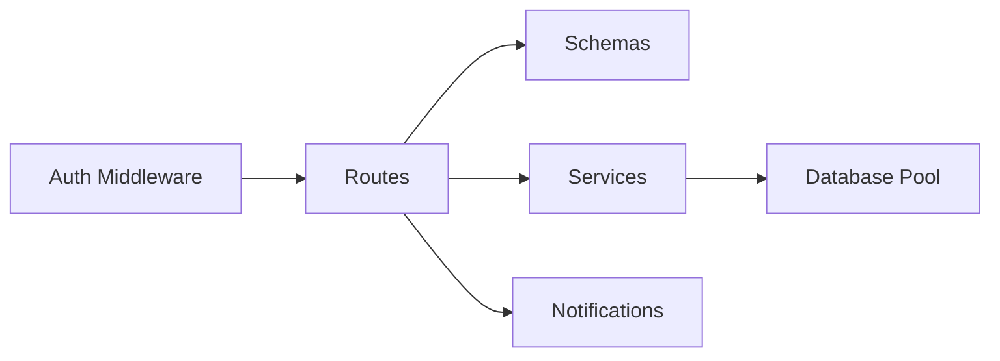

# API Reference

<cite>
**Referenced Files in This Document**
- [auth.js](file://server/src/routes/auth.js)
- [projects.js](file://server/src/routes/projects.js)
- [orders.js](file://server/src/routes/orders.js)
- [demos.js](file://server/src/routes/demos.js)
- [handovers.js](file://server/src/routes/handovers.js)
- [notifications.js](file://server/src/routes/notifications.js)
- [push.js](file://server/src/routes/push.js)
- [users.js](file://server/src/routes/users.js)
- [subtasks.js](file://server/src/routes/subtasks.js)
- [meetings.js](file://server/src/routes/meetings.js)
- [product-info.js](file://server/src/routes/product-info.js)
- [target-project-ideas.js](file://server/src/routes/target-project-ideas.js)
- [work-log.js](file://server/src/routes/work-log.js)
- [config.js](file://server/src/config.js)
- [auth.js (middleware)](file://server/src/middleware/auth.js)
- [schemas/index.js](file://server/src/schemas/index.js)
</cite>

## Table of Contents
1. Introduction
2. Project Structure
3. Core Components
4. Architecture Overview
5. Detailed Component Analysis
6. Dependency Analysis
7. Performance Considerations
8. Troubleshooting Guide
9. Conclusion

## Introduction
This document provides a comprehensive RESTful API reference for YZ Yayın Takip. It covers authentication, project management, order processing, demo and handover workflows, notifications, and push notifications. For each endpoint, it specifies HTTP methods, URL patterns, request/response schemas, authentication requirements, and error codes, along with practical client usage patterns.

## Project Structure
The server exposes Fastify routes grouped by domain:
- Authentication and session management
- Projects and stage transitions
- Orders (print orders, spec sheets, delivery coordination)
- Demos and ozalit form submissions
- Handovers (delivery confirmation)
- Notifications feed and read/mark operations
- Web Push subscriptions
- Users, invitations, avatars
- Subtasks and progress
- Meetings and target project ideas
- Product info catalog
- Work log

**Diagram sources**
- [auth.js:58-344](file://server/src/routes/auth.js#L58-L344)
- [projects.js:68-800](file://server/src/routes/projects.js#L68-L800)
- [orders.js:45-800](file://server/src/routes/orders.js#L45-L800)
- [demos.js:17-153](file://server/src/routes/demos.js#L17-L153)
- [handovers.js:24-123](file://server/src/routes/handovers.js#L24-L123)
- [notifications.js:45-89](file://server/src/routes/notifications.js#L45-L89)
- [push.js:23-70](file://server/src/routes/push.js#L23-L70)
- [users.js:55-423](file://server/src/routes/users.js#L55-L423)
- [subtasks.js:87-442](file://server/src/routes/subtasks.js#L87-L442)
- [meetings.js:39-275](file://server/src/routes/meetings.js#L39-L275)
- [product-info.js:19-113](file://server/src/routes/product-info.js#L19-L113)
- [target-project-ideas.js:39-275](file://server/src/routes/target-project-ideas.js#L39-L275)
- [work-log.js:21-48](file://server/src/routes/work-log.js#L21-L48)

**Section sources**
- [auth.js:58-344](file://server/src/routes/auth.js#L58-L344)
- [projects.js:68-800](file://server/src/routes/projects.js#L68-L800)
- [orders.js:45-800](file://server/src/routes/orders.js#L45-L800)
- [demos.js:17-153](file://server/src/routes/demos.js#L17-L153)
- [handovers.js:24-123](file://server/src/routes/handovers.js#L24-L123)
- [notifications.js:45-89](file://server/src/routes/notifications.js#L45-L89)
- [push.js:23-70](file://server/src/routes/push.js#L23-L70)
- [users.js:55-423](file://server/src/routes/users.js#L55-L423)
- [subtasks.js:87-442](file://server/src/routes/subtasks.js#L87-L442)
- [meetings.js:39-275](file://server/src/routes/meetings.js#L39-L275)
- [product-info.js:19-113](file://server/src/routes/product-info.js#L19-L113)
- [target-project-ideas.js:39-275](file://server/src/routes/target-project-ideas.js#L39-L275)
- [work-log.js:21-48](file://server/src/routes/work-log.js#L21-L48)

## Core Components
- Authentication and sessions: login, logout, invite acceptance, password reset/change, dev login.
- Projects: CRUD, import, catalog visibility, stage transitions, approvals/rejections, receive/not-received flows.
- Orders: create, advance through steps, matbaa receive/not-received, ozalit start/cancel/edit/change-request, multi-party approval.
- Demos: list and submit demo/ozalit forms with guards against started work.
- Handovers: printer raises, sales confirms; updates project stage to satista.
- Notifications: paginated feed, mark read/seen.
- Push: public key, subscribe/unsubscribe, test notification.
- Users: list, invite, deactivate/reactivate/delete, avatar upload/read/delete.
- Subtasks: update fields, notes, bulk replace list.
- Meetings and target ideas: CRUD, images, gallery, notes.
- Product info: per-project components catalog.
- Work log: personal daily entries.

**Section sources**
- [auth.js:58-344](file://server/src/routes/auth.js#L58-L344)
- [projects.js:68-800](file://server/src/routes/projects.js#L68-L800)
- [orders.js:45-800](file://server/src/routes/orders.js#L45-L800)
- [demos.js:17-153](file://server/src/routes/demos.js#L17-L153)
- [handovers.js:24-123](file://server/src/routes/handovers.js#L24-L123)
- [notifications.js:45-89](file://server/src/routes/notifications.js#L45-L89)
- [push.js:23-70](file://server/src/routes/push.js#L23-L70)
- [users.js:55-423](file://server/src/routes/users.js#L55-L423)
- [subtasks.js:87-442](file://server/src/routes/subtasks.js#L87-L442)
- [meetings.js:39-275](file://server/src/routes/meetings.js#L39-L275)
- [product-info.js:19-113](file://server/src/routes/product-info.js#L19-L113)
- [target-project-ideas.js:39-275](file://server/src/routes/target-project-ideas.js#L39-L275)
- [work-log.js:21-48](file://server/src/routes/work-log.js#L21-L48)

## Architecture Overview
Authentication is enforced via middleware that accepts an httpOnly cookie session or a development header. Role checks gate sensitive endpoints. All state-changing routes validate inputs using centralized JSON schemas. Transactions ensure consistency for complex workflows.

**Diagram sources**
- [auth.js (middleware):48-90](file://server/src/middleware/auth.js#L48-L90)
- [auth.js:58-344](file://server/src/routes/auth.js#L58-L344)
- [projects.js:68-800](file://server/src/routes/projects.js#L68-L800)
- [orders.js:45-800](file://server/src/routes/orders.js#L45-L800)

## Detailed Component Analysis

### Authentication API
- POST /api/auth/login
  - Auth: none
  - Body: email, password (validated by schema)
  - Response: { token, user }
  - Notes: rate-limited per IP and email; sets httpOnly session cookie
  - Errors: 401 unauthorized, 403 forbidden (inactive), 400 validation
- POST /api/auth/logout
  - Auth: required (session)
  - Response: { ok: true }
  - Notes: deletes session, clears cookie
- GET /api/auth/me
  - Auth: required
  - Response: { user }
- GET /api/auth/invite-preview?token=...
  - Auth: none
  - Response: { name, email, role, expiresAt }
- POST /api/auth/accept-invite
  - Auth: none
  - Body: token, password
  - Response: { token, user }
  - Notes: consumes invitation, sets password, issues session
- POST /api/auth/forgot-password
  - Auth: none
  - Body: email
  - Response: { ok: true }
  - Notes: always 200; sends reset email if active user exists; rate-limited
- POST /api/auth/reset-password
  - Auth: none
  - Body: token, password
  - Response: { token, user }
  - Notes: consumes token, rotates password, invalidates other sessions
- PATCH /api/auth/change-password
  - Auth: required
  - Body: currentPassword, newPassword
  - Response: { ok: true }
- POST /api/auth/dev-login (dev only)
  - Auth: none
  - Body: user_id
  - Response: { token, user }
  - Notes: disabled in production

Practical usage pattern:
- On login success, store the httpOnly cookie; subsequent requests automatically include it.
- On logout, call /api/auth/logout to clear session.

Error codes:
- 400 Bad Request: validation errors
- 401 Unauthorized: invalid credentials or session
- 403 Forbidden: inactive account or insufficient permissions
- 429 Too Many Requests: rate limit exceeded

**Section sources**
- [auth.js:81-126](file://server/src/routes/auth.js#L81-L126)
- [auth.js:128-147](file://server/src/routes/auth.js#L128-L147)
- [auth.js:161-196](file://server/src/routes/auth.js#L161-L196)
- [auth.js:208-240](file://server/src/routes/auth.js#L208-L240)
- [auth.js:254-292](file://server/src/routes/auth.js#L254-L292)
- [auth.js:301-327](file://server/src/routes/auth.js#L301-L327)
- [auth.js:332-342](file://server/src/routes/auth.js#L332-L342)
- [schemas/index.js:65-140](file://server/src/schemas/index.js#L65-L140)

### Projects API
- GET /api/projects
  - Auth: required
  - Response: list of projects
- GET /api/projects/:id
  - Auth: required
  - Response: project + subtasks + history + assignees
- POST /api/projects
  - Auth: required, role team_leader
  - Body: title, type, optional target_month, pass_kind, assigned_to/assignees, subtaskAssignees, subtasks
  - Response: created project with subtasks and empty history
- POST /api/projects/import
  - Auth: required, role team_leader
  - Body: items[], dryRun?
  - Response: summary with willCreate, duplicates, missingProductInfo, errors, created[]
- PATCH /api/projects/:id
  - Auth: required, role team_leader
  - Body: allowed fields (title, type, target_month, assigned_to, assignees, subtasks, counts)
  - Response: updated project
- DELETE /api/projects/:id
  - Auth: required, role team_leader
  - Response: { ok: true }
- GET /api/projects/deleted
  - Auth: required, role team_leader
  - Response: soft-deleted projects
- POST /api/projects/:id/restore
  - Auth: required, role team_leader
  - Response: restored project
- POST /api/projects/:id/catalog
  - Auth: required, role team_leader
  - Body: hidden boolean, note
  - Response: updated project
- POST /api/projects/:id/advance
  - Auth: required
  - Body: note?
  - Response: updated project after transition
- POST /api/projects/:id/approve
  - Auth: required
  - Body: stage, note?
  - Response: updated project after approval
- POST /api/projects/:id/reject
  - Auth: required
  - Body: stage, reason, reject_target?, revizeIds?, note?
  - Response: updated project after rejection
- POST /api/projects/:id/receive
  - Auth: required
  - Response: updated project marking demo received
- POST /api/projects/:id/demo-not-received
  - Auth: required
  - Response: updated project sending back to delivery stage
- POST /api/projects/:id/ozalit-receive
  - Auth: required
  - Response: updated project marking ozalit received
- POST /api/projects/:id/ozalit-not-received
  - Auth: required
  - Response: updated project resetting ozalit round
- POST /api/projects/:id/baski-onay-prepare
  - Auth: required
  - Response: updated project preparing print approval
- POST /api/projects/:id/demo-start
  - Auth: required
  - Response: updated project flagging demo started

Notes:
- Transitions are validated by domain logic; many routes write stage_history and emit notifications.
- Some routes require specific roles or ownership checks.

**Section sources**
- [projects.js:68-159](file://server/src/routes/projects.js#L68-L159)
- [projects.js:174-302](file://server/src/routes/projects.js#L174-L302)
- [projects.js:304-426](file://server/src/routes/projects.js#L304-L426)
- [projects.js:428-625](file://server/src/routes/projects.js#L428-L625)
- [projects.js:627-794](file://server/src/routes/projects.js#L627-L794)
- [schemas/index.js:457-704](file://server/src/schemas/index.js#L457-L704)

### Orders API
- GET /api/order-requests
  - Auth: required
  - Response: list of orders with history and subtasks snapshot
- POST /api/order-requests
  - Auth: required, role satis
  - Body: projectId, payload?, items?, quantity?, notes?
  - Response: created order
- PATCH /api/order-requests/:id/advance
  - Auth: required
  - Body: notes?, assignees?, expectedVersion?, route?
  - Response: updated order after step advancement
- POST /api/order-requests/:id/matbaa-receive
  - Auth: required
  - Response: updated order marking matbaa received
- POST /api/order-requests/:id/matbaa-not-received
  - Auth: required
  - Response: updated order resetting ozalit round
- POST /api/order-requests/:id/ozalit-start
  - Auth: required
  - Response: updated order starting ozalit
- POST /api/order-requests/:id/ozalit-cancel
  - Auth: required
  - Response: updated order canceling ozalit
- POST /api/order-requests/:id/ozalit-edit-notify
  - Auth: required
  - Body: payload?, attempt?
  - Response: updated order with fix pending
- POST /api/order-requests/:id/ozalit-change-request
  - Auth: required
  - Body: note?
  - Response: updated order requesting change
- POST /api/order-requests/:id/ozalit-change-accept
  - Auth: required
  - Response: updated order accepting change

Notes:
- Multi-party approval on matbaa_onay requires all active team leaders and order assignees.
- Versioning prevents concurrent edits from stomping each other.

**Section sources**
- [orders.js:45-182](file://server/src/routes/orders.js#L45-L182)
- [orders.js:184-427](file://server/src/routes/orders.js#L184-L427)
- [orders.js:429-570](file://server/src/routes/orders.js#L429-L570)
- [orders.js:572-800](file://server/src/routes/orders.js#L572-L800)

### Demos API
- GET /api/demos
  - Auth: required
  - Response: list of demo/ozalit snapshots
- POST /api/demos
  - Auth: required
  - Body: project_id, order_id?, kind?, payload?, attempt?, silent?
  - Response: created snapshot
  - Notes: guarded by started flags; writes stage_history or order_history

**Section sources**
- [demos.js:17-153](file://server/src/routes/demos.js#L17-L153)

### Handovers API
- GET /api/handovers
  - Auth: required
  - Response: list of handovers
- POST /api/handovers
  - Auth: required, role printer
  - Body: projectId
  - Response: created handover
- PATCH /api/handovers/:id/confirm
  - Auth: required, role satis
  - Response: { handover, project } updated to satista

**Section sources**
- [handovers.js:24-123](file://server/src/routes/handovers.js#L24-L123)

### Notifications API
- GET /api/notifications
  - Auth: required
  - Query: limit?, cursor?
  - Response: { items, unread, unseen, nextCursor }
- PATCH /api/notifications/:id/read
  - Auth: required
  - Response: { ok }
- POST /api/notifications/read-all
  - Auth: required
  - Response: { count }
- POST /api/notifications/seen
  - Auth: required
  - Response: { count }

**Section sources**
- [notifications.js:45-89](file://server/src/routes/notifications.js#L45-L89)

### Push Notifications API
- GET /api/push/public-key
  - Auth: required
  - Response: { enabled, key }
- POST /api/push/subscribe
  - Auth: required
  - Body: subscription object
  - Response: { ok, id }
- DELETE /api/push/subscribe
  - Auth: required
  - Body: endpoint
  - Response: { ok }
- POST /api/push/test
  - Auth: required
  - Response: { sent, pruned }

**Section sources**
- [push.js:23-70](file://server/src/routes/push.js#L23-L70)

### Users API
- GET /api/users
  - Auth: required
  - Response: users list (columns vary by role)
- POST /api/users/invite
  - Auth: required, role team_leader
  - Body: name, email, role
  - Response: user + invitation details
- PATCH /api/users/:id/deactivate
  - Auth: required, role team_leader
  - Response: updated user
- PATCH /api/users/:id/reactivate
  - Auth: required, role team_leader
  - Response: updated user
- DELETE /api/users/:id
  - Auth: required, role team_leader
  - Response: 204 No Content
- PUT /api/users/me/avatar
  - Auth: required
  - Body: image file
  - Response: { avatarUrl, avatarUpdatedAt }
- DELETE /api/users/me/avatar
  - Auth: required
  - Response: { ok: true }
- GET /api/users/:id/avatar/file
  - Public-ish
  - Response: image bytes
- GET /api/users/me/avatar/file
  - Auth: required
  - Response: image bytes

**Section sources**
- [users.js:55-423](file://server/src/routes/users.js#L55-L423)

### Subtasks API
- PATCH /api/subtasks/:id
  - Auth: required
  - Body: is_done?, pages_done?, stickers_done?, needs_revize?
  - Response: project with updated subtasks/history
- POST /api/subtasks/:id/revize
  - Auth: required
  - Response: project
- POST /api/subtasks/:id/updates
  - Auth: required
  - Body: note
  - Response: { project, entry }
- PUT /api/projects/:id/subtasks
  - Auth: required, role team_leader
  - Body: subtasks[]
  - Response: { project, subtasks, progress }

**Section sources**
- [subtasks.js:87-442](file://server/src/routes/subtasks.js#L87-L442)

### Meetings API
- GET /api/meetings
  - Auth: required
  - Response: { meetings }
- POST /api/meetings
  - Auth: required, roles team_leader/designer/printer
  - Body: title, meeting_at, links?, project_id?
  - Response: created meeting
- GET /api/meetings/:id
  - Auth: required
  - Response: detail
- PATCH /api/meetings/:id
  - Auth: required
  - Response: updated meeting
- DELETE /api/meetings/:id
  - Auth: required
  - Response: 204 No Content
- PUT /api/meetings/:id/image
  - Auth: required
  - Body: image file
  - Response: updated meeting
- DELETE /api/meetings/:id/image
  - Auth: required
  - Response: updated meeting
- GET /api/meetings/:id/image
  - Public-ish
  - Response: image bytes
- POST /api/meetings/:id/images
  - Auth: required
  - Body: image file
  - Response: created gallery image
- DELETE /api/meetings/:id/images/:imageId
  - Auth: required
  - Response: 204 No Content
- GET /api/meetings/:id/images/:imageId
  - Public-ish
  - Response: image bytes
- POST /api/meetings/:id/notes
  - Auth: required, roles team_leader/designer/printer
  - Body: body
  - Response: created note
- PATCH /api/meetings/:id/notes/:noteId
  - Auth: required
  - Body: body
  - Response: updated note
- DELETE /api/meetings/:id/notes/:noteId
  - Auth: required
  - Response: 204 No Content

**Section sources**
- [meetings.js:39-275](file://server/src/routes/meetings.js#L39-L275)

### Target Project Ideas API
- GET /api/target-project-ideas
  - Auth: required
  - Response: { ideas }
- POST /api/target-project-ideas
  - Auth: required, roles team_leader/designer
  - Body: name, links?
  - Response: created idea
- GET /api/target-project-ideas/:id
  - Auth: required
  - Response: detail
- PATCH /api/target-project-ideas/:id
  - Auth: required
  - Response: updated idea
- DELETE /api/target-project-ideas/:id
  - Auth: required
  - Response: 204 No Content
- PUT /api/target-project-ideas/:id/image
  - Auth: required
  - Body: image file
  - Response: updated idea
- DELETE /api/target-project-ideas/:id/image
  - Auth: required
  - Response: updated idea
- GET /api/target-project-ideas/:id/image
  - Public-ish
  - Response: image bytes
- POST /api/target-project-ideas/:id/images
  - Auth: required
  - Body: image file
  - Response: created gallery image
- DELETE /api/target-project-ideas/:id/images/:imageId
  - Auth: required
  - Response: 204 No Content
- GET /api/target-project-ideas/:id/images/:imageId
  - Public-ish
  - Response: image bytes
- POST /api/target-project-ideas/:id/notes
  - Auth: required, roles team_leader/designer
  - Body: body
  - Response: created note
- PATCH /api/target-project-ideas/:id/notes/:noteId
  - Auth: required
  - Body: body
  - Response: updated note
- DELETE /api/target-project-ideas/:id/notes/:noteId
  - Auth: required
  - Response: 204 No Content

**Section sources**
- [target-project-ideas.js:39-275](file://server/src/routes/target-project-ideas.js#L39-L275)

### Product Info API
- GET /api/product-info
  - Auth: required
  - Response: list of product_info rows
- GET /api/product-info/:projectId
  - Auth: required
  - Response: project components or empty spec
- PUT /api/product-info/:projectId
  - Auth: required, role team_leader (or designer under specific order conditions)
  - Body: components[]
  - Response: upserted product_info

**Section sources**
- [product-info.js:19-113](file://server/src/routes/product-info.js#L19-L113)

### Work Log API
- GET /api/work-log
  - Auth: required
  - Query: days?
  - Response: { entries, days }
- POST /api/work-log
  - Auth: required
  - Body: kind?, body, minutes?
  - Response: created entry
- PATCH /api/work-log/:id
  - Auth: required
  - Body: kind?, body, minutes?
  - Response: updated entry
- DELETE /api/work-log/:id
  - Auth: required
  - Response: 204 No Content

**Section sources**
- [work-log.js:21-48](file://server/src/routes/work-log.js#L21-L48)

## Dependency Analysis
- Authentication middleware attaches user and enforces roles.
- Schemas centralize input validation across routes.
- Services handle business logic (transitions, notifications, repositories).
- Database pool used for queries; transactions wrap multi-step changes.

**Diagram sources**
- [auth.js (middleware):48-90](file://server/src/middleware/auth.js#L48-L90)
- [schemas/index.js:1-24](file://server/src/schemas/index.js#L1-L24)
- [projects.js:68-800](file://server/src/routes/projects.js#L68-L800)
- [orders.js:45-800](file://server/src/routes/orders.js#L45-L800)

**Section sources**
- [auth.js (middleware):48-90](file://server/src/middleware/auth.js#L48-L90)
- [schemas/index.js:1-24](file://server/src/schemas/index.js#L1-L24)

## Performance Considerations
- Rate limiting protects sensitive endpoints (login, invites, password resets).
- Transactions reduce race conditions and ensure consistent state.
- Cursor-based pagination for notifications avoids large payloads.
- File uploads enforce size limits and content sniffing to prevent abuse.
- ETag and cache headers optimize image serving.

[No sources needed since this section provides general guidance]

## Troubleshooting Guide
Common errors and causes:
- 400 Bad Request: invalid body, missing required fields, out-of-range values
- 401 Unauthorized: invalid or expired session, wrong credentials
- 403 Forbidden: inactive account, insufficient role, not owner
- 404 Not Found: resource does not exist
- 409 Conflict: concurrent edit/version mismatch
- 429 Too Many Requests: rate limit exceeded

Debugging tips:
- Verify session cookie presence and validity.
- Check role requirements for endpoints.
- Inspect request bodies against schemas.
- Review logs for service failures (e.g., avatar save, mail send).

**Section sources**
- [auth.js (middleware):48-90](file://server/src/middleware/auth.js#L48-L90)
- [auth.js:81-126](file://server/src/routes/auth.js#L81-L126)
- [users.js:208-291](file://server/src/routes/users.js#L208-L291)
- [orders.js:184-427](file://server/src/routes/orders.js#L184-L427)

## Conclusion
YZ Yayın Takip’s API provides a robust set of endpoints covering authentication, project lifecycle, order processing, quality assurance workflows, and real-time notifications. Endpoints are secured with role-based access, validated via centralized schemas, and backed by transactions for data integrity. Use the documented patterns to integrate clients effectively and handle errors gracefully.

[No sources needed since this section summarizes without analyzing specific files]