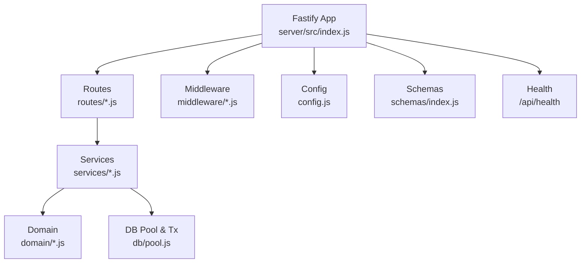
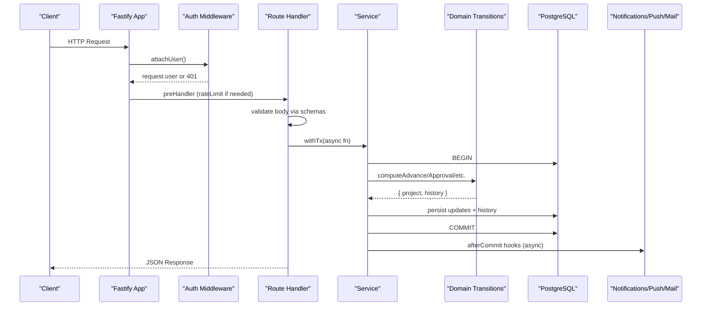
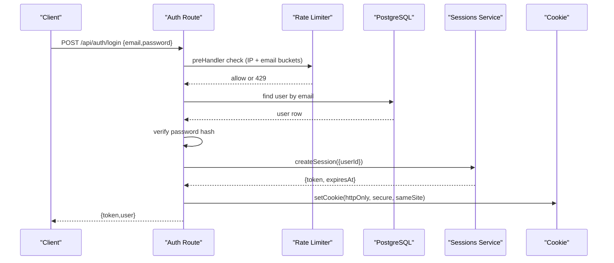
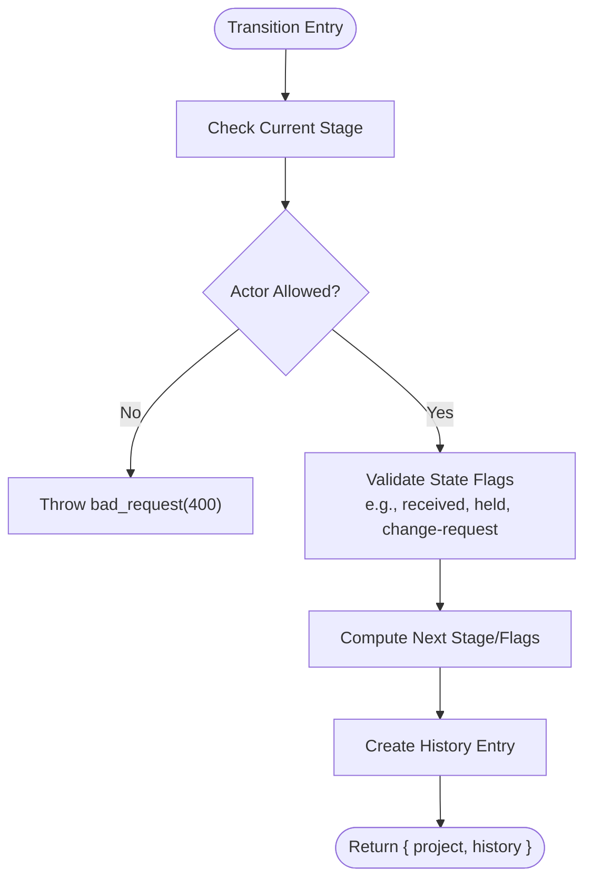
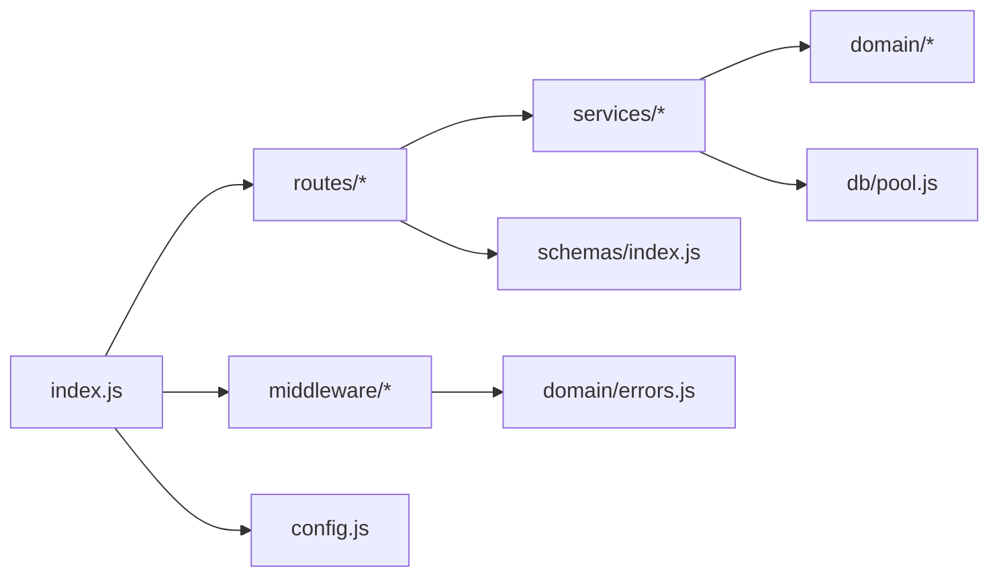

# Backend Development

<cite>
**Referenced Files in This Document**
- [index.js](file://server/src/index.js)
- [config.js](file://server/src/config.js)
- [package.json](file://server/package.json)
- [auth.js](file://server/src/routes/auth.js)
- [projects.js](file://server/src/routes/projects.js)
- [auth-middleware.js](file://server/src/middleware/auth.js)
- [rate-limit.js](file://server/src/middleware/rate-limit.js)
- [errors.js](file://server/src/domain/errors.js)
- [transitions.js](file://server/src/domain/transitions.js)
- [project-transitions.js](file://server/src/services/project-transitions.js)
- [sessions.js](file://server/src/services/sessions.js)
- [schemas-index.js](file://server/src/schemas/index.js)
- [pool.js](file://server/src/db/pool.js)
</cite>

## Table of Contents
1. Introduction
2. Project Structure
3. Core Components
4. Architecture Overview
5. Detailed Component Analysis
6. Dependency Analysis
7. Performance Considerations
8. Troubleshooting Guide
9. Conclusion

## Introduction
This document explains the Fastify-based backend for the application. It covers route organization and controller patterns, service-layer architecture for business logic and external integrations, domain-layer state machine and validation, middleware for authentication/authorization/rate limiting/error handling, configuration management, logging, error handling patterns, monitoring, security considerations, input validation, and API versioning strategies.

## Project Structure
The server is organized into clear layers:
- Entry point and bootstrapping: registers plugins, global error handler, CORS, helmet, multipart, auth decorators, routes under /api, health endpoint, migrations/seed on boot, graceful shutdown, and background maintenance tasks.
- Routes (controllers): feature-scoped modules that parse requests, enforce auth/roles, call services, and return responses.
- Services: encapsulate business operations, database transactions, notifications, email, push, sessions, migrations, and seed data.
- Domain: pure business rules, state machine transitions, progress calculations, and shared constants.
- Middleware: reusable cross-cutting concerns like authentication, authorization, and rate limiting.
- Configuration: environment-driven settings for DB, cookies, CORS, SMTP, Redis, and push.
- Schemas: centralized JSON schemas for request validation.
- Database: connection pooling and transaction helpers.

**Diagram sources**
- [index.js:39-173](file://server/src/index.js#L39-L173)
- [config.js:22-121](file://server/src/config.js#L22-L121)
- [pool.js:13-88](file://server/src/db/pool.js#L13-L88)

**Section sources**
- [index.js:27-173](file://server/src/index.js#L27-L173)
- [config.js:1-121](file://server/src/config.js#L1-L121)
- [pool.js:1-100](file://server/src/db/pool.js#L1-L100)

## Core Components
- Fastify app bootstrap: configures logger, body limits, trustProxy, AJV strictness, helmet, CORS, cookie parsing, multipart, error handler, auth decorators, mounts all routes under /api, exposes /api/health, runs migrations/seed when configured, starts notification maintenance, and handles graceful shutdown.
- Authentication and session: httpOnly cookie sessions with server-side tokens; optional legacy header auth in dev/test; role-based guards via decorators.
- Rate limiting: pluggable memory or Redis-backed sliding window limiter used on sensitive endpoints.
- Domain state machine: pure functions compute next project states for advance/approve/reject/demo flows, enforcing roles, stage gates, and multi-party approvals.
- Service layer: transactional operations using a shared pool, after-commit hooks for side effects (notifications, push, email), and integration points for mail and web push.
- Validation: centralized JSON schemas per route to reject unknown fields and enforce types/constraints early.

**Section sources**
- [index.js:39-173](file://server/src/index.js#L39-L173)
- [auth-middleware.js:32-122](file://server/src/middleware/auth.js#L32-L122)
- [rate-limit.js:139-175](file://server/src/middleware/rate-limit.js#L139-L175)
- [transitions.js:99-500](file://server/src/domain/transitions.js#L99-L500)
- [project-transitions.js:51-184](file://server/src/services/project-transitions.js#L51-L184)
- [schemas-index.js:65-140](file://server/src/schemas/index.js#L65-L140)

## Architecture Overview
The request lifecycle:
- Request enters Fastify → CORS/helmet/cookie/multipart → auth decorator attaches user (session or dev header) → route preHandler may apply rate limit → handler validates via schema → service executes within a transaction → domain transition computes new state → repository persists changes → after-commit hooks send notifications/push/email → response returned.

**Diagram sources**
- [index.js:86-161](file://server/src/index.js#L86-L161)
- [auth-middleware.js:48-82](file://server/src/middleware/auth.js#L48-L82)
- [rate-limit.js:139-175](file://server/src/middleware/rate-limit.js#L139-L175)
- [pool.js:49-88](file://server/src/db/pool.js#L49-L88)
- [project-transitions.js:51-184](file://server/src/services/project-transitions.js#L51-L184)

## Detailed Component Analysis

### Route Organization and Controller Patterns
- Feature-scoped route modules under routes/ are mounted under /api by the entry point. Each module exports a function that registers its routes on the provided Fastify instance.
- Controllers consistently:
  - Enforce authentication via attachUser or requireAuth decorator.
  - Enforce roles via requireRole where needed.
  - Validate inputs using schemas from schemas/index.js.
  - Execute mutations inside withTx to ensure atomicity.
  - Call services to perform domain transitions and side effects.
  - Return structured JSON responses.

Examples:
- Auth routes handle login/logout/me, invite acceptance, password reset/change, and dev-login. They use rate limiting on sensitive endpoints and set httpOnly session cookies.
- Projects routes expose CRUD and pipeline transitions (advance, approve, receive/not-received, baski-onay prepare, demo/ozalit start/cancel/edit/change-request). They hydrate assignees/subtasks before calling domain transitions and log history + notify stakeholders.

**Section sources**
- [index.js:148-161](file://server/src/index.js#L148-L161)
- [auth.js:58-343](file://server/src/routes/auth.js#L58-L343)
- [projects.js:68-800](file://server/src/routes/projects.js#L68-L800)
- [schemas-index.js:65-140](file://server/src/schemas/index.js#L65-L140)

#### Sequence: Login Flow

**Diagram sources**
- [auth.js:81-118](file://server/src/routes/auth.js#L81-L118)
- [rate-limit.js:139-175](file://server/src/middleware/rate-limit.js#L139-L175)
- [sessions.js:29-38](file://server/src/services/sessions.js#L29-L38)
- [config.js:49-63](file://server/src/config.js#L49-L63)

### Service Layer Architecture
- Transactional execution: withTx wraps multiple DB writes and provides afterCommit hooks for side effects (notifications, push, email) that run only after successful commit and outside the transaction.
- Session service: creates, resolves, and invalidates server-side sessions stored in PostgreSQL; centralizes cookie options.
- Project transitions service: thin wrappers over domain transition functions, passing required context (e.g., team leader IDs, designer IDs) so routes remain clean.
- Notifications and mail: emit events for project lifecycle changes, invitations, password resets, and catalog changes.

**Section sources**
- [pool.js:27-88](file://server/src/db/pool.js#L27-L88)
- [sessions.js:29-107](file://server/src/services/sessions.js#L29-L107)
- [project-transitions.js:51-184](file://server/src/services/project-transitions.js#L51-L184)

### Domain Layer: Business Rules and State Machine
- Pure transition functions compute next project state and history entries based on current stage, actor role, and contextual flags.
- Guards include:
  - Role checks (team_leader, printer, assigned designer).
  - Stage-specific gates (demo receipt, ozalit receipt, change-request pending).
  - Multi-party approval tracking (ozalit approvals, baski_onay dual approval).
  - Progress constraints (must reach 100% before certain advances).
- Helpers produce canonical history entries and timestamps.

**Diagram sources**
- [transitions.js:99-500](file://server/src/domain/transitions.js#L99-L500)

**Section sources**
- [transitions.js:99-500](file://server/src/domain/transitions.js#L99-L500)
- [project-transitions.js:51-184](file://server/src/services/project-transitions.js#L51-L184)

### Middleware: Authentication, Authorization, Rate Limiting, Error Handling
- Authentication:
  - attachUser prefers httpOnly session cookie; falls back to X-User-Id header only when TRUST_HEADER_AUTH is enabled (dev/test).
  - requireAuth and requireRole decorators provide declarative preHandlers.
- Authorization:
  - requireRole enforces role membership; additional active-user checks available via requireActiveUser.
- Rate Limiting:
  - Pluggable store (memory or Redis) with sliding window; supports multiple keys per request (AND semantics).
  - Returns 429 with Retry-After header when exceeded.
- Error Handling:
  - Global error handler maps HttpError instances and errors with status codes to consistent JSON responses; logs unhandled errors and returns 500.

**Section sources**
- [auth-middleware.js:32-122](file://server/src/middleware/auth.js#L32-L122)
- [rate-limit.js:1-195](file://server/src/middleware/rate-limit.js#L1-L195)
- [index.js:125-146](file://server/src/index.js#L125-L146)
- [errors.js:7-21](file://server/src/domain/errors.js#L7-L21)

### Configuration Management, Environment Variables, Deployment Settings
- Centralized config object reads from process.env with safe defaults:
  - Server host/port, database URL, pool size.
  - Migration and seed toggles.
  - CORS origins (production default locked to known SPA origin).
  - Session cookie name, TTL, secure flag, sameSite, domain.
  - SMTP settings and invite base URL.
  - Rate limit store selection (memory/redis) and redisUrl.
  - Web Push VAPID keys and subject.
- Boot behavior:
  - Optional migrateOnBoot and seedOnBoot.
  - Health endpoint includes commit info for deployment verification.

**Section sources**
- [config.js:1-121](file://server/src/config.js#L1-L121)
- [index.js:176-216](file://server/src/index.js#L176-L216)

### Logging, Monitoring, and Observability
- Logging:
  - Fastify logger level controlled by LOG_LEVEL.
  - Unhandled exceptions and rejections logged at process level.
  - After-commit hook failures logged without crashing.
- Monitoring:
  - /api/health returns ok, timestamp, and GIT_COMMIT for quick deployment verification.
  - Graceful shutdown stops background maintenance, closes Fastify, and releases DB pool.

**Section sources**
- [index.js:40-42](file://server/src/index.js#L40-L42)
- [index.js:163-171](file://server/src/index.js#L163-L171)
- [index.js:203-216](file://server/src/index.js#L203-L216)
- [pool.js:60-76](file://server/src/db/pool.js#L60-L76)

### Security Considerations, Input Validation, and API Versioning
- Security:
  - Helmet applied with CSP disabled for JSON API; cross-origin resource policy allows avatar images.
  - CORS reflects allowed origins and enables credentials only for trusted origins.
  - Sessions are httpOnly, secure in production, with configurable sameSite and domain.
  - TrustHeaderAuth disabled in production to prevent header impersonation.
  - Passwords hashed with bcrypt; rate limiting on sensitive endpoints.
- Input Validation:
  - Strict AJV options reject unknown keys; coerceTypes disabled to avoid silent coercion.
  - Centralized schemas define required fields, enums, lengths, and formats.
- API Versioning:
  - All routes are mounted under /api; no explicit version segment currently.
  - To introduce versioning, mount versioned prefixes (e.g., /api/v1) and register route modules accordingly.

**Section sources**
- [index.js:65-103](file://server/src/index.js#L65-L103)
- [config.js:31-63](file://server/src/config.js#L31-L63)
- [auth.js:329-342](file://server/src/routes/auth.js#L329-L342)
- [schemas-index.js:1-24](file://server/src/schemas/index.js#L1-L24)

## Dependency Analysis
High-level dependencies between components:

**Diagram sources**
- [index.js:39-173](file://server/src/index.js#L39-L173)
- [auth.js:1-25](file://server/src/routes/auth.js#L1-L25)
- [projects.js:1-38](file://server/src/routes/projects.js#L1-L38)
- [project-transitions.js:18-42](file://server/src/services/project-transitions.js#L18-L42)
- [pool.js:1-25](file://server/src/db/pool.js#L1-L25)
- [schemas-index.js:1-24](file://server/src/schemas/index.js#L1-L24)
- [errors.js:7-21](file://server/src/domain/errors.js#L7-L21)

**Section sources**
- [index.js:39-173](file://server/src/index.js#L39-L173)
- [auth.js:1-25](file://server/src/routes/auth.js#L1-L25)
- [projects.js:1-38](file://server/src/routes/projects.js#L1-L38)
- [project-transitions.js:18-42](file://server/src/services/project-transitions.js#L18-L42)
- [pool.js:1-25](file://server/src/db/pool.js#L1-L25)
- [schemas-index.js:1-24](file://server/src/schemas/index.js#L1-L24)
- [errors.js:7-21](file://server/src/domain/errors.js#L7-L21)

## Performance Considerations
- Connection pooling: pg.Pool with configurable max connections; idle client errors logged but do not crash.
- Transactions: withTx ensures atomicity and uses afterCommit hooks to avoid holding DB connections during network calls.
- Rate limiting: sliding window with memory or Redis; Redis fallback to memory on failure prevents hard errors.
- Body limits: global bodyLimit and multipart file size limits protect against large payloads.
- Background tasks: notification maintenance started/stopped cleanly on shutdown to avoid races.

[No sources needed since this section provides general guidance]

## Troubleshooting Guide
Common issues and how the system responds:
- Invalid input: AJV rejects unknown keys or malformed bodies with 400; clients already map these to errors.
- Unauthorized/Forbidden: HttpError subclasses map to 401/403 with consistent codes; middleware throws appropriate errors.
- Rate limited: 429 with Retry-After header; adjust client retry strategy.
- Unhandled errors: global error handler logs and returns 500; check logs for stack traces.
- DB issues: pool idle errors logged; afterCommit hook failures logged without affecting response.
- Shutdown: SIGTERM/SIGINT stop maintenance, close Fastify, release DB pool.

**Section sources**
- [index.js:125-146](file://server/src/index.js#L125-L146)
- [errors.js:7-21](file://server/src/domain/errors.js#L7-L21)
- [rate-limit.js:139-175](file://server/src/middleware/rate-limit.js#L139-L175)
- [pool.js:19-24](file://server/src/db/pool.js#L19-L24)
- [index.js:203-216](file://server/src/index.js#L203-L216)

## Conclusion
The backend follows a layered architecture with clear separation of concerns: routes orchestrate requests, services encapsulate business operations and side effects, and domain functions enforce immutable business rules and state transitions. Middleware provides robust authentication, authorization, and rate limiting, while centralized schemas and strict validation ensure contract integrity. Configuration is environment-driven, supporting both local development and production deployments. Logging, error handling, and graceful shutdown support operational reliability. For future growth, consider adding explicit API versioning under /api/vN and expanding monitoring with metrics and tracing.