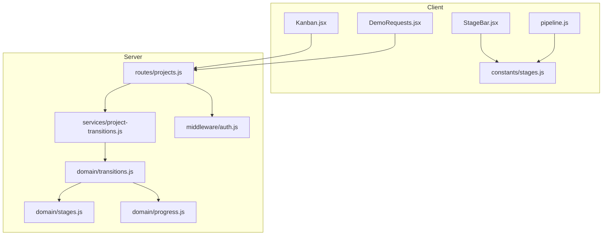
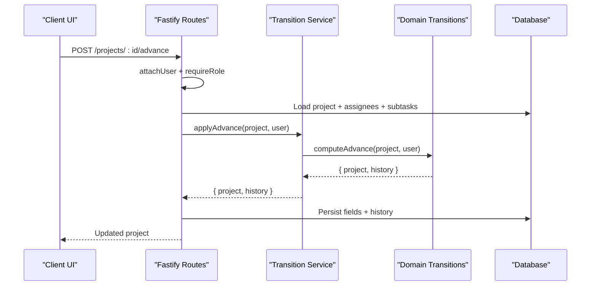
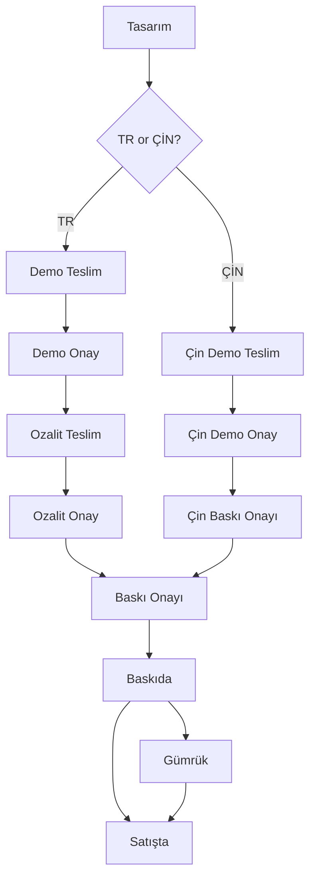
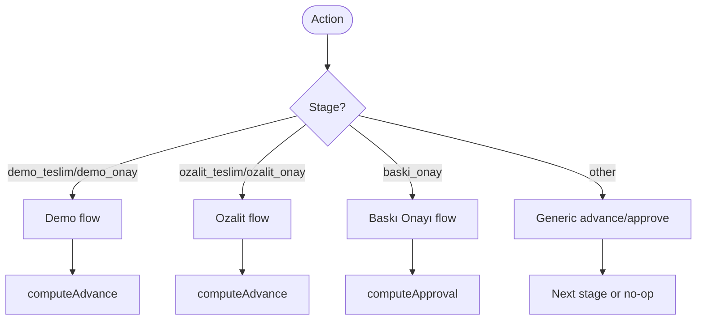
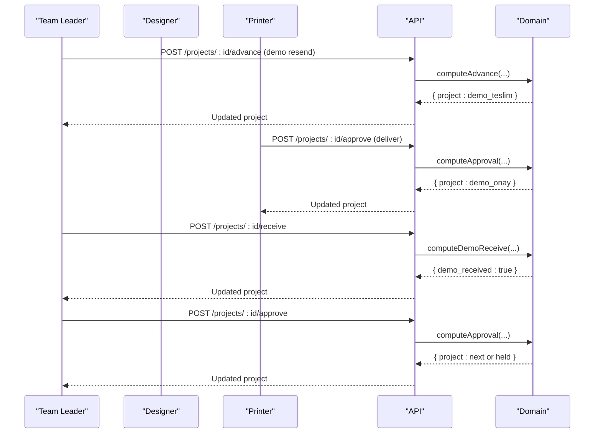
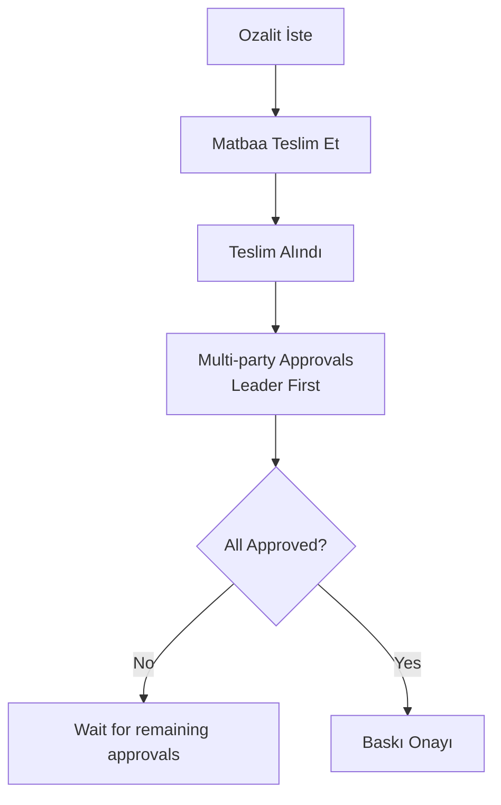
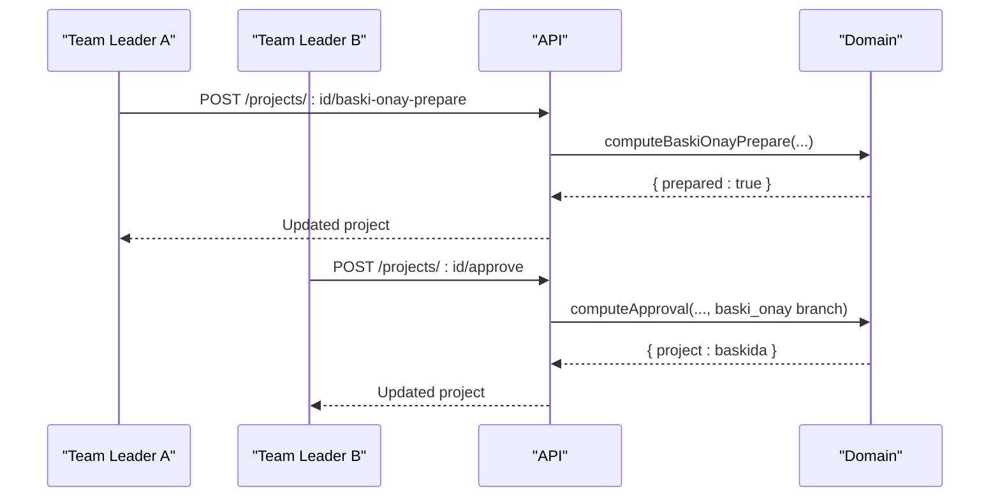
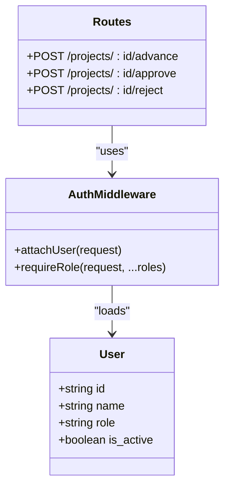
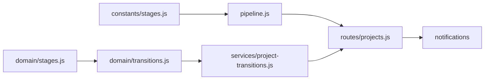

# Core Features

<cite>
**Referenced Files in This Document**
- [stages.js](file://server/src/domain/stages.js)
- [transitions.js](file://server/src/domain/transitions.js)
- [project-transitions.js](file://server/src/services/project-transitions.js)
- [projects.js](file://server/src/routes/projects.js)
- [pipeline.js](file://client/src/domain/services/pipeline.js)
- [stages.js (client)](file://client/src/domain/constants/stages.js)
- [StageBar.jsx](file://client/src/components/StageBar.jsx)
- [Kanban.jsx](file://client/src/pages/Kanban.jsx)
- [DemoRequests.jsx](file://client/src/pages/DemoRequests.jsx)
- [OzalitFormDialog.jsx](file://client/src/components/OzalitFormDialog.jsx)
- [progress.js](file://server/src/domain/progress.js)
- [auth.js](file://server/src/middleware/auth.js)
</cite>

## Table of Contents
1. [Introduction](#introduction)
2. [Project Structure](#project-structure)
3. [Core Components](#core-components)
4. [Architecture Overview](#architecture-overview)
5. [Detailed Component Analysis](#detailed-component-analysis)
6. [Dependency Analysis](#dependency-analysis)
7. [Performance Considerations](#performance-considerations)
8. [Troubleshooting Guide](#troubleshooting-guide)
9. [Conclusion](#conclusion)

## Introduction
This document explains the core features of the YZ Yayın Takip publishing workflow management system. It covers:
- Project lifecycle and stage-based pipelines for TR (Tasarım/Rapor) and ÇİN types
- The server-side state machine governing transitions between stages
- Role-based access control for team_leader, designer, printer, and satis roles
- Quality assurance workflows including demo requests, ozalit (proof) management, and multi-party approvals
- Practical end-to-end workflows from project creation to delivery
- Kanban-style visualization and progress tracking

## Project Structure
The system is split into a client SPA and a Node/Fastify API server. Domain logic for stages and transitions lives on the server and is mirrored on the client to keep UI behavior consistent with backend rules.

**Diagram sources**
- [Kanban.jsx:1-218](file://client/src/pages/Kanban.jsx#L1-L218)
- [DemoRequests.jsx:1-520](file://client/src/pages/DemoRequests.jsx#L1-L520)
- [StageBar.jsx:1-111](file://client/src/components/StageBar.jsx#L1-L111)
- [pipeline.js:1-453](file://client/src/domain/services/pipeline.js#L1-L453)
- [stages.js (client):1-56](file://client/src/domain/constants/stages.js#L1-L56)
- [projects.js:1-800](file://server/src/routes/projects.js#L1-L800)
- [project-transitions.js:1-204](file://server/src/services/project-transitions.js#L1-L204)
- [transitions.js:1-1653](file://server/src/domain/transitions.js#L1-L1653)
- [stages.js:1-49](file://server/src/domain/stages.js#L1-L49)
- [progress.js:1-33](file://server/src/domain/progress.js#L1-L33)
- [auth.js:1-123](file://server/src/middleware/auth.js#L1-L123)

**Section sources**
- [Kanban.jsx:1-218](file://client/src/pages/Kanban.jsx#L1-L218)
- [projects.js:1-800](file://server/src/routes/projects.js#L1-L800)
- [transitions.js:1-1653](file://server/src/domain/transitions.js#L1-L1653)
- [stages.js:1-49](file://server/src/domain/stages.js#L1-L49)

## Core Components
- Stage definitions and pipelines:
  - TR pipeline: Tasarım → Demo Teslim → Demo Onay → Ozalit Teslim → Ozalit Onay → Baskı Onayı → Baskıda → Satışta
  - ÇİN pipeline: Tasarım → Çin Demo Teslim → Çin Demo Onay → Çin Baskı Onayı → Baskıda → Gümrük → Satışta
- State machine:
  - Advance, approve, reject, receive/not-receive, start/cancel/edit/change-request flows
  - Multi-party ozalit approval with leader-first rule
- Roles and permissions:
  - team_leader, designer, printer, satis (sales)
  - Route-level role enforcement via middleware
- QA workflows:
  - Demo request and delivery loop
  - Ozalit proof request, delivery, receipt, and multi-party sign-off
  - Baskı Onayı dual-approval pair
- Visualization:
  - Kanban board per pipeline stage
  - Stage bar showing current position
  - Demo queue and actions

**Section sources**
- [stages.js:1-49](file://server/src/domain/stages.js#L1-L49)
- [pipeline.js:1-453](file://client/src/domain/services/pipeline.js#L1-L453)
- [auth.js:1-123](file://server/src/middleware/auth.js#L1-L123)
- [StageBar.jsx:1-111](file://client/src/components/StageBar.jsx#L1-L111)
- [Kanban.jsx:1-218](file://client/src/pages/Kanban.jsx#L1-L218)

## Architecture Overview
The API routes accept authenticated requests, hydrate project context (assignees, subtasks), delegate to transition services, persist changes, log history, and emit notifications. The domain layer enforces business rules and returns new project state plus history entries.

**Diagram sources**
- [projects.js:428-526](file://server/src/routes/projects.js#L428-L526)
- [project-transitions.js:44-53](file://server/src/services/project-transitions.js#L44-L53)
- [transitions.js:99-255](file://server/src/domain/transitions.js#L99-L255)

**Section sources**
- [projects.js:1-800](file://server/src/routes/projects.js#L1-L800)
- [project-transitions.js:1-204](file://server/src/services/project-transitions.js#L1-L204)
- [transitions.js:1-1653](file://server/src/domain/transitions.js#L1-L1653)

## Detailed Component Analysis

### Pipeline and Stage Definitions
- Two pipelines are defined: TR and ÇİN. Both converge at production stages (Baskıda, then either Satışta or Gümrük→Satışta).
- Stages requiring full design completion block entry until progress reaches 100%.
- Orderable stages allow Sales to create orders once production is complete.

**Diagram sources**
- [stages.js:21-24](file://server/src/domain/stages.js#L21-L24)
- [stages.js (client):32-35](file://client/src/domain/constants/stages.js#L32-L35)

**Section sources**
- [stages.js:1-49](file://server/src/domain/stages.js#L1-L49)
- [pipeline.js:1-158](file://client/src/domain/services/pipeline.js#L1-L158)

### State Machine: Advance, Approve, Reject
- Advance:
  - Handles re-send of demos, ozalit resubmit after rejection, and generic forward movement.
  - Enforces revize gates and full-progress requirements before entering production stages.
- Approve:
  - Demo approval can hold if design is not 100% complete; otherwise advances.
  - Ozalit approval is multi-party with leader-first rule; advances to Baskı Onayı when all required approvers signed.
  - Baskı Onayı requires preparation by one leader and approval by another (unless only one exists).
- Reject:
  - Only team_leader can reject.
  - Can target matbaa for re-delivery or return to Tasarım for redesign. Resets leg-specific flags and partial approvals.

**Diagram sources**
- [transitions.js:99-255](file://server/src/domain/transitions.js#L99-L255)
- [transitions.js:377-501](file://server/src/domain/transitions.js#L377-L501)
- [transitions.js:1514-1599](file://server/src/domain/transitions.js#L1514-L1599)

**Section sources**
- [transitions.js:99-255](file://server/src/domain/transitions.js#L99-L255)
- [transitions.js:377-501](file://server/src/domain/transitions.js#L377-L501)
- [transitions.js:1514-1599](file://server/src/domain/transitions.js#L1514-L1599)

### Demo Workflow
- Request: Team leader or assigned designer can request a demo when design is complete.
- Delivery: Printer delivers to demo_teslim or cin_demo_teslim.
- Receipt: Leader or assigned designer marks “Teslim Alındı” before approval.
- Approval: Leader or printer approves; if progress < 100%, demo is held and a second round is needed.
- Change requests: After printer starts work, leader can request change; printer accepts/declines.

**Diagram sources**
- [transitions.js:136-221](file://server/src/domain/transitions.js#L136-L221)
- [transitions.js:257-307](file://server/src/domain/transitions.js#L257-L307)
- [transitions.js:632-664](file://server/src/domain/transitions.js#L632-L664)
- [transitions.js:437-485](file://server/src/domain/transitions.js#L437-L485)

**Section sources**
- [transitions.js:136-221](file://server/src/domain/transitions.js#L136-L221)
- [transitions.js:257-307](file://server/src/domain/transitions.js#L257-L307)
- [transitions.js:632-664](file://server/src/domain/transitions.js#L632-L664)
- [transitions.js:437-485](file://server/src/domain/transitions.js#L437-L485)

### Ozalit (Proof) Workflow and Multi-Party Approval
- Request: Team leader or assigned designer requests ozalit while at ozalit_teslim.
- Delivery: Printer delivers to ozalit_onay.
- Receipt: One acknowledgment unlocks multi-party approval.
- Approval: Every active team leader and every assigned designer must approve; leader must approve first.
- Transition: After all approvals, moves to baski_onay for final dual-signature.

**Diagram sources**
- [transitions.js:309-371](file://server/src/domain/transitions.js#L309-L371)
- [transitions.js:743-775](file://server/src/domain/transitions.js#L743-L775)
- [transitions.js:1417-1508](file://server/src/domain/transitions.js#L1417-L1508)

**Section sources**
- [transitions.js:309-371](file://server/src/domain/transitions.js#L309-L371)
- [transitions.js:743-775](file://server/src/domain/transitions.js#L743-L775)
- [transitions.js:1417-1508](file://server/src/domain/transitions.js#L1417-L1508)

### Baskı Onayı (Print Approval) Dual-Signature
- Preparation: Any active team leader prepares the form.
- Approval: A different team leader approves unless only one exists.
- Transition: Advances to production stage (Baskıda).

**Diagram sources**
- [transitions.js:1388-1415](file://server/src/domain/transitions.js#L1388-L1415)
- [transitions.js:397-431](file://server/src/domain/transitions.js#L397-L431)
- [projects.js:765-794](file://server/src/routes/projects.js#L765-L794)

**Section sources**
- [transitions.js:1388-1415](file://server/src/domain/transitions.js#L1388-L1415)
- [transitions.js:397-431](file://server/src/domain/transitions.js#L397-L431)
- [projects.js:765-794](file://server/src/routes/projects.js#L765-L794)

### Role-Based Access Control
- Middleware attaches user identity and enforces roles at route level.
- Role capabilities:
  - team_leader: Create projects, approve/reject, prepare/approve print forms, manage catalog visibility.
  - designer: Assigned designers participate in ozalit approvals and can request demos when assigned.
  - printer: Deliver demos/ozalit, mark work started, respond to change requests.
  - satis: Create order requests for orderable stages (enforced by pipeline helpers).

**Diagram sources**
- [auth.js:48-90](file://server/src/middleware/auth.js#L48-L90)
- [projects.js:68-106](file://server/src/routes/projects.js#L68-L106)

**Section sources**
- [auth.js:1-123](file://server/src/middleware/auth.js#L1-L123)
- [projects.js:1-800](file://server/src/routes/projects.js#L1-L800)

### Progress Computation and Gates
- Progress is computed from subtasks; excluded items like “Yazılım” do not count toward completion.
- Once a project enters production-bound stages, progress is pinned at 100% to freeze design.

**Section sources**
- [progress.js:1-33](file://server/src/domain/progress.js#L1-L33)
- [stages.js:33-48](file://server/src/domain/stages.js#L33-L48)

### Kanban and Stage Visualization
- Kanban columns map to pipeline stages; users can filter by type (TR/ÇİN).
- Stage bar shows completed/current steps and auto-scrolls to current step on narrow screens.

**Section sources**
- [Kanban.jsx:1-218](file://client/src/pages/Kanban.jsx#L1-L218)
- [StageBar.jsx:1-111](file://client/src/components/StageBar.jsx#L1-L111)
- [stages.js (client):1-56](file://client/src/domain/constants/stages.js#L1-L56)

## Dependency Analysis
- Client pipeline helpers mirror server constants to ensure UI and API agree on allowed transitions and capabilities.
- Route handlers depend on transition services which delegate to pure domain functions.
- Notifications are emitted on key transitions and events.

**Diagram sources**
- [stages.js (client):1-56](file://client/src/domain/constants/stages.js#L1-L56)
- [pipeline.js:1-453](file://client/src/domain/services/pipeline.js#L1-L453)
- [stages.js:1-49](file://server/src/domain/stages.js#L1-L49)
- [transitions.js:1-1653](file://server/src/domain/transitions.js#L1-L1653)
- [project-transitions.js:1-204](file://server/src/services/project-transitions.js#L1-L204)
- [projects.js:1-800](file://server/src/routes/projects.js#L1-L800)

**Section sources**
- [pipeline.js:1-453](file://client/src/domain/services/pipeline.js#L1-L453)
- [transitions.js:1-1653](file://server/src/domain/transitions.js#L1-L1653)
- [project-transitions.js:1-204](file://server/src/services/project-transitions.js#L1-L204)
- [projects.js:1-800](file://server/src/routes/projects.js#L1-L800)

## Performance Considerations
- Use transactions for mutation routes to ensure consistency across project updates, history logging, and notifications.
- Hydrate only necessary data (assignees, subtasks) before calling transition functions to avoid extra queries.
- Keep client/server stage definitions synchronized to prevent mismatched UI states.

[No sources needed since this section provides general guidance]

## Troubleshooting Guide
Common issues and resolutions:
- Cannot advance from Tasarım due to pending revize: Clear all flagged subtasks before submitting again.
- Ozalit cannot be requested: Ensure you are at ozalit_teslim and either team_leader or assigned designer; also ensure no existing ozalit request is pending.
- Ozalit approval blocked: Confirm “Teslim Alındı” was marked and that a team leader has approved first.
- Baskı Onayı cannot be approved: Ensure form was prepared by a different team leader than the approver.
- Demo cannot be delivered: Ensure any pending change request is resolved before delivery.

**Section sources**
- [transitions.js:103-134](file://server/src/domain/transitions.js#L103-L134)
- [transitions.js:309-371](file://server/src/domain/transitions.js#L309-L371)
- [transitions.js:1417-1508](file://server/src/domain/transitions.js#L1417-L1508)
- [transitions.js:1388-1415](file://server/src/domain/transitions.js#L1388-L1415)
- [transitions.js:1160-1194](file://server/src/domain/transitions.js#L1160-L1194)

## Conclusion
YZ Yayın Takip implements a robust, role-aware publishing workflow with clear separation between design, QA, and production phases. The dual-pipeline model supports both domestic and international processes, while the state machine ensures strict adherence to business rules. Visual tools like Kanban and Stage Bar provide intuitive oversight, and comprehensive QA flows (demo and ozalit) with multi-party approvals safeguard quality before production.

[No sources needed since this section summarizes without analyzing specific files]