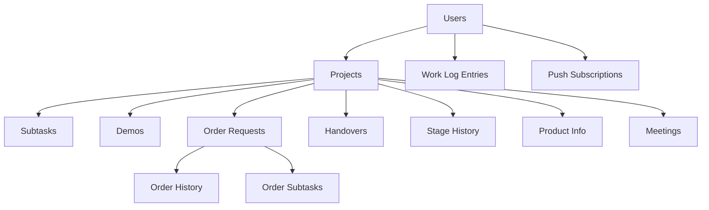
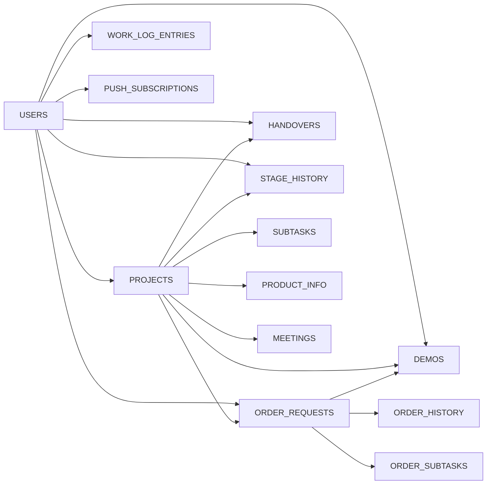

# Database Design

<cite>
**Referenced Files in This Document**
- [001__users.sql](file://server/db/migrations/001__users.sql)
- [002__projects.sql](file://server/db/migrations/002__projects.sql)
- [003__subtasks.sql](file://server/db/migrations/003__subtasks.sql)
- [004__demos.sql](file://server/db/migrations/004__demos.sql)
- [005__order_requests.sql](file://server/db/migrations/005__order_requests.sql)
- [006__handovers.sql](file://server/db/migrations/006__handovers.sql)
- [007__stage_history.sql](file://server/db/migrations/007__stage_history.sql)
- [020__product_info.sql](file://server/db/migrations/020__product_info.sql)
- [025__daily_status.sql](file://server/db/migrations/025__daily_status.sql)
- [026__work_log.sql](file://server/db/migrations/026__work_log.sql)
- [032__push_subscriptions.sql](file://server/db/migrations/032__push_subscriptions.sql)
- [039__order_subtasks.sql](file://server/db/migrations/039__order_subtasks.sql)
- [040__meetings.sql](file://server/db/migrations/040__meetings.sql)
- [053__order_spec_sheets.sql](file://server/db/migrations/053__order_spec_sheets.sql)
- [054__order_kontrol_step.sql](file://server/db/migrations/054__order_kontrol_step.sql)
</cite>

## Table of Contents
1. Introduction
2. Project Structure
3. Core Components
4. Architecture Overview
5. Detailed Component Analysis
6. Dependency Analysis
7. Performance Considerations
8. Troubleshooting Guide
9. Conclusion
10. Appendices

## Introduction
This document describes the PostgreSQL data model for YZ Yayın Takip, focusing on entities and relationships among users, projects, subtasks, orders (order requests), demos, and handovers. It also covers additional supporting tables such as stage history, product info, work log, meetings, and push subscriptions. The document explains primary and foreign key constraints, indexes, validation rules, referential integrity, migration versioning, performance tuning considerations, lifecycle management, backup strategies, and provides sample queries for reporting and analysis.

## Project Structure
The database schema is evolved through a series of numbered SQL migrations under server/db/migrations. Each file introduces or alters tables, constraints, and indexes to implement the domain model incrementally. Migrations are designed to be idempotent where possible and use safe defaults to support re-runs on seeded databases.



**Diagram sources**
- [001__users.sql:20-35](file://server/db/migrations/001__users.sql#L20-L35)
- [002__projects.sql:7-39](file://server/db/migrations/002__projects.sql#L7-L39)
- [003__subtasks.sql:8-38](file://server/db/migrations/003__subtasks.sql#L8-L38)
- [004__demos.sql:7-19](file://server/db/migrations/004__demos.sql#L7-L19)
- [005__order_requests.sql:8-35](file://server/db/migrations/005__order_requests.sql#L8-L35)
- [006__handovers.sql:7-23](file://server/db/migrations/006__handovers.sql#L7-L23)
- [007__stage_history.sql:7-37](file://server/db/migrations/007__stage_history.sql#L7-L37)
- [020__product_info.sql:14-21](file://server/db/migrations/020__product_info.sql#L14-L21)
- [026__work_log.sql:22-41](file://server/db/migrations/026__work_log.sql#L22-L41)
- [032__push_subscriptions.sql:23-57](file://server/db/migrations/032__push_subscriptions.sql#L23-L57)
- [039__order_subtasks.sql:17-37](file://server/db/migrations/039__order_subtasks.sql#L17-L37)
- [040__meetings.sql:14-26](file://server/db/migrations/040__meetings.sql#L14-L26)
- [053__order_spec_sheets.sql:41-53](file://server/db/migrations/053__order_spec_sheets.sql#L41-L53)

**Section sources**
- [001__users.sql:20-35](file://server/db/migrations/001__users.sql#L20-L35)
- [002__projects.sql:7-39](file://server/db/migrations/002__projects.sql#L7-L39)
- [003__subtasks.sql:8-38](file://server/db/migrations/003__subtasks.sql#L8-L38)
- [004__demos.sql:7-19](file://server/db/migrations/004__demos.sql#L7-L19)
- [005__order_requests.sql:8-35](file://server/db/migrations/005__order_requests.sql#L8-L35)
- [006__handovers.sql:7-23](file://server/db/migrations/006__handovers.sql#L7-L23)
- [007__stage_history.sql:7-37](file://server/db/migrations/007__stage_history.sql#L7-L37)
- [020__product_info.sql:14-21](file://server/db/migrations/020__product_info.sql#L14-L21)
- [026__work_log.sql:22-41](file://server/db/migrations/026__work_log.sql#L22-L41)
- [032__push_subscriptions.sql:23-57](file://server/db/migrations/032__push_subscriptions.sql#L23-L57)
- [039__order_subtasks.sql:17-37](file://server/db/migrations/039__order_subtasks.sql#L17-L37)
- [040__meetings.sql:14-26](file://server/db/migrations/040__meetings.sql#L14-L26)
- [053__order_spec_sheets.sql:41-53](file://server/db/migrations/053__order_spec_sheets.sql#L41-L53)
- [054__order_kontrol_step.sql:32-37](file://server/db/migrations/054__order_kontrol_step.sql#L32-L37)

## Core Components
- Users: Identity and role-based access control with activity flags and timestamps.
- Projects: Central entity representing books across passes, with stage tracking, assignment, and counters.
- Subtasks: Per-project checklist and numeric tasks with optional assignments and completion tracking; includes per-subtask updates.
- Demos: Per-project submissions for demo/ozalit rounds with flexible JSONB payloads and attempt tracking.
- Order Requests: Sales-driven order workflow with status transitions, optimistic concurrency via version, and append-only history.
- Handovers: Production-to-sales confirmation flow that finalizes project delivery.
- Stage History: Append-only timeline of project state changes.
- Product Info: Project-scoped product specification stored as JSONB for reuse across forms.
- Work Log Entries: Daily user activity logging replacing earlier daily status fields.
- Meetings: Optional meeting notes linked to projects.
- Push Subscriptions: Web push device endpoints for real-time notifications.

Key constraints and validations include CHECK constraints on roles, stages, kinds, statuses, lengths, and ranges; UNIQUE constraints on emails and tokens; and foreign keys enforcing referential integrity with appropriate ON DELETE behaviors (CASCADE or SET NULL).

**Section sources**
- [001__users.sql:20-35](file://server/db/migrations/001__users.sql#L20-L35)
- [002__projects.sql:7-39](file://server/db/migrations/002__projects.sql#L7-L39)
- [003__subtasks.sql:8-38](file://server/db/migrations/003__subtasks.sql#L8-L38)
- [004__demos.sql:7-19](file://server/db/migrations/004__demos.sql#L7-L19)
- [005__order_requests.sql:8-35](file://server/db/migrations/005__order_requests.sql#L8-L35)
- [006__handovers.sql:7-23](file://server/db/migrations/006__handovers.sql#L7-L23)
- [007__stage_history.sql:7-37](file://server/db/migrations/007__stage_history.sql#L7-L37)
- [020__product_info.sql:14-21](file://server/db/migrations/020__product_info.sql#L14-L21)
- [026__work_log.sql:22-41](file://server/db/migrations/026__work_log.sql#L22-L41)
- [040__meetings.sql:14-26](file://server/db/migrations/040__meetings.sql#L14-L26)
- [032__push_subscriptions.sql:23-57](file://server/db/migrations/032__push_subscriptions.sql#L23-L57)
- [039__order_subtasks.sql:17-37](file://server/db/migrations/039__order_subtasks.sql#L17-L37)
- [053__order_spec_sheets.sql:41-53](file://server/db/migrations/053__order_spec_sheets.sql#L41-L53)
- [054__order_kontrol_step.sql:32-37](file://server/db/migrations/054__order_kontrol_step.sql#L32-L37)

## Architecture Overview
The data model centers on Projects, which link to users (assignments and creation), subtasks (checklists and numeric tasks), demos (proofs), order requests (sales pipeline), handovers (production sign-off), and stage history (audit trail). Supporting tables provide product specifications, work logs, meetings, and push subscriptions.

```mermaid
erDiagram
USERS {
text id PK
text name
text email UK
text password
text role
boolean is_active
timestamptz invited_at
timestamptz joined_at
timestamptz created_at
timestamptz updated_at
}
PROJECTS {
text id PK
text title
text type
text stage
text assigned_to FK
text created_by FK
date target_month
int demo_attempt
int ozalit_attempt
int pass_number
text pass_kind
text last_reject_reason
int progress
int version
timestamptz created_at
timestamptz updated_at
}
SUBTASKS {
text id PK
text project_id FK
text title
text kind
boolean is_done
int total_pages
int pages_done
int total_stickers
int stickers_done
text assigned_to FK
timestamptz done_at
timestamptz created_at
timestamptz updated_at
}
DEMOS {
text id PK
text project_id FK
text kind
jsonb payload
int attempt
text created_by FK
timestamptz created_at
text order_id FK
}
ORDER_REQUESTS {
text id PK
text project_id FK
text status
text requested_by FK
jsonb payload
jsonb assignee_ids
int version
timestamptz created_at
timestamptz updated_at
int ozalit_attempt
}
ORDER_HISTORY {
text id PK
text order_id FK
text step
text signed_by_id FK
text notes
timestamptz created_at
text demo_id FK
}
HANDOVERS {
text id PK
text project_id FK
text status
text from_stage
text raised_by FK
text confirmed_by FK
timestamptz created_at
timestamptz confirmed_at
}
STAGE_HISTORY {
text id PK
text project_id FK
text from_stage
text to_stage
text action
text reason
text reject_target
int pass_number
text done_by FK
text note
timestamptz created_at
}
PRODUCT_INFO {
text project_id PK FK
jsonb components
text updated_by FK
timestamptz created_at
timestamptz updated_at
}
WORK_LOG_ENTRIES {
text id PK
text user_id FK
date entry_date
text kind
text body
int minutes
timestamptz created_at
timestamptz updated_at
}
MEETINGS {
text id PK
text title
text notes
timestamptz meeting_at
text project_id FK
text created_by FK
text created_by_name
timestamptz created_at
}
PUSH_SUBSCRIPTIONS {
text id PK
text user_id FK
text endpoint UK
text p256dh
text auth
text user_agent
timestamptz last_used_at
timestamptz failed_at
timestamptz created_at
}
USERS ||--o{ PROJECTS : "assigned_to / created_by"
PROJECTS ||--o{ SUBTASKS : "project_id"
PROJECTS ||--o{ DEMOS : "project_id"
PROJECTS ||--o{ ORDER_REQUESTS : "project_id"
PROJECTS ||--o{ HANDOVERS : "project_id"
PROJECTS ||--o{ STAGE_HISTORY : "project_id"
PROJECTS ||--|| PRODUCT_INFO : "project_id"
USERS ||--o{ WORK_LOG_ENTRIES : "user_id"
USERS ||--o{ PUSH_SUBSCRIPTIONS : "user_id"
PROJECTS ||--o{ MEETINGS : "project_id"
ORDER_REQUESTS ||--o{ ORDER_HISTORY : "order_id"
ORDER_REQUESTS ||--o{ DEMOS : "order_id"
```

**Diagram sources**
- [001__users.sql:20-35](file://server/db/migrations/001__users.sql#L20-L35)
- [002__projects.sql:7-39](file://server/db/migrations/002__projects.sql#L7-L39)
- [003__subtasks.sql:8-38](file://server/db/migrations/003__subtasks.sql#L8-L38)
- [004__demos.sql:7-19](file://server/db/migrations/004__demos.sql#L7-L19)
- [005__order_requests.sql:8-35](file://server/db/migrations/005__order_requests.sql#L8-L35)
- [006__handovers.sql:7-23](file://server/db/migrations/006__handovers.sql#L7-L23)
- [007__stage_history.sql:7-37](file://server/db/migrations/007__stage_history.sql#L7-L37)
- [020__product_info.sql:14-21](file://server/db/migrations/020__product_info.sql#L14-L21)
- [026__work_log.sql:22-41](file://server/db/migrations/026__work_log.sql#L22-L41)
- [032__push_subscriptions.sql:23-57](file://server/db/migrations/032__push_subscriptions.sql#L23-L57)
- [040__meetings.sql:14-26](file://server/db/migrations/040__meetings.sql#L14-L26)
- [039__order_subtasks.sql:17-37](file://server/db/migrations/039__order_subtasks.sql#L17-L37)
- [053__order_spec_sheets.sql:41-53](file://server/db/migrations/053__order_spec_sheets.sql#L41-L53)

## Detailed Component Analysis

### Users
- Purpose: Represents team members with roles and activity state.
- Key constraints:
  - Primary key: id (TEXT)
  - Unique email
  - Role restricted to allowed values
  - Boolean active flag
  - Timestamps for invitation, join, create, update
- Indexes: Active users index for filtering.

**Section sources**
- [001__users.sql:20-35](file://server/db/migrations/001__users.sql#L20-L35)

### Projects
- Purpose: Central business entity for each book across passes.
- Key constraints:
  - Primary key: id (TEXT)
  - Type restricted to allowed values
  - Stage restricted to allowed values
  - Progress bounded between 0 and 100
  - Pass kind restricted to allowed values
  - Foreign keys to users for assignment and creator
- Indexes: Stage, assigned_to, target_month, created_at for common queries.

**Section sources**
- [002__projects.sql:7-39](file://server/db/migrations/002__projects.sql#L7-L39)

### Subtasks and Subtask Updates
- Purpose: Checklist and numeric tasks per project; per-subtask notes form a timeline.
- Key constraints:
  - Subtasks reference projects with CASCADE delete
  - Kind restricted to check/pages/sticker-count
  - Assignments reference users with SET NULL
  - Subtask updates reference subtasks with CASCADE delete
- Indexes: Project-scoped subtasks and subtask updates by subtask.

**Section sources**
- [003__subtasks.sql:8-38](file://server/db/migrations/003__subtasks.sql#L8-L38)

### Demos
- Purpose: Per-project submission records for demo/ozalit rounds with flexible payloads.
- Key constraints:
  - References projects with CASCADE delete
  - Kind restricted to demo/ozalit
  - Attempt counter tracks revisions
  - Later extended to associate with orders for sipariş rounds
- Indexes: Project-scoped demos and order-scoped demos.

**Section sources**
- [004__demos.sql:7-19](file://server/db/migrations/004__demos.sql#L7-L19)
- [053__order_spec_sheets.sql:41-53](file://server/db/migrations/053__order_spec_sheets.sql#L41-L53)

### Order Requests and Order History
- Purpose: Sales-driven order workflow with status transitions and append-only history.
- Key constraints:
  - Status restricted to allowed values (including kontrol_edildi after evolution)
  - Version supports optimistic concurrency
  - History rows record steps, signers, and notes
  - Demo linkage added to associate order-specific proof sheets
- Indexes: Status and project-scoped order requests; order-scoped history; demo-scoped history.

**Section sources**
- [005__order_requests.sql:8-35](file://server/db/migrations/005__order_requests.sql#L8-L35)
- [053__order_spec_sheets.sql:41-53](file://server/db/migrations/053__order_spec_sheets.sql#L41-L53)
- [054__order_kontrol_step.sql:32-37](file://server/db/migrations/054__order_kontrol_step.sql#L32-L37)

### Order Subtasks
- Purpose: Snapshot of project subtasks per order to avoid concurrent interference between orders.
- Key constraints:
  - References order requests with CASCADE delete
  - Source subtask references set to NULL on delete to preserve provenance without cascading writes
  - Mirrors subtask fields including revision flags and position
- Indexes: Order-scoped snapshots.

**Section sources**
- [039__order_subtasks.sql:17-37](file://server/db/migrations/039__order_subtasks.sql#L17-L37)

### Handovers
- Purpose: Final production-to-sales confirmation flow.
- Key constraints:
  - References projects with CASCADE delete
  - Status restricted to pending/received
  - Unique constraint ensures only one pending handover per project
  - Indexes on status for queue processing
- Referential integrity: Raised and confirmed by users.

**Section sources**
- [006__handovers.sql:7-23](file://server/db/migrations/006__handovers.sql#L7-L23)

### Stage History
- Purpose: Append-only audit trail of project state changes.
- Key constraints:
  - References projects with CASCADE delete
  - Action restricted to allowed values
  - Reject target indicates routing for rework
- Indexes: Project-scoped and action-scoped for timeline rendering.

**Section sources**
- [007__stage_history.sql:7-37](file://server/db/migrations/007__stage_history.sql#L7-L37)

### Product Info
- Purpose: Project-scoped product specification stored as JSONB for reuse across forms.
- Key constraints:
  - Primary key doubles as foreign key to projects with CASCADE delete
  - Updated by user with timestamp tracking
- Indexes: None beyond primary key; reads typically keyed by project_id.

**Section sources**
- [020__product_info.sql:14-21](file://server/db/migrations/020__product_info.sql#L14-L21)

### Work Log Entries
- Purpose: Daily user activity logging replacing earlier daily status fields.
- Key constraints:
  - References users with CASCADE delete
  - Kind restricted to allowed categories
  - Body length constrained
  - Minutes optional and bounded
- Indexes: User+date and date+created_at for efficient reads.

**Section sources**
- [025__daily_status.sql:8-11](file://server/db/migrations/025__daily_status.sql#L8-L11)
- [026__work_log.sql:22-41](file://server/db/migrations/026__work_log.sql#L22-L41)

### Meetings
- Purpose: Optional meeting notes linked to projects.
- Key constraints:
  - Title length constrained
  - Notes optional with length limit
  - Project reference with SET NULL to preserve records if project deleted
  - Created by user with SET NULL behavior
- Indexes: Meeting date for chronological queries.

**Section sources**
- [040__meetings.sql:14-26](file://server/db/migrations/040__meetings.sql#L14-L26)

### Push Subscriptions
- Purpose: Web push device endpoints for real-time notifications.
- Key constraints:
  - References users with CASCADE delete
  - Endpoint unique to prevent duplicate subscriptions
  - Encryption fields stored for secure delivery
  - Last used and failure timestamps for diagnostics and pruning
- Indexes: User-scoped fan-out for notification emission.

**Section sources**
- [032__push_subscriptions.sql:23-57](file://server/db/migrations/032__push_subscriptions.sql#L23-L57)

## Dependency Analysis
- Strong cohesion around Projects: Most tables reference projects directly, ensuring clear ownership and lifecycle.
- Order-centric dependencies: Order requests anchor order history, order subtasks, and order-specific demos, isolating concurrent order workflows.
- User-centric dependencies: Users are referenced by assignments, creators, signers, and subscribers, with consistent SET NULL or CASCADE policies depending on semantics.
- Append-only histories: Stage history and order history provide immutable audit trails, decoupled from mutable state changes.



**Diagram sources**
- [001__users.sql:20-35](file://server/db/migrations/001__users.sql#L20-L35)
- [002__projects.sql:7-39](file://server/db/migrations/002__projects.sql#L7-L39)
- [003__subtasks.sql:8-38](file://server/db/migrations/003__subtasks.sql#L8-L38)
- [004__demos.sql:7-19](file://server/db/migrations/004__demos.sql#L7-L19)
- [005__order_requests.sql:8-35](file://server/db/migrations/005__order_requests.sql#L8-L35)
- [006__handovers.sql:7-23](file://server/db/migrations/006__handovers.sql#L7-L23)
- [007__stage_history.sql:7-37](file://server/db/migrations/007__stage_history.sql#L7-L37)
- [020__product_info.sql:14-21](file://server/db/migrations/020__product_info.sql#L14-L21)
- [026__work_log.sql:22-41](file://server/db/migrations/026__work_log.sql#L22-L41)
- [032__push_subscriptions.sql:23-57](file://server/db/migrations/032__push_subscriptions.sql#L23-L57)
- [039__order_subtasks.sql:17-37](file://server/db/migrations/039__order_subtasks.sql#L17-L37)
- [040__meetings.sql:14-26](file://server/db/migrations/040__meetings.sql#L14-L26)
- [053__order_spec_sheets.sql:41-53](file://server/db/migrations/053__order_spec_sheets.sql#L41-L53)

**Section sources**
- [001__users.sql:20-35](file://server/db/migrations/001__users.sql#L20-L35)
- [002__projects.sql:7-39](file://server/db/migrations/002__projects.sql#L7-L39)
- [003__subtasks.sql:8-38](file://server/db/migrations/003__subtasks.sql#L8-L38)
- [004__demos.sql:7-19](file://server/db/migrations/004__demos.sql#L7-L19)
- [005__order_requests.sql:8-35](file://server/db/migrations/005__order_requests.sql#L8-L35)
- [006__handovers.sql:7-23](file://server/db/migrations/006__handovers.sql#L7-L23)
- [007__stage_history.sql:7-37](file://server/db/migrations/007__stage_history.sql#L7-L37)
- [020__product_info.sql:14-21](file://server/db/migrations/020__product_info.sql#L14-L21)
- [026__work_log.sql:22-41](file://server/db/migrations/026__work_log.sql#L22-L41)
- [032__push_subscriptions.sql:23-57](file://server/db/migrations/032__push_subscriptions.sql#L23-L57)
- [039__order_subtasks.sql:17-37](file://server/db/migrations/039__order_subtasks.sql#L17-L37)
- [040__meetings.sql:14-26](file://server/db/migrations/040__meetings.sql#L14-L26)
- [053__order_spec_sheets.sql:41-53](file://server/db/migrations/053__order_spec_sheets.sql#L41-L53)

## Performance Considerations
- Index usage:
  - Projects: stage, assigned_to, target_month, created_at optimize filtering and sorting.
  - Orders: status and project_id improve queue and project-scoped queries.
  - History: project_id and action indexes support timeline rendering and filtering.
  - Work log: composite indexes on user+date and date+created_at accelerate daily and personal views.
  - Push subscriptions: user_id index optimizes fan-out for notifications.
  - Demos: project_id and order_id indexes support retrieval of latest proofs per context.
- Concurrency controls:
  - Optimistic concurrency via version columns on projects and order requests prevents conflicting updates.
  - Unique partial index on handovers(project_id) WHERE status = 'pending' prevents duplicate pending handovers.
- Data shape:
  - JSONB payloads in demos, order_requests, and product_info allow schema evolution without migrations while keeping query flexibility.
- Recommendations:
  - Ensure application queries leverage existing indexes (e.g., filter by stage, status, project_id).
  - Avoid full-table scans on large append-only tables (stage_history, order_history) by always scoping by project or order.
  - Monitor push subscription growth and prune expired or failed entries periodically.

[No sources needed since this section provides general guidance]

## Troubleshooting Guide
- Validation errors:
  - Role, stage, kind, and status CHECK constraints will reject invalid values; verify allowed sets when debugging.
  - Length constraints on titles, notes, and work log bodies enforce limits; trim inputs before insert.
- Referential integrity issues:
  - Cascades on subtasks, demos, order history, and order subtasks can remove dependent rows; ensure upstream deletes are intentional.
  - SET NULL on some foreign keys preserves records when parents are removed; confirm expected behavior in reports.
- Duplicate pending handovers:
  - Partial unique index prevents multiple pending handovers per project; handle conflicts at the application layer.
- Notification delivery:
  - Push subscriptions marked as failed may need cleanup; monitor last_used_at and failed_at for maintenance.

**Section sources**
- [001__users.sql:20-35](file://server/db/migrations/001__users.sql#L20-L35)
- [002__projects.sql:7-39](file://server/db/migrations/002__projects.sql#L7-L39)
- [003__subtasks.sql:8-38](file://server/db/migrations/003__subtasks.sql#L8-L38)
- [004__demos.sql:7-19](file://server/db/migrations/004__demos.sql#L7-L19)
- [005__order_requests.sql:8-35](file://server/db/migrations/005__order_requests.sql#L8-L35)
- [006__handovers.sql:7-23](file://server/db/migrations/006__handovers.sql#L7-L23)
- [007__stage_history.sql:7-37](file://server/db/migrations/007__stage_history.sql#L7-L37)
- [026__work_log.sql:22-41](file://server/db/migrations/026__work_log.sql#L22-L41)
- [032__push_subscriptions.sql:23-57](file://server/db/migrations/032__push_subscriptions.sql#L23-L57)
- [040__meetings.sql:14-26](file://server/db/migrations/040__meetings.sql#L14-L26)
- [053__order_spec_sheets.sql:41-53](file://server/db/migrations/053__order_spec_sheets.sql#L41-L53)

## Conclusion
The YZ Yayın Takip database model provides a robust, extensible foundation for managing projects, approvals, proofs, orders, and production handovers. Constraints and indexes enforce data integrity and performance. The migration system enables incremental evolution with safe defaults and idempotency. Supporting tables capture audit trails, product specs, daily logs, meetings, and push subscriptions to enable comprehensive reporting and real-time notifications.

[No sources needed since this section summarizes without analyzing specific files]

## Appendices

### Migration System Architecture and Version Control
- Numbered SQL migrations define schema evolution; each file corresponds to a discrete change.
- Idempotent patterns (e.g., ADD COLUMN IF NOT EXISTS, DROP CONSTRAINT IF EXISTS) allow safe re-runs.
- Safe defaults and CHECK constraints minimize risk during upgrades.
- Version control approach: sequential numbering implies execution order; maintain strict ordering and test migrations against seeded data.

**Section sources**
- [001__users.sql:20-35](file://server/db/migrations/001__users.sql#L20-L35)
- [053__order_spec_sheets.sql:41-53](file://server/db/migrations/053__order_spec_sheets.sql#L41-L53)
- [054__order_kontrol_step.sql:32-37](file://server/db/migrations/054__order_kontrol_step.sql#L32-L37)

### Data Lifecycle Management
- Soft deletion: Projects include a soft-delete column introduced later; ensure queries exclude deleted records where appropriate.
- Append-only histories: Stage history and order history retain complete audit trails; archive old data if necessary.
- Work log retention: Queries filter by current date for self-cleaning behavior; consider long-term archival policies.
- Push subscriptions: Prune failed or stale subscriptions based on last_used_at and failed_at.

**Section sources**
- [007__stage_history.sql:7-37](file://server/db/migrations/007__stage_history.sql#L7-L37)
- [026__work_log.sql:22-41](file://server/db/migrations/026__work_log.sql#L22-L41)
- [032__push_subscriptions.sql:23-57](file://server/db/migrations/032__push_subscriptions.sql#L23-L57)

### Backup Strategies
- Logical backups: Use pg_dump to export schema and data; schedule regularly and store offsite.
- Point-in-time recovery: Enable WAL archiving to restore to specific timestamps.
- Test restores: Periodically validate backups by restoring to a staging environment.

[No sources needed since this section provides general guidance]

### Sample Queries for Reporting and Analysis
- Projects by stage with assignee names:
  - Select projects filtered by stage, join users for assignee and creator names, order by created_at.
- Latest demo per project:
  - Group by project_id, select max attempt or created_at, join demos to retrieve payload and kind.
- Order request status distribution:
  - Count orders grouped by status, optionally filter by project or time range.
- Handover queues:
  - Select pending handovers with project details and raised_by names for follow-up.
- Work log for today:
  - Filter work_log_entries by entry_date = CURRENT_DATE, group by user_id for daily summaries.
- Meetings this month:
  - Filter meetings by meeting_at within current month, join projects for context.

[No sources needed since this section provides general guidance]