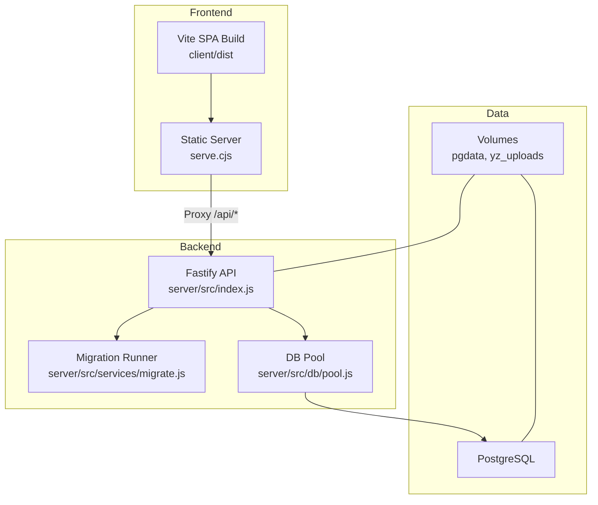
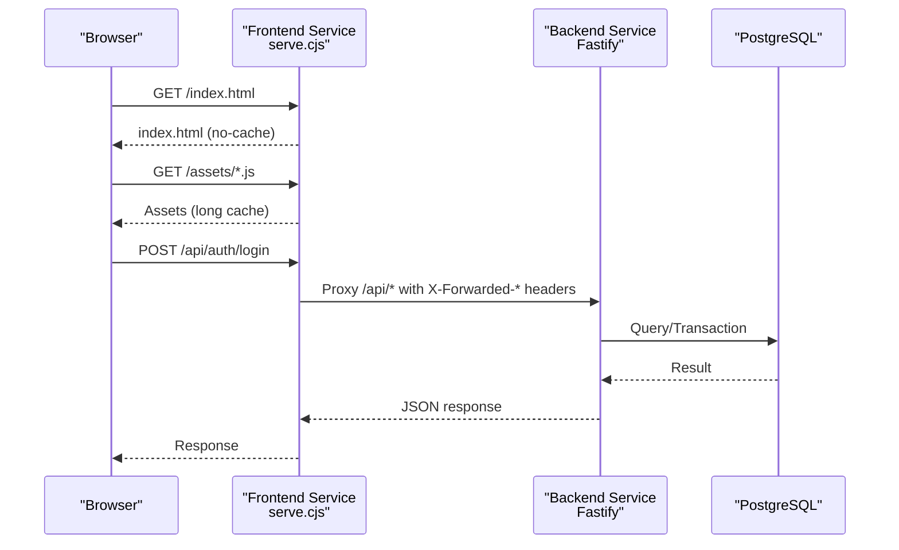
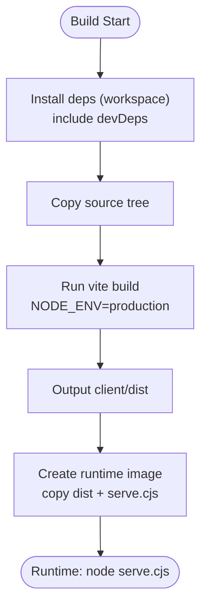
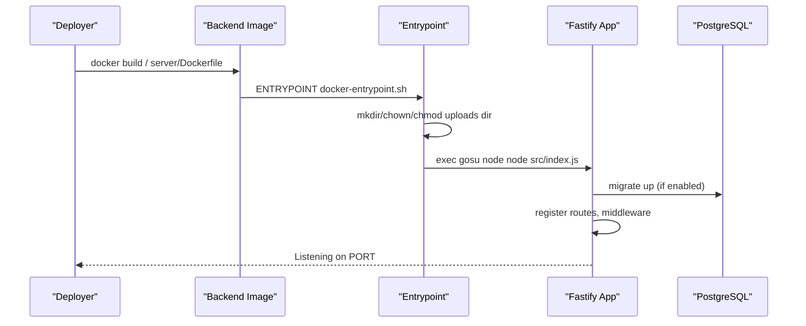
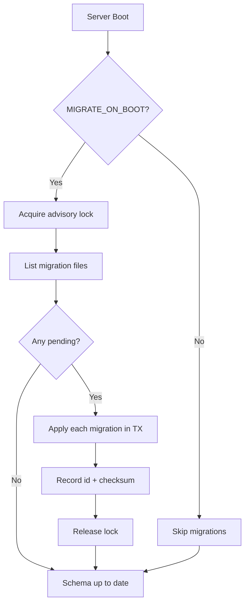
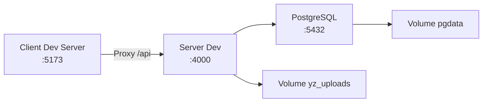
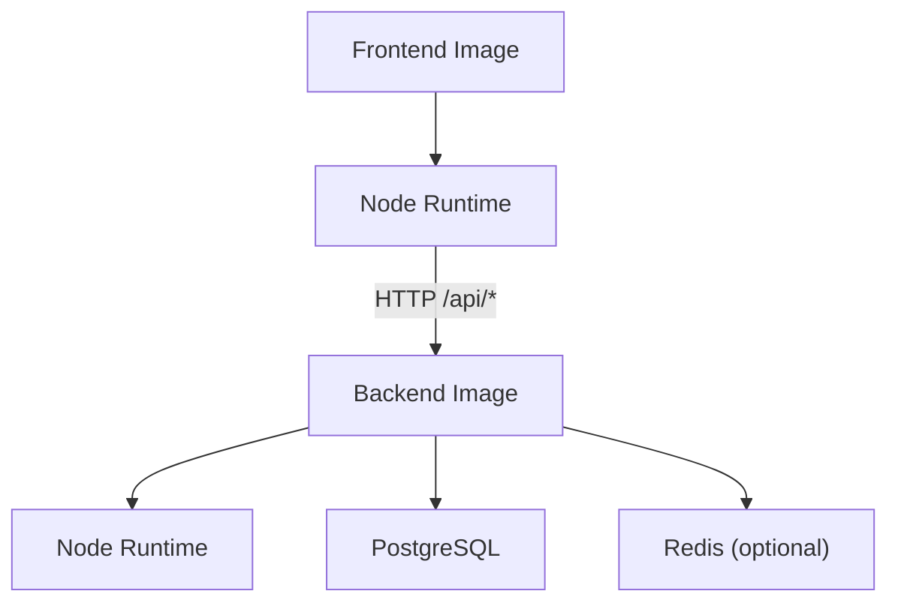

# Deployment

<cite>
**Referenced Files in This Document**
- [docker-compose.yml](file://docker-compose.yml)
- [Dockerfile](file://Dockerfile)
- [server/Dockerfile](file://server/Dockerfile)
- [server/docker-entrypoint.sh](file://server/docker-entrypoint.sh)
- [serve.cjs](file://serve.cjs)
- [client/vite.config.js](file://client/vite.config.js)
- [server/src/config.js](file://server/src/config.js)
- [server/src/index.js](file://server/src/index.js)
- [server/src/services/migrate.js](file://server/src/services/migrate.js)
- [server/src/db/pool.js](file://server/src/db/pool.js)
- [server/package.json](file://server/package.json)
- [client/package.json](file://client/package.json)
</cite>

## Table of Contents
1. [Introduction](#introduction)
2. [Project Structure](#project-structure)
3. [Core Components](#core-components)
4. [Architecture Overview](#architecture-overview)
5. [Detailed Component Analysis](#detailed-component-analysis)
6. [Dependency Analysis](#dependency-analysis)
7. [Performance Considerations](#performance-considerations)
8. [Troubleshooting Guide](#troubleshooting-guide)
9. [Conclusion](#conclusion)
10. [Appendices](#appendices)

## Introduction
This document provides comprehensive deployment guidance for the YZ Yayın Takip application. It covers containerization with Docker and Docker Compose, environment configuration for databases, email, push notifications, and third-party integrations, build processes for frontend and backend, production deployment checklists, health checks, monitoring, scaling, high availability, backup and recovery procedures, troubleshooting, and performance optimization tips.

## Project Structure
The repository is organized into three primary runtime components:
- Frontend SPA (Vite + React) built to static assets and served by a minimal Node server that also proxies API calls.
- Backend API (Fastify) with PostgreSQL migrations, session-based auth, file uploads, and optional Redis-backed features.
- Database (PostgreSQL) with versioned SQL migrations and optional seed data.

**Diagram sources**
- [Dockerfile:1-65](file://Dockerfile#L1-L65)
- [server/Dockerfile:1-97](file://server/Dockerfile#L1-L97)
- [serve.cjs:1-221](file://serve.cjs#L1-L221)
- [server/src/index.js:1-236](file://server/src/index.js#L1-L236)
- [server/src/services/migrate.js:1-176](file://server/src/services/migrate.js#L1-L176)
- [server/src/db/pool.js:1-100](file://server/src/db/pool.js#L1-L100)
- [docker-compose.yml:1-82](file://docker-compose.yml#L1-L82)

**Section sources**
- [docker-compose.yml:1-82](file://docker-compose.yml#L1-L82)
- [Dockerfile:1-65](file://Dockerfile#L1-L65)
- [server/Dockerfile:1-97](file://server/Dockerfile#L1-L97)

## Core Components
- Frontend SPA: Built via Vite; production image serves static files and proxies API requests to the backend.
- Backend API: Fastify app with secure defaults, CORS, multipart uploads, session cookies, rate limiting, and health endpoint.
- Database: PostgreSQL with migration runner ensuring schema consistency on boot.
- Orchestration: Docker Compose for local development; Dokploy-compatible Dockerfiles for production builds.

Key responsibilities:
- Build-time separation of dependencies vs runtime to minimize image size.
- Health checks and graceful shutdowns for reliable deployments.
- Persistent volumes for database and uploaded files.
- Environment-driven configuration for DB, SMTP, push, and session behavior.

**Section sources**
- [server/src/index.js:1-236](file://server/src/index.js#L1-L236)
- [server/src/config.js:1-122](file://server/src/config.js#L1-L122)
- [server/src/services/migrate.js:1-176](file://server/src/services/migrate.js#L1-L176)
- [server/src/db/pool.js:1-100](file://server/src/db/pool.js#L1-L100)
- [serve.cjs:1-221](file://serve.cjs#L1-L221)
- [Dockerfile:1-65](file://Dockerfile#L1-L65)
- [server/Dockerfile:1-97](file://server/Dockerfile#L1-L97)

## Architecture Overview
Production architecture uses two services:
- Frontend service serving the SPA and proxying API calls to the backend.
- Backend service exposing the API and managing database migrations.

Local development uses Docker Compose to run PostgreSQL, backend, and a Vite dev server together.

**Diagram sources**
- [serve.cjs:144-189](file://serve.cjs#L144-L189)
- [server/src/index.js:148-171](file://server/src/index.js#L148-L171)
- [server/src/db/pool.js:14-25](file://server/src/db/pool.js#L14-L25)

## Detailed Component Analysis

### Frontend Build and Serve
- Build process: Two-stage Docker build installs workspace dependencies and runs Vite build to client/dist. NODE_ENV is set per-command to avoid shipping development code.
- Runtime serve: A lightweight Node server serves static assets with appropriate cache headers and proxies /api/* to the backend. It ensures correct MIME types, PWA support, and safe path resolution.

**Diagram sources**
- [Dockerfile:13-51](file://Dockerfile#L13-L51)
- [Dockerfile:53-65](file://Dockerfile#L53-L65)
- [serve.cjs:1-221](file://serve.cjs#L1-L221)

**Section sources**
- [Dockerfile:1-65](file://Dockerfile#L1-L65)
- [serve.cjs:1-221](file://serve.cjs#L1-L221)
- [client/vite.config.js:1-37](file://client/vite.config.js#L1-L37)
- [client/package.json:1-57](file://client/package.json#L1-L57)

### Backend Build and Serve
- Build process: Two-stage Docker build installs production-only dependencies and copies source into a minimal runtime image.
- Runtime: Entrypoint prepares upload directory permissions, drops privileges, and starts Fastify. Health endpoint exposes commit info for verification.

**Diagram sources**
- [server/Dockerfile:22-97](file://server/Dockerfile#L22-L97)
- [server/docker-entrypoint.sh:1-57](file://server/docker-entrypoint.sh#L1-L57)
- [server/src/index.js:176-195](file://server/src/index.js#L176-L195)
- [server/src/services/migrate.js:87-123](file://server/src/services/migrate.js#L87-L123)

**Section sources**
- [server/Dockerfile:1-97](file://server/Dockerfile#L1-L97)
- [server/docker-entrypoint.sh:1-57](file://server/docker-entrypoint.sh#L1-L57)
- [server/src/index.js:1-236](file://server/src/index.js#L1-L236)
- [server/src/services/migrate.js:1-176](file://server/src/services/migrate.js#L1-L176)

### Database and Migrations
- Migration runner discovers ordered SQL files under db/migrations, applies pending ones within transactions, and records checksums. Advisory locks prevent concurrent migration races across multiple instances.
- Connection pool manages pg connections with error handling and transaction helpers including after-commit hooks for side effects.

**Diagram sources**
- [server/src/services/migrate.js:80-123](file://server/src/services/migrate.js#L80-L123)
- [server/src/services/migrate.js:32-66](file://server/src/services/migrate.js#L32-L66)
- [server/src/db/pool.js:49-88](file://server/src/db/pool.js#L49-L88)

**Section sources**
- [server/src/services/migrate.js:1-176](file://server/src/services/migrate.js#L1-L176)
- [server/src/db/pool.js:1-100](file://server/src/db/pool.js#L1-L100)

### Local Development with Docker Compose
- Services: PostgreSQL, backend (Fastify), and client (Vite dev server).
- Persistence: Named volumes for database and uploads.
- Dev convenience: Auto-run migrations and seed on boot; CORS configured for Vite dev origin.

**Diagram sources**
- [docker-compose.yml:18-76](file://docker-compose.yml#L18-L76)

**Section sources**
- [docker-compose.yml:1-82](file://docker-compose.yml#L1-L82)

## Dependency Analysis
- Frontend depends on Vite build toolchain and React ecosystem; production runtime only needs Node to serve static assets and proxy API calls.
- Backend depends on Fastify, PostgreSQL driver, optional Redis, Nodemailer, and Web Push libraries.
- Orchestration ties services via environment variables and network; persistent storage decouples state from containers.

**Diagram sources**
- [Dockerfile:53-65](file://Dockerfile#L53-L65)
- [server/Dockerfile:39-97](file://server/Dockerfile#L39-L97)
- [server/package.json:18-29](file://server/package.json#L18-L29)

**Section sources**
- [server/package.json:1-31](file://server/package.json#L1-L31)
- [client/package.json:1-57](file://client/package.json#L1-L57)

## Performance Considerations
- Use production images with minimal layers and no dev dependencies.
- Enable connection pooling for PostgreSQL; tune PG_POOL_MAX based on workload.
- Configure cache headers for static assets; ensure index.html and service worker are not cached to enable fast rollouts.
- Prefer single-instance migrations with advisory locks to avoid contention.
- For high traffic, consider Redis-backed rate limiting and shared caches.

[No sources needed since this section provides general guidance]

## Troubleshooting Guide
Common issues and resolutions:
- Health check failures: Verify /api/health responds; ensure migrations completed and DB is reachable.
- Upload permission errors: Entrypoint sets ownership and permissions for the uploads directory; confirm volume mount paths match expected locations.
- CORS errors: Ensure CORS_ORIGINS includes the SPA origin; in prod, set explicit origins.
- Session cookie issues: Confirm SESSION_COOKIE_SECURE and SESSION_COOKIE_SAMESITE settings align with HTTPS and domain strategy.
- Rate limiting blocks: If using memory store, ensure single instance; otherwise configure Redis store via RATE_LIMIT_STORE and REDIS_URL.
- Push notifications not delivered: Set VAPID keys and subject; missing keys disable push but app remains functional.

**Section sources**
- [server/Dockerfile:84-90](file://server/Dockerfile#L84-L90)
- [server/docker-entrypoint.sh:30-57](file://server/docker-entrypoint.sh#L30-L57)
- [server/src/config.js:31-63](file://server/src/config.js#L31-L63)
- [server/src/config.js:85-121](file://server/src/config.js#L85-L121)
- [serve.cjs:51-99](file://serve.cjs#L51-L99)

## Conclusion
YZ Yayın Takip is designed for straightforward containerized deployment with clear separation between frontend and backend, robust migration handling, and sensible defaults for security and performance. Follow the environment configuration guidelines, use the provided Dockerfiles and Compose setup for local parity, and apply the production checklist to ensure reliability, scalability, and maintainability.

[No sources needed since this section summarizes without analyzing specific files]

## Appendices

### Environment Variables Reference
- Database
  - DATABASE_URL: PostgreSQL connection string
  - PG_POOL_MAX: Max connections in pool
- Server
  - PORT, HOST: Bind address and port
  - MIGRATE_ON_BOOT, SEED_ON_BOOT: Control boot-time actions
  - TRUST_HEADER_AUTH: Allow legacy header auth (disable in prod)
  - CORS_ORIGINS: Comma-separated allowed origins
  - LOG_LEVEL: Logging verbosity
- Session
  - SESSION_COOKIE_NAME, SESSION_TTL_DAYS, SESSION_COOKIE_SECURE, SESSION_COOKIE_SAMESITE, SESSION_COOKIE_DOMAIN
- Email
  - SMTP_HOST, SMTP_PORT, SMTP_USER, SMTP_PASS, SMTP_FROM, SMTP_SECURE
- Invite URL
  - INVITE_BASE_URL: Base URL for invitation links
- Rate Limiting
  - RATE_LIMIT_STORE: 'memory' or 'redis'
  - REDIS_URL: Redis connection string (used when store=redis)
- Push Notifications
  - VAPID_PUBLIC_KEY, VAPID_PRIVATE_KEY, VAPID_SUBJECT
- Frontend Proxy (prod)
  - API_UPSTREAM: Upstream backend URL for /api/* proxy

**Section sources**
- [server/src/config.js:22-121](file://server/src/config.js#L22-L121)
- [docker-compose.yml:43-51](file://docker-compose.yml#L43-L51)
- [serve.cjs:22-26](file://serve.cjs#L22-L26)

### Production Deployment Checklist
- Build artifacts
  - Frontend: Ensure client/dist exists and is served by serve.cjs.
  - Backend: Ensure production node_modules and source are present.
- Environment
  - Set DATABASE_URL, PG_POOL_MAX, CORS_ORIGINS, SMTP_* if used, VAPID_* if push is required, REDIS_URL if using Redis.
  - Disable TRUST_HEADER_AUTH in production.
  - Set SESSION_COOKIE_SECURE=true and appropriate SAMESITE/domain.
- Storage
  - Mount persistent volumes for PostgreSQL data and uploads.
- Health and Monitoring
  - Verify /api/health returns ok and commit info.
  - Configure platform probes (interval, timeout, retries).
- Security
  - Ensure HTTPS at edge; restrict CORS to known origins.
  - Validate upload sizes and content types.
- Scaling
  - Run multiple backend replicas behind a load balancer.
  - Use Redis for shared rate limiting and caching if needed.
  - Ensure migrations run safely with advisory locks.

**Section sources**
- [server/Dockerfile:84-90](file://server/Dockerfile#L84-L90)
- [server/src/index.js:163-171](file://server/src/index.js#L163-L171)
- [server/src/config.js:31-63](file://server/src/config.js#L31-L63)
- [server/src/services/migrate.js:80-123](file://server/src/services/migrate.js#L80-L123)

### Health Checks and Monitoring
- Backend health endpoint: GET /api/health returns status, timestamp, and commit hash.
- Container-level healthcheck defined in server/Dockerfile.
- Frontend cache headers: index.html and service worker are not cached; hashed assets are cached aggressively.

**Section sources**
- [server/Dockerfile:84-90](file://server/Dockerfile#L84-L90)
- [server/src/index.js:163-171](file://server/src/index.js#L163-L171)
- [serve.cjs:51-99](file://serve.cjs#L51-L99)

### Scaling and High Availability
- Horizontal scaling: Run multiple backend instances; share database and optionally Redis.
- Load balancing: Place a reverse proxy/load balancer in front of backend; preserve X-Forwarded-* headers.
- Migration safety: Advisory locks prevent concurrent schema changes; keep MIGRATE_ON_BOOT consistent across instances.
- Statelessness: Keep backend stateless; persist uploads and database externally.

**Section sources**
- [server/src/services/migrate.js:80-123](file://server/src/services/migrate.js#L80-L123)
- [serve.cjs:144-189](file://serve.cjs#L144-L189)

### Backup and Recovery
- PostgreSQL
  - Use pg_dump/pg_restore or managed service snapshots for backups.
  - Schedule regular backups; verify restore procedures periodically.
- Uploaded Files
  - Back up the mounted volume containing .yz-uploads.
  - Ensure consistent snapshots or offline backups to avoid corruption.
- Disaster Recovery
  - Restore database first, then verify uploads exist.
  - Rebuild frontend/backend images as needed; validate health endpoints.

[No sources needed since this section provides general guidance]

### Build Processes
- Frontend
  - Two-stage build: install workspace deps, run vite build, copy dist to runtime image.
  - Exposes build-time arg VITE_API_BASE_URL for custom API base if needed.
- Backend
  - Two-stage build: install production deps, copy source, add entrypoint and healthcheck.
  - Supports GIT_COMMIT build-arg for health reporting.

**Section sources**
- [Dockerfile:13-65](file://Dockerfile#L13-L65)
- [server/Dockerfile:22-97](file://server/Dockerfile#L22-L97)