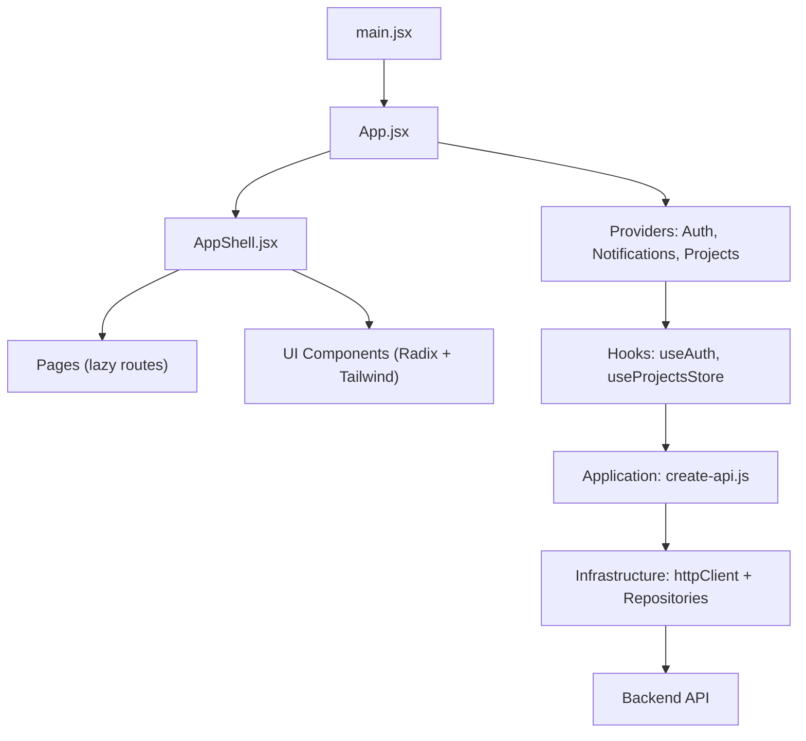
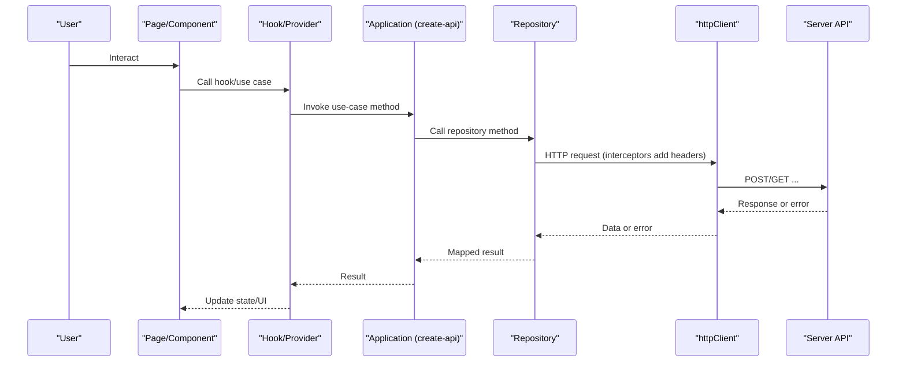
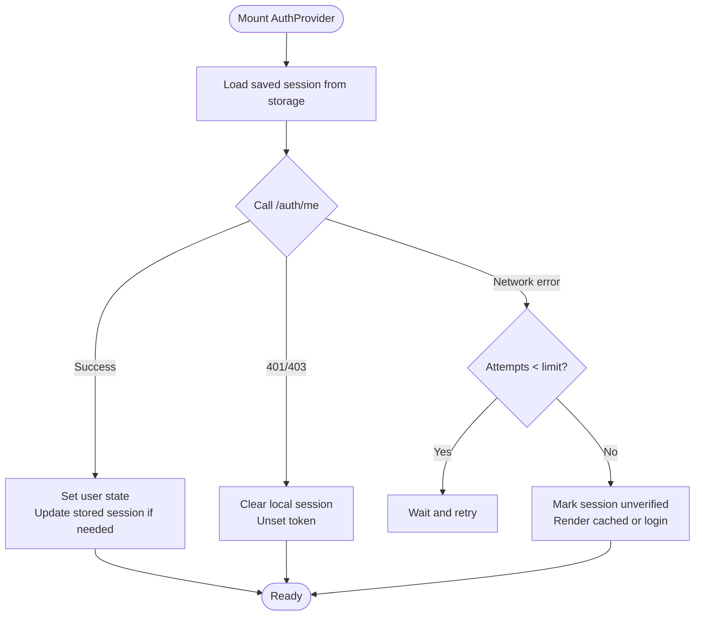
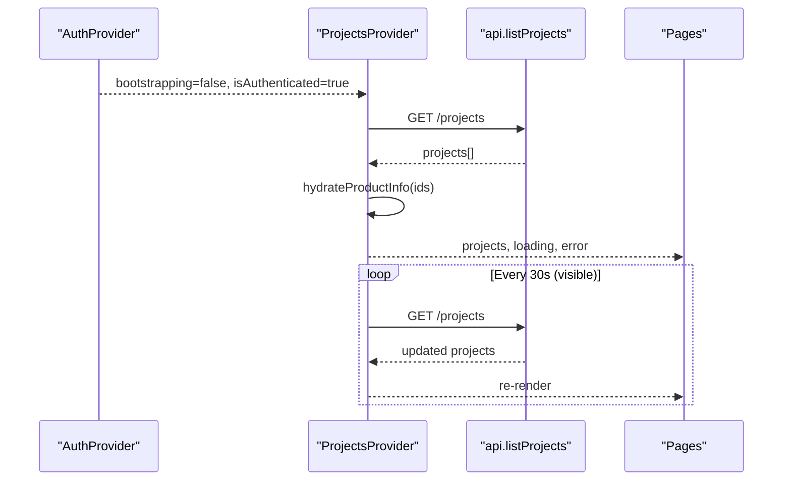
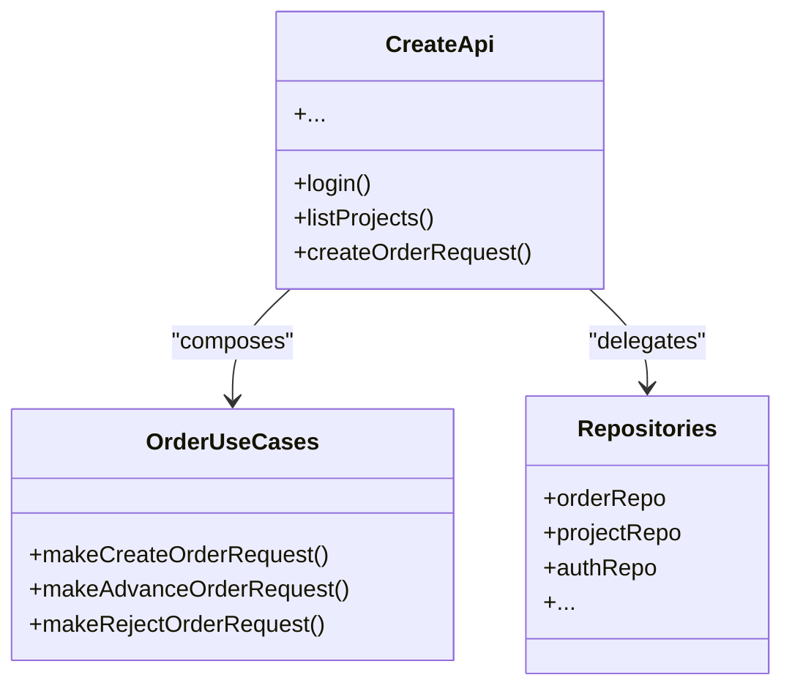
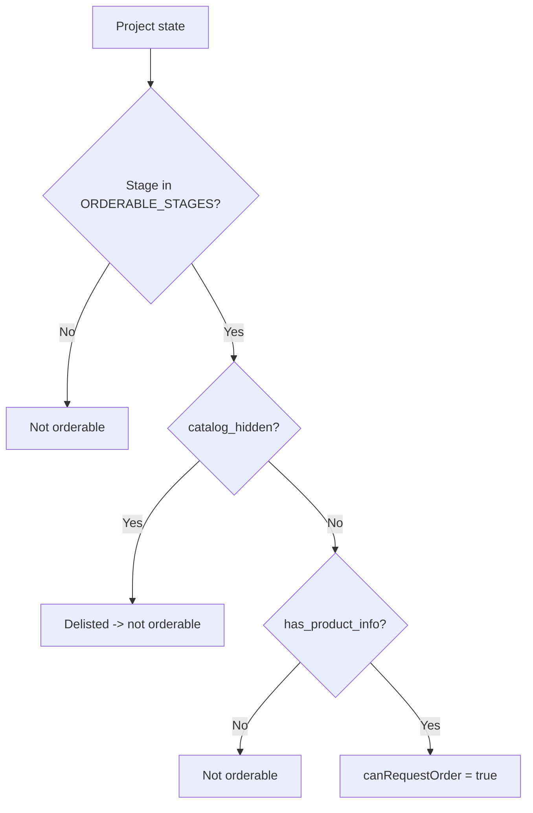
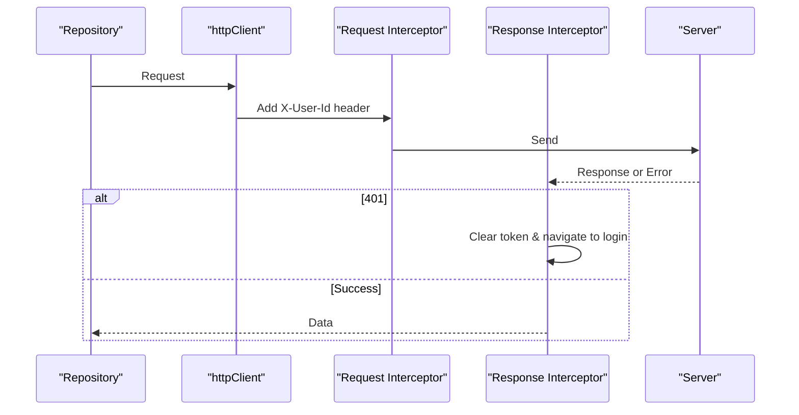
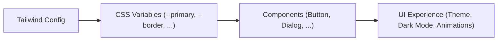
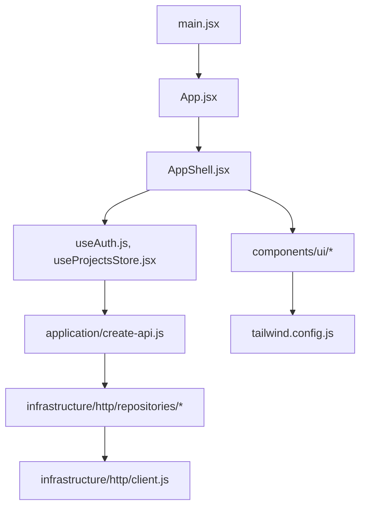

# Frontend Development

<cite>
**Referenced Files in This Document**
- [main.jsx](file://client/src/main.jsx)
- [App.jsx](file://client/src/App.jsx)
- [package.json](file://client/package.json)
- [tailwind.config.js](file://client/tailwind.config.js)
- [components.json](file://client/components.json)
- [useAuth.js](file://client/src/hooks/useAuth.js)
- [client.js](file://client/src/infrastructure/http/client.js)
- [create-api.js](file://client/src/application/create-api.js)
- [index.js](file://client/src/domain/index.js)
- [pipeline.js](file://client/src/domain/services/pipeline.js)
- [http-auth.repository.js](file://client/src/infrastructure/http/repositories/http-auth.repository.js)
- [create-order-request.js](file://client/src/application/use-cases/orders/create-order-request.js)
- [useProjectsStore.jsx](file://client/src/hooks/useProjectsStore.jsx)
- [AppShell.jsx](file://client/src/components/AppShell.jsx)
- [button.jsx](file://client/src/components/ui/button.jsx)
</cite>

## Table of Contents
1. [Introduction](#introduction)
2. [Project Structure](#project-structure)
3. [Core Components](#core-components)
4. [Architecture Overview](#architecture-overview)
5. [Detailed Component Analysis](#detailed-component-analysis)
6. [Dependency Analysis](#dependency-analysis)
7. [Performance Considerations](#performance-considerations)
8. [Troubleshooting Guide](#troubleshooting-guide)
9. [Conclusion](#conclusion)
10. [Appendices](#appendices)

## Introduction
This document explains the React-based client application’s architecture and development practices. It covers component composition with Radix UI primitives, custom components, a custom hook system for state management and API communication, an application layer that orchestrates business processes via use cases and mappers, a domain layer encapsulating business rules and constants, and an infrastructure layer providing HTTP clients and repositories. It also documents styling guidelines using Tailwind CSS, responsive design patterns, accessibility compliance, testing strategies, component composition patterns, and performance optimization techniques.

## Project Structure
The client is organized into clear layers:
- Presentation (pages and components): UI screens and reusable UI elements built on Radix primitives and styled with Tailwind CSS.
- Application (use cases and mappers): Orchestrates cross-aggregate workflows and maps data between layers.
- Domain (constants and services): Encapsulates business rules, stage pipelines, and capability checks.
- Infrastructure (HTTP client and repositories): Abstracts API calls behind typed repositories.
- Hooks and providers: Centralize auth, projects store, notifications, and other cross-cutting concerns.

**Diagram sources**
- [main.jsx:65-79](file://client/src/main.jsx#L65-L79)
- [App.jsx:90-131](file://client/src/App.jsx#L90-L131)
- [AppShell.jsx:76-158](file://client/src/components/AppShell.jsx#L76-L158)
- [create-api.js:29-44](file://client/src/application/create-api.js#L29-L44)
- [client.js:36-56](file://client/src/infrastructure/http/client.js#L36-L56)

**Section sources**
- [main.jsx:1-80](file://client/src/main.jsx#L1-L80)
- [App.jsx:1-297](file://client/src/App.jsx#L1-L297)
- [package.json:1-57](file://client/package.json#L1-L57)

## Core Components
- AppShell: Root layout for authenticated pages; provides sidebar navigation, top bar, notification bell, and route outlet with Suspense fallbacks.
- UI primitives: Accessible, themeable components (Button, Dialog, Select, Tabs, Tooltip, etc.) built on Radix UI and styled with Tailwind CSS.
- Providers and hooks: Auth provider manages session lifecycle and user state; ProjectsProvider fetches and caches project data with background refresh and resume handling.

Key responsibilities:
- Routing and guards: Role-based access control and protected routes.
- State orchestration: Auth state, project list, notifications, and push integration.
- UI composition: Reusable UI building blocks with consistent theming and accessibility.

**Section sources**
- [AppShell.jsx:76-347](file://client/src/components/AppShell.jsx#L76-L347)
- [button.jsx:1-87](file://client/src/components/ui/button.jsx#L1-L87)
- [useAuth.js:54-243](file://client/src/hooks/useAuth.js#L54-L243)
- [useProjectsStore.jsx:9-144](file://client/src/hooks/useProjectsStore.jsx#L9-L144)

## Architecture Overview
The app follows a layered architecture:
- Presentation: Pages and components consume context and hooks.
- Application: Use cases compose repositories to implement features (e.g., order requests).
- Domain: Business rules and constants define allowed transitions and capabilities.
- Infrastructure: Axios-based HTTP client with interceptors and repositories abstract backend endpoints.

**Diagram sources**
- [create-api.js:29-44](file://client/src/application/create-api.js#L29-L44)
- [client.js:114-179](file://client/src/infrastructure/http/client.js#L114-L179)
- [http-auth.repository.js:10-41](file://client/src/infrastructure/http/repositories/http-auth.repository.js#L10-L41)
- [create-order-request.js:10-22](file://client/src/application/use-cases/orders/create-order-request.js#L10-L22)

## Detailed Component Analysis

### Authentication Flow (useAuth)
- Bootstrapping: On mount, attempts to verify session via server endpoint; retries briefly on transient failures to avoid false logouts during cold starts.
- Session persistence: Supports “remember me” by persisting token and user with expiry; otherwise memory-only session.
- Guards: Provides isAuthenticated, bootstrapping, login/logout/updateUser functions used by routing guards and UI.

**Diagram sources**
- [useAuth.js:82-162](file://client/src/hooks/useAuth.js#L82-L162)

**Section sources**
- [useAuth.js:1-250](file://client/src/hooks/useAuth.js#L1-L250)

### Projects Store (useProjectsStore)
- Fetch strategy: Waits for authentication bootstrap before fetching projects; polls every 30 seconds when visible; refetches on app resume.
- Local cache: Maintains a normalized list of projects; supports optimistic updates via updateOne/addOne.
- Filtering: Excludes legacy imported products from pipeline views while exposing allProjects where needed.

**Diagram sources**
- [useProjectsStore.jsx:18-91](file://client/src/hooks/useProjectsStore.jsx#L18-L91)
- [useProjectsStore.jsx:103-126](file://client/src/hooks/useProjectsStore.jsx#L103-L126)

**Section sources**
- [useProjectsStore.jsx:1-151](file://client/src/hooks/useProjectsStore.jsx#L1-L151)

### Application Layer: Use Cases and API Composition
- Composition root: createApi wires repositories and exposes a unified surface for hooks/pages.
- Use cases: Encapsulate cross-aggregate flows (e.g., order creation) and enforce payload constraints before calling repositories.

**Diagram sources**
- [create-api.js:29-44](file://client/src/application/create-api.js#L29-L44)
- [create-api.js:168-188](file://client/src/application/create-api.js#L168-L188)
- [create-order-request.js:10-22](file://client/src/application/use-cases/orders/create-order-request.js#L10-L22)

**Section sources**
- [create-api.js:1-203](file://client/src/application/create-api.js#L1-L203)
- [create-order-request.js:1-23](file://client/src/application/use-cases/orders/create-order-request.js#L1-L23)

### Domain Layer: Business Rules and Constants
- Pipeline rules: Stage transitions, catalog listing, handover eligibility, demo/ozalit approvals, and production gates.
- Capabilities: Functions determine who can perform actions at each stage (e.g., approve ozalit, reject at stage).
- Constants: Stages, labels, status styles, subtasks, passes, orders.

**Diagram sources**
- [pipeline.js:17-30](file://client/src/domain/services/pipeline.js#L17-L30)

**Section sources**
- [index.js:1-45](file://client/src/domain/index.js#L1-L45)
- [pipeline.js:1-200](file://client/src/domain/services/pipeline.js#L1-L200)

### Infrastructure Layer: HTTP Client and Repositories
- HTTP client: Axios instance with base URL resolution, timeout, credentials, request/response interceptors, and standardized error mapping.
- Repositories: Per-domain modules (auth, projects, orders, etc.) encapsulate endpoint calls and return structured data.

**Diagram sources**
- [client.js:36-56](file://client/src/infrastructure/http/client.js#L36-L56)
- [client.js:114-179](file://client/src/infrastructure/http/client.js#L114-L179)
- [http-auth.repository.js:10-41](file://client/src/infrastructure/http/repositories/http-auth.repository.js#L10-L41)

**Section sources**
- [client.js:1-182](file://client/src/infrastructure/http/client.js#L1-L182)
- [http-auth.repository.js:1-134](file://client/src/infrastructure/http/repositories/http-auth.repository.js#L1-L134)

### Styling Guidelines and Accessibility
- Theme tokens: Colors mapped to CSS variables; brand palette and pastels defined for charts and kanban.
- Typography: Custom fonts configured for sans, mono, display, serif, and creative variants.
- Responsive: Sidebar collapses to icon rail on desktop; drawer on mobile; safe-area insets for iOS home indicators.
- Accessibility: Skip links, aria attributes, focus rings, and keyboard-friendly interactions across components.

**Diagram sources**
- [tailwind.config.js:7-86](file://client/tailwind.config.js#L7-L86)
- [components.json:1-20](file://client/components.json#L1-L20)

**Section sources**
- [tailwind.config.js:1-88](file://client/tailwind.config.js#L1-L88)
- [components.json:1-20](file://client/components.json#L1-L20)
- [AppShell.jsx:207-233](file://client/src/components/AppShell.jsx#L207-L233)

## Dependency Analysis
High-level dependencies among core modules:

**Diagram sources**
- [main.jsx:65-79](file://client/src/main.jsx#L65-L79)
- [App.jsx:90-131](file://client/src/App.jsx#L90-L131)
- [AppShell.jsx:76-158](file://client/src/components/AppShell.jsx#L76-L158)
- [create-api.js:29-44](file://client/src/application/create-api.js#L29-L44)
- [client.js:36-56](file://client/src/infrastructure/http/client.js#L36-L56)
- [tailwind.config.js:7-86](file://client/tailwind.config.js#L7-L86)

**Section sources**
- [package.json:15-39](file://client/package.json#L15-L39)
- [create-api.js:29-44](file://client/src/application/create-api.js#L29-L44)

## Performance Considerations
- Code splitting: Lazy-loading routes reduces initial bundle size; Suspense fallbacks keep chrome visible.
- Network timeouts: Global 20s timeout prevents indefinite hangs; uploads opt out when necessary.
- Polling strategy: Projects store polls only when visible and resumes on foreground to save battery/data.
- Startup resilience: Short retry loops and watchdog timers prevent blank screens during cold launches.
- PWA recovery: Preload error handler reloads once to recover from stale chunk references after deployments.

[No sources needed since this section provides general guidance]

## Troubleshooting Guide
Common issues and resolutions:
- Blank screen on cold launch: The app retries /auth/me briefly and renders cached state; if network remains down, it marks session unverified and retries on resume.
- 401 redirects: Response interceptor clears token and navigates to login when server rejects authentication; ensures users are not stuck on error states.
- Offline errors: Requests without response map to friendly offline messages instead of raw Axios errors.
- Route fallbacks: Suspense boundaries show consistent skeletons while lazy chunks load.

**Section sources**
- [useAuth.js:82-162](file://client/src/hooks/useAuth.js#L82-L162)
- [client.js:120-179](file://client/src/infrastructure/http/client.js#L120-L179)
- [App.jsx:96-131](file://client/src/App.jsx#L96-L131)

## Conclusion
The client application uses a clean, layered architecture with clear separation of concerns: presentation, application, domain, and infrastructure. Radix UI primitives and Tailwind CSS provide accessible, themeable components. Custom hooks and providers centralize state and side effects, while repositories and use cases encapsulate API interactions and business workflows. Robust error handling, performance optimizations, and responsive design ensure a reliable user experience across devices and network conditions.

[No sources needed since this section summarizes without analyzing specific files]

## Appendices

### Testing Strategies
- Unit tests: Vitest runs unit tests for domain logic and utilities; coverage scripts available.
- Component tests: Use jsdom for rendering and interaction tests of UI components.
- Integration tests: Playwright for end-to-end scenarios across critical flows.

**Section sources**
- [package.json:6-14](file://client/package.json#L6-L14)
- [package.json:40-51](file://client/package.json#L40-L51)

### Component Composition Patterns
- Radix primitives: Unstyled, accessible primitives composed into themed components.
- Variants and slots: Button uses cva for variants and Radix Slot for flexible composition.
- Context-driven behavior: Providers supply shared state (auth, projects, notifications) consumed by components via hooks.

**Section sources**
- [button.jsx:1-87](file://client/src/components/ui/button.jsx#L1-L87)
- [useAuth.js:54-243](file://client/src/hooks/useAuth.js#L54-L243)
- [useProjectsStore.jsx:9-144](file://client/src/hooks/useProjectsStore.jsx#L9-L144)