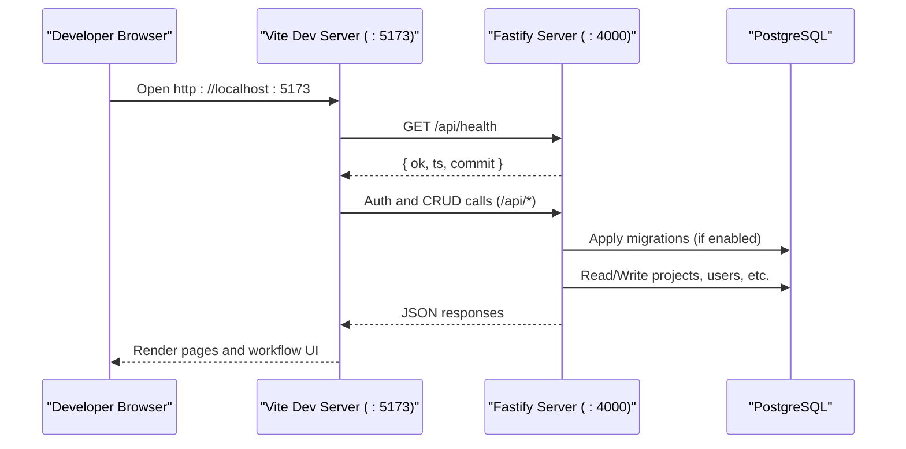
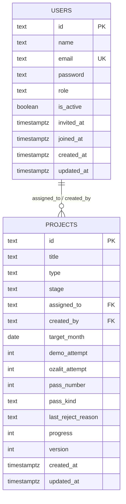
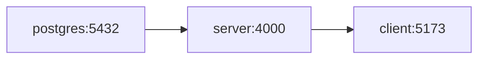

# Getting Started

<cite>
**Referenced Files in This Document**
- [docker-compose.yml](file://docker-compose.yml)
- [server/Dockerfile](file://server/Dockerfile)
- [server/docker-entrypoint.sh](file://server/docker-entrypoint.sh)
- [package.json](file://package.json)
- [server/package.json](file://server/package.json)
- [client/package.json](file://client/package.json)
- [server/src/config.js](file://server/src/config.js)
- [server/src/index.js](file://server/src/index.js)
- [client/src/main.jsx](file://client/src/main.jsx)
- [server/db/migrations/001__users.sql](file://server/db/migrations/001__users.sql)
- [server/db/migrations/002__projects.sql](file://server/db/migrations/002__projects.sql)
- [server/src/domain/stages.js](file://server/src/domain/stages.js)
- [client/src/domain/constants/stages.js](file://client/src/domain/constants/stages.js)
</cite>

## Table of Contents
1. Introduction
2. Project Structure
3. Core Components
4. Architecture Overview
5. Detailed Component Analysis
6. Dependency Analysis
7. Performance Considerations
8. Troubleshooting Guide
9. Conclusion

## Introduction
YZ Yayın Takip is a Turkish publishing house workflow management system that coordinates book production from concept to market release. It models the end-to-end pipeline (design, demos, print proofs, printing, customs, and sales), supports multiple pipelines for domestic and China-bound titles, and provides role-based collaboration across team leaders, designers, printers, and sales.

This guide helps you set up a local development environment using Node.js, PostgreSQL, and Docker; initialize the database; configure the application; and perform your first tasks such as creating projects, advancing stages, and navigating the interface.

## Project Structure
The repository is a monorepo with two main workspaces:
- client: React + Vite SPA that renders the publishing workflow UI
- server: Fastify API backed by PostgreSQL that enforces publishing-stage transitions and orchestrates notifications

```mermaid
graph TB
subgraph "Client"
CMain["client/src/main.jsx"]
CPkg["client/package.json"]
end
subgraph "Server"
SIndex["server/src/index.js"]
SConfig["server/src/config.js"]
SDockerfile["server/Dockerfile"]
SEntrypoint["server/docker-entrypoint.sh"]
end
subgraph "Database"
PG["PostgreSQL 16"]
M1["migrations/001__users.sql"]
M2["migrations/002__projects.sql"]
end
subgraph "Compose"
Compose["docker-compose.yml"]
end
Compose --> PG
Compose --> SIndex
Compose --> CMain
SIndex --> SConfig
SIndex --> M1
SIndex --> M2
CMain --> SIndex
```

**Diagram sources**
- [docker-compose.yml:1-82](file://docker-compose.yml#L1-L82)
- [server/Dockerfile:1-97](file://server/Dockerfile#L1-L97)
- [server/docker-entrypoint.sh:1-57](file://server/docker-entrypoint.sh#L1-L57)
- [server/src/index.js:1-236](file://server/src/index.js#L1-L236)
- [server/src/config.js:1-122](file://server/src/config.js#L1-L122)
- [client/src/main.jsx:1-80](file://client/src/main.jsx#L1-L80)
- [server/db/migrations/001__users.sql:1-35](file://server/db/migrations/001__users.sql#L1-L35)
- [server/db/migrations/002__projects.sql:1-39](file://server/db/migrations/002__projects.sql#L1-L39)

**Section sources**
- [docker-compose.yml:1-82](file://docker-compose.yml#L1-L82)
- [server/Dockerfile:1-97](file://server/Dockerfile#L1-L97)
- [server/docker-entrypoint.sh:1-57](file://server/docker-entrypoint.sh#L1-L57)
- [server/src/index.js:1-236](file://server/src/index.js#L1-L236)
- [client/src/main.jsx:1-80](file://client/src/main.jsx#L1-L80)

## Core Components
- Client (React SPA): Provides the user interface for managing projects, approvals, orders, handovers, meetings, and notifications. Built with Vite and served on port 5173 in development.
- Server (Fastify API): Implements authentication, project lifecycle, stage transitions, order requests, handovers, product info, push notifications, and more. Binds on port 4000 in development.
- Database (PostgreSQL): Stores users, projects, subtasks, orders, handovers, stage history, and related entities. Migrations are applied at boot when enabled.
- Compose stack: Orchestrates PostgreSQL, server, and client services for local development with persistent volumes for data and uploads.

Key runtime configuration is centralized in the server config module and can be overridden via environment variables or Docker Compose.

**Section sources**
- [client/package.json:1-57](file://client/package.json#L1-L57)
- [server/package.json:1-31](file://server/package.json#L1-L31)
- [server/src/config.js:1-122](file://server/src/config.js#L1-L122)
- [docker-compose.yml:1-82](file://docker-compose.yml#L1-L82)

## Architecture Overview
At a high level, the SPA communicates with the API over HTTP. The API applies business rules for publishing workflows, persists state in PostgreSQL, and emits notifications.



**Diagram sources**
- [server/src/index.js:163-171](file://server/src/index.js#L163-L171)
- [server/src/index.js:176-195](file://server/src/index.js#L176-L195)
- [docker-compose.yml:35-64](file://docker-compose.yml#L35-L64)
- [client/src/main.jsx:65-79](file://client/src/main.jsx#L65-L79)

## Detailed Component Analysis

### Installation Requirements
- Node.js: The server requires Node.js version 20 or newer.
- PostgreSQL: Version 16 is used in the compose stack.
- Docker and Docker Compose: Used to run the full local stack (PostgreSQL, server, client).

You can either:
- Use Docker Compose to run everything locally, or
- Run the server and client directly with Node.js and connect to a local or remote PostgreSQL instance.

**Section sources**
- [server/package.json:7-9](file://server/package.json#L7-L9)
- [docker-compose.yml:19-27](file://docker-compose.yml#L19-L27)
- [server/Dockerfile:22-40](file://server/Dockerfile#L22-L40)

### Local Development with Docker Compose
Recommended for parity with production-like setup.

Steps:
1. Ensure Docker and Docker Compose are installed.
2. From the repository root, start the stack:
   - docker compose up --build
3. Access:
   - Client: http://localhost:5173
   - API health: http://localhost:4000/api/health
4. On first boot, migrations and optional seed data are applied automatically based on environment flags.

What runs:
- PostgreSQL service with a named volume for persistence.
- Server container that binds on :4000, auto-runs migrations and seeds when enabled.
- Client container running Vite dev server on :5173, proxying API calls to the server.

Environment highlights:
- DATABASE_URL, PORT, HOST, CORS_ORIGINS, MIGRATE_ON_BOOT, SEED_ON_BOOT, TRUST_HEADER_AUTH are configured per service.
- Uploads are persisted under a named volume mounted into the server container.

**Section sources**
- [docker-compose.yml:1-82](file://docker-compose.yml#L1-L82)
- [server/src/config.js:22-63](file://server/src/config.js#L22-L63)

### Running Without Docker (Node.js + PostgreSQL)
If you prefer to run components locally:

Prerequisites:
- Node.js >= 20
- A running PostgreSQL instance accessible to the server

Steps:
1. Install dependencies at the workspace root:
   - npm ci
2. Start the server:
   - npm run server
3. Start the client:
   - npm run client
4. Configure the server to connect to your PostgreSQL instance via environment variables (e.g., DATABASE_URL).
5. Run migrations and seed if needed:
   - npm run migrate
   - npm run seed

Notes:
- The server’s default host/port and CORS origins are suitable for local development but should be explicitly set in production.
- The client proxies API calls to the server during development.

**Section sources**
- [package.json:7-16](file://package.json#L7-L16)
- [server/package.json:10-16](file://server/package.json#L10-L16)
- [server/src/config.js:22-40](file://server/src/config.js#L22-L40)

### Database Initialization
Migrations define the schema for users and projects (and many others). They are applied automatically when MIGRATE_ON_BOOT is true. You can also run them manually.

Key tables created early:
- users: stores team members and roles (team_leader, designer, printer, satis)
- projects: represents each book title across its pass loop, with stage, progress, and counters



**Diagram sources**
- [server/db/migrations/001__users.sql:20-32](file://server/db/migrations/001__users.sql#L20-L32)
- [server/db/migrations/002__projects.sql:7-33](file://server/db/migrations/002__projects.sql#L7-L33)

**Section sources**
- [server/db/migrations/001__users.sql:1-35](file://server/db/migrations/001__users.sql#L1-L35)
- [server/db/migrations/002__projects.sql:1-39](file://server/db/migrations/002__projects.sql#L1-L39)
- [server/src/index.js:176-192](file://server/src/index.js#L176-L192)

### First-Time Configuration
Core settings are read from environment variables and can be adjusted per deployment.

Important variables:
- DATABASE_URL: PostgreSQL connection string
- PORT, HOST: API bind address
- CORS_ORIGINS: Comma-separated list of allowed SPA origins
- MIGRATE_ON_BOOT, SEED_ON_BOOT: Control automatic migration and seeding
- TRUST_HEADER_AUTH: Allows legacy header-based identity in dev/test
- SMTP_*: Optional email settings for invitations and future notifications
- VAPID_*: Web Push keys for browser push notifications
- REDIS_URL: Optional shared rate-limit store

Defaults:
- In development, CORS allows localhost origins; in production, defaults lock to known hosts unless overridden.
- Session cookie behavior adapts to NODE_ENV for secure flags.

**Section sources**
- [server/src/config.js:22-121](file://server/src/config.js#L22-L121)

### Basic Usage Examples

#### Create a Project
- Navigate to the Projects page in the SPA.
- Create a new project with a title and select the pipeline type (TR or CIN).
- The project starts at the design stage and progresses through demos, print proofs, printing, customs (for CN), and sales.

Tip:
- Assign a team member to receive updates and action items.

**Section sources**
- [server/db/migrations/002__projects.sql:7-33](file://server/db/migrations/002__projects.sql#L7-L33)
- [client/src/domain/constants/stages.js:1-56](file://client/src/domain/constants/stages.js#L1-L56)

#### Advance Through Stages
- Designers submit demos and print proofs; team leaders approve or request revisions.
- Once approved, the project advances to the next stage in the pipeline.
- Certain stages require 100% completion before entering production-related phases.

Pipeline highlights:
- Domestic (TR): design → demo delivery/approval → print proof delivery/approval → approval → in print → sale
- China (CIN): design → China demo delivery/approval → China print approval → in print → customs → sale

**Section sources**
- [server/src/domain/stages.js:1-49](file://server/src/domain/stages.js#L1-L49)
- [client/src/domain/constants/stages.js:21-56](file://client/src/domain/constants/stages.js#L21-L56)

#### Manage Orders and Handovers
- Sales can request orders once a project reaches “In Print” or later stages.
- When physical copies are ready, printers initiate a handover request; sales confirm receipt to move to “On Sale.”

**Section sources**
- [client/src/domain/constants/stages.js:37-56](file://client/src/domain/constants/stages.js#L37-L56)

#### Navigate the Interface
- Dashboard and Kanban views show projects by stage.
- Project detail shows history, subtasks, approvals, and actions available to your role.
- Notifications bell aggregates in-app alerts and can integrate with web push in production builds.

**Section sources**
- [client/src/main.jsx:65-79](file://client/src/main.jsx#L65-L79)

## Dependency Analysis
The compose stack defines explicit service dependencies and ports. The server depends on PostgreSQL being healthy before starting. The client depends on the server for API access.



**Diagram sources**
- [docker-compose.yml:19-75](file://docker-compose.yml#L19-L75)

**Section sources**
- [docker-compose.yml:19-75](file://docker-compose.yml#L19-L75)

## Performance Considerations
- Connection pooling: Adjust PG_POOL_MAX according to expected concurrency.
- Request size limits: The server sets global and multipart limits to protect against oversized payloads.
- Rate limiting: Uses an in-memory store by default; switch to Redis for multi-instance deployments.
- Health checks: The server exposes a health endpoint used by orchestration tools.

[No sources needed since this section provides general guidance]

## Troubleshooting Guide

Common issues and resolutions:

- Cannot connect to PostgreSQL
  - Verify the database URL and credentials match the compose environment.
  - Ensure the postgres service is healthy before the server starts.

- Migrations fail on boot
  - Check database connectivity and permissions.
  - If using a managed database, ensure extensions are not required by migrations.

- CORS errors from the SPA
  - Confirm CORS_ORIGINS includes the client origin (http://localhost:5173 in dev).
  - Ensure cookies are allowed when credentials are enabled.

- Uploads fail due to permissions
  - The entrypoint prepares the upload directory and drops privileges; verify the volume mount path and ownership.

- Push notifications not working locally
  - Web Push requires VAPID keys in production; locally, in-app notifications still work without push.

- Client chunk loading errors after deploy
  - The SPA includes a recovery mechanism to reload once when stale chunks are detected.

**Section sources**
- [docker-compose.yml:19-64](file://docker-compose.yml#L19-L64)
- [server/src/config.js:22-63](file://server/src/config.js#L22-L63)
- [server/docker-entrypoint.sh:1-57](file://server/docker-entrypoint.sh#L1-L57)
- [client/src/main.jsx:12-63](file://client/src/main.jsx#L12-L63)

## Conclusion
You now have the essentials to run YZ Yayın Takip locally, initialize the database, and begin managing publishing workflows. Use Docker Compose for a consistent environment, adjust configuration via environment variables, and leverage the built-in migrations and seed scripts to get started quickly. For production, review security-sensitive settings (CORS, session cookies, VAPID keys, and rate limiting) and deploy the server and SPA according to your platform’s best practices.