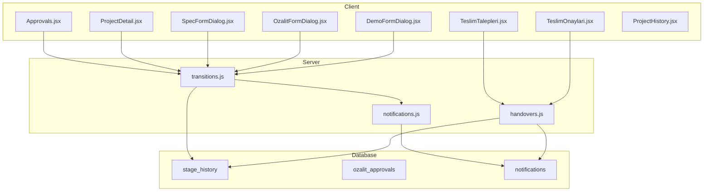
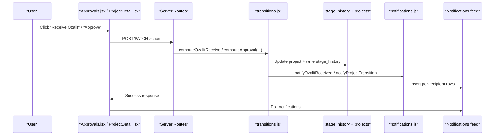
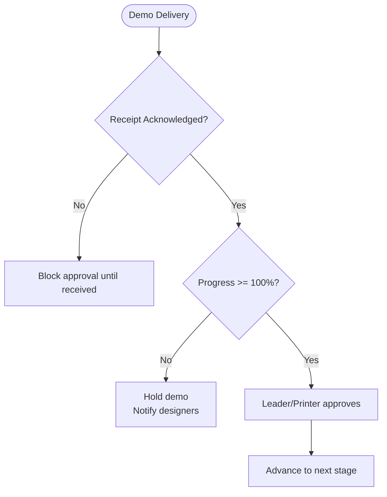
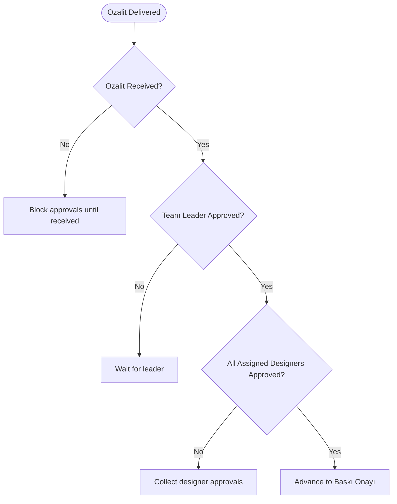
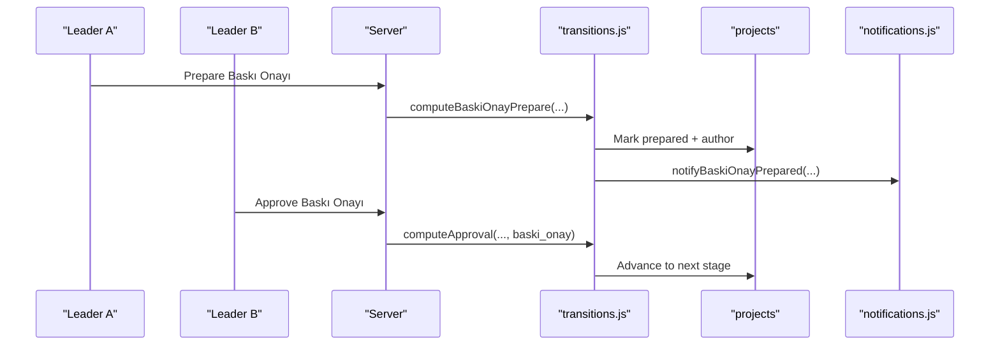
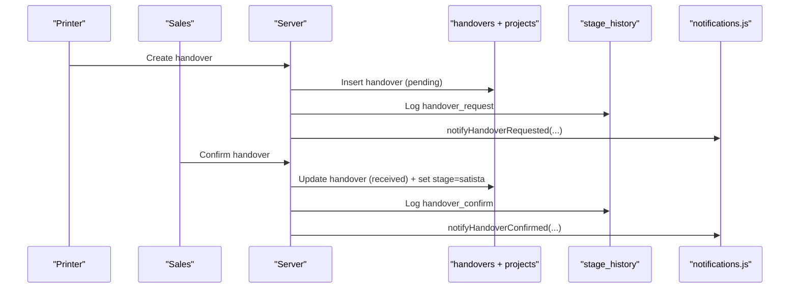
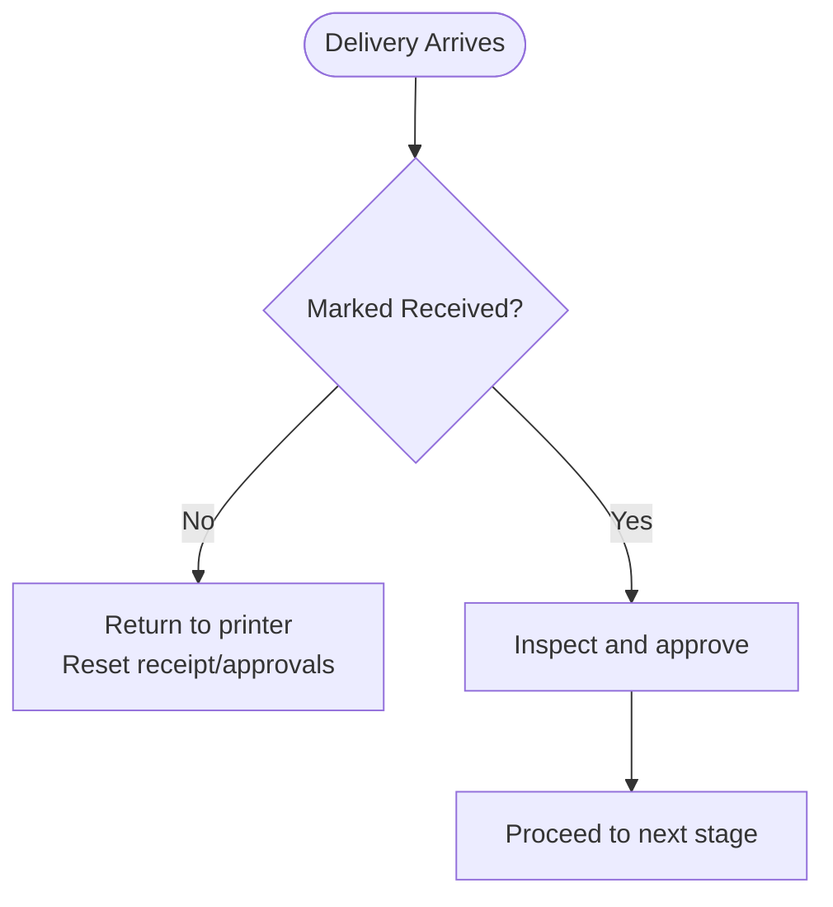
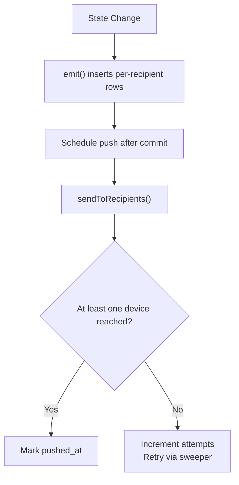
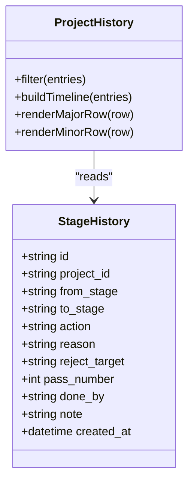
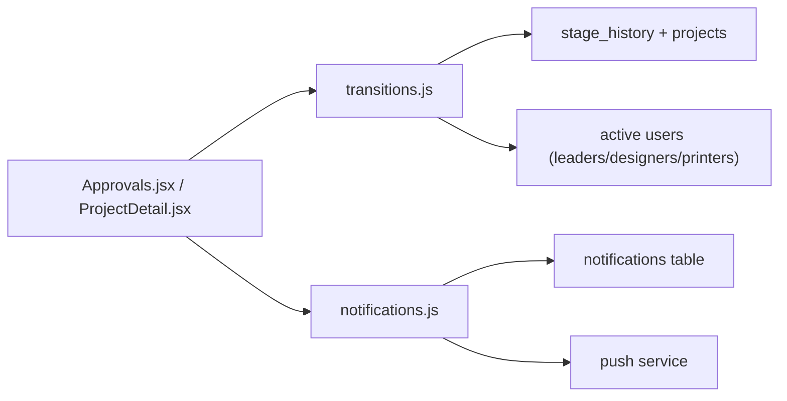

# Quality Assurance

<cite>
**Referenced Files in This Document**
- [transitions.js](file://server/src/domain/transitions.js)
- [notifications.js](file://server/src/services/notifications.js)
- [handovers.js](file://server/src/routes/handovers.js)
- [019__ozalit_multi_party_approval.sql](file://server/db/migrations/019__ozalit_multi_party_approval.sql)
- [044__baski_onay.sql](file://server/db/migrations/044__baski_onay.sql)
- [007__stage_history.sql](file://server/db/migrations/007__stage_history.sql)
- [022__notifications.sql](file://server/db/migrations/022__notifications.sql)
- [Approvals.jsx](file://client/src/pages/Approvals.jsx)
- [ProjectDetail.jsx](file://client/src/pages/ProjectDetail.jsx)
- [SpecFormDialog.jsx](file://client/src/components/SpecFormDialog.jsx)
- [OzalitFormDialog.jsx](file://client/src/components/OzalitFormDialog.jsx)
- [DemoFormDialog.jsx](file://client/src/components/DemoFormDialog.jsx)
- [TeslimTalepleri.jsx](file://client/src/pages/TeslimTalepleri.jsx)
- [TeslimOnaylari.jsx](file://client/src/pages/TeslimOnaylari.jsx)
- [project-history.js](file://client/lib/project-history.js)
- [ProjectHistory.jsx](file://client/src/components/ProjectHistory.jsx)
- [orders.js](file://client/src/domain/constants/orders.js)
</cite>

## Table of Contents
1. Introduction
2. Project Structure
3. Core Components
4. Architecture Overview
5. Detailed Component Analysis
6. Dependency Analysis
7. Performance Considerations
8. Troubleshooting Guide
9. Conclusion
10. Appendices

## Introduction
This document explains the quality assurance system embedded in the publishing workflow. It covers:
- Demo request and approval process for design reviews
- Proof (ozalit) management with multi-party approvals and revision tracking
- Handover from production to sales and final acceptance
- Inspection and acceptance procedures for deliverables
- Notification alerts for pending approvals and status changes
- Audit trails, approval histories, and compliance reporting
- Configuration examples for approval workflows across product types and organizations

The system enforces strict gates so that nothing proceeds to print or sale without proper acknowledgments and approvals.

## Project Structure
Quality assurance spans server-side state transitions, notification emission, UI queues, and persistent audit logs:
- Server domain logic defines transitions for demo, ozalit, baski onay, handover, and stage progression.
- Notifications fan out to relevant roles at each gate.
- Client pages present queues for approvals, proof delivery, and handover confirmation.
- Database migrations add columns and tables for multi-party approvals, forms, notifications, and history.

**Diagram sources**
- [transitions.js:99-255](file://server/src/domain/transitions.js#L99-L255)
- [notifications.js:640-791](file://server/src/services/notifications.js#L640-L791)
- [handovers.js:40-121](file://server/src/routes/handovers.js#L40-L121)
- [007__stage_history.sql:7-23](file://server/db/migrations/007__stage_history.sql#L7-L23)
- [019__ozalit_multi_party_approval.sql:1-13](file://server/db/migrations/019__ozalit_multi_party_approval.sql#L1-L13)
- [022__notifications.sql:20-56](file://server/db/migrations/022__notifications.sql#L20-L56)

**Section sources**
- [transitions.js:99-255](file://server/src/domain/transitions.js#L99-L255)
- [notifications.js:640-791](file://server/src/services/notifications.js#L640-L791)
- [handovers.js:40-121](file://server/src/routes/handovers.js#L40-L121)
- [007__stage_history.sql:7-23](file://server/db/migrations/007__stage_history.sql#L7-L23)
- [019__ozalit_multi_party_approval.sql:1-13](file://server/db/migrations/019__ozalit_multi_party_approval.sql#L1-L13)
- [022__notifications.sql:20-56](file://server/db/migrations/022__notifications.sql#L20-L56)

## Core Components
- Demo request and approval: Designers submit demos; printers deliver; leaders/designers acknowledge receipt; approvals may hold at <100% until completion.
- Ozalit (proof) management: Multi-party approval requires every active team leader and every assigned designer to sign off; leader must approve first; physical proof must be acknowledged before any approval.
- Baskı Onayı (final print approval): After ozalit approvals, a dual-approval form is prepared by one leader and approved by another (or the only active leader).
- Handover and acceptance: Printers raise handover requests; sales confirms receipt; project moves to sale.
- Notifications: Event-driven fan-out to relevant roles at each step, including push delivery with retry and settlement.
- Audit trail: Append-only stage_history records all advances, approvals, rejections, and system events; client renders a filtered timeline.

**Section sources**
- [transitions.js:377-501](file://server/src/domain/transitions.js#L377-L501)
- [transitions.js:733-800](file://server/src/domain/transitions.js#L733-L800)
- [transitions.js:1417-1439](file://server/src/domain/transitions.js#L1417-L1439)
- [handovers.js:40-121](file://server/src/routes/handovers.js#L40-L121)
- [notifications.js:366-433](file://server/src/services/notifications.js#L366-L433)
- [019__ozalit_multi_party_approval.sql:1-13](file://server/db/migrations/019__ozalit_multi_party_approval.sql#L1-L13)
- [044__baski_onay.sql:1-24](file://server/db/migrations/044__baski_onay.sql#L1-L24)
- [007__stage_history.sql:7-23](file://server/db/migrations/007__stage_history.sql#L7-L23)

## Architecture Overview
The QA flow is event-driven and transactional:
- UI actions call API routes that invoke transition functions.
- Transitions validate rules, update project state, and append stage_history.
- Notifications are emitted within the same transaction as the state change.
- Push delivery is scheduled after commit with retries and settlement tracking.

**Diagram sources**
- [transitions.js:733-800](file://server/src/domain/transitions.js#L733-L800)
- [transitions.js:1417-1439](file://server/src/domain/transitions.js#L1417-L1439)
- [notifications.js:640-791](file://server/src/services/notifications.js#L640-L791)
- [007__stage_history.sql:7-23](file://server/db/migrations/007__stage_history.sql#L7-L23)
- [022__notifications.sql:20-56](file://server/db/migrations/022__notifications.sql#L20-L56)

## Detailed Component Analysis

### Demo Request and Approval
- Submission: Designers advance to demo delivery; printers mark delivery; leaders/designers acknowledge receipt before approving.
- Hold behavior: Approving below 100% progress holds the demo; designers finish work and resubmit.
- Ekran Demo Onayı: Lightweight digital approval path for held demos once design reaches 100%.

**Diagram sources**
- [transitions.js:257-307](file://server/src/domain/transitions.js#L257-L307)
- [transitions.js:433-485](file://server/src/domain/transitions.js#L433-L485)
- [notifications.js:686-709](file://server/src/services/notifications.js#L686-L709)

**Section sources**
- [transitions.js:257-307](file://server/src/domain/transitions.js#L257-L307)
- [transitions.js:433-485](file://server/src/domain/transitions.js#L433-L485)
- [notifications.js:686-709](file://server/src/services/notifications.js#L686-L709)

### Ozalit (Proof) Management and Multi-Party Approval
- Receipt gate: Physical proof must be marked “received” by team leader or assigned designer before any approval.
- Leader-first rule: Team leader must approve before assigned designers can sign off.
- Multi-party ledger: Every active team leader and every assigned designer must approve; approvals recorded as objects with id, role, name, timestamp.
- Revision tracking: Change requests between team and printer are supported; new deliveries reset receipts and partial approvals.

**Diagram sources**
- [transitions.js:733-800](file://server/src/domain/transitions.js#L733-L800)
- [transitions.js:1417-1439](file://server/src/domain/transitions.js#L1417-L1439)
- [019__ozalit_multi_party_approval.sql:1-13](file://server/db/migrations/019__ozalit_multi_party_approval.sql#L1-L13)

**Section sources**
- [transitions.js:733-800](file://server/src/domain/transitions.js#L733-L800)
- [transitions.js:1417-1439](file://server/src/domain/transitions.js#L1417-L1439)
- [019__ozalit_multi_party_approval.sql:1-13](file://server/db/migrations/019__ozalit_multi_party_approval.sql#L1-L13)

### Baskı Onayı (Final Print Approval)
- Dual-approval: One leader prepares the form; a different active leader approves it (unless only one leader exists).
- Gate enforcement: Approve cannot proceed unless prepared; preparation triggers notifications to other leaders.

**Diagram sources**
- [transitions.js:385-431](file://server/src/domain/transitions.js#L385-L431)
- [notifications.js:436-450](file://server/src/services/notifications.js#L436-L450)
- [044__baski_onay.sql:1-24](file://server/db/migrations/044__baski_onay.sql#L1-L24)

**Section sources**
- [transitions.js:385-431](file://server/src/domain/transitions.js#L385-L431)
- [notifications.js:436-450](file://server/src/services/notifications.js#L436-L450)
- [044__baski_onay.sql:1-24](file://server/db/migrations/044__baski_onay.sql#L1-L24)

### Handover Process and Final Acceptance
- Printer raises handover when production is complete.
- Sales confirms receipt; project moves to sale.
- Both raise and confirm are logged in stage_history and trigger notifications.

**Diagram sources**
- [handovers.js:40-121](file://server/src/routes/handovers.js#L40-L121)
- [007__stage_history.sql:7-23](file://server/db/migrations/007__stage_history.sql#L7-L23)

**Section sources**
- [handovers.js:40-121](file://server/src/routes/handovers.js#L40-L121)
- [007__stage_history.sql:7-23](file://server/db/migrations/007__stage_history.sql#L7-L23)

### Inspection and Acceptance Procedures
- For both demo and ozalit, physical receipt must be acknowledged before approvals can proceed.
- If delivery is not received, the item is returned to the printer for redelivery, incrementing attempt counters and resetting round-specific flags.
- UI surfaces clear messages guiding users to receive or return items.

**Diagram sources**
- [transitions.js:624-731](file://server/src/domain/transitions.js#L624-L731)
- [transitions.js:733-800](file://server/src/domain/transitions.js#L733-L800)
- [ProjectDetail.jsx:1517-1534](file://client/src/pages/ProjectDetail.jsx#L1517-L1534)

**Section sources**
- [transitions.js:624-731](file://server/src/domain/transitions.js#L624-L731)
- [transitions.js:733-800](file://server/src/domain/transitions.js#L733-L800)
- [ProjectDetail.jsx:1517-1534](file://client/src/pages/ProjectDetail.jsx#L1517-L1534)

### Notification System
- Event-driven emission: Each transition emits notifications to relevant roles (leaders, designers, printers, sales).
- Delivery model: In-app feed plus web push; failed pushes are retried up to a cap; settled rows are marked to avoid infinite retries.
- Contextual links: Notifications include links to appropriate pages (approvals, project detail, queues).

**Diagram sources**
- [notifications.js:58-106](file://server/src/services/notifications.js#L58-L106)
- [notifications.js:145-191](file://server/src/services/notifications.js#L145-L191)
- [notifications.js:270-303](file://server/src/services/notifications.js#L270-L303)
- [022__notifications.sql:20-56](file://server/db/migrations/022__notifications.sql#L20-L56)

**Section sources**
- [notifications.js:58-106](file://server/src/services/notifications.js#L58-L106)
- [notifications.js:145-191](file://server/src/services/notifications.js#L145-L191)
- [notifications.js:270-303](file://server/src/services/notifications.js#L270-L303)
- [022__notifications.sql:20-56](file://server/db/migrations/022__notifications.sql#L20-L56)

### Audit Trails, Approval Histories, and Compliance Reporting
- stage_history: Append-only log of create/advance/approve/reject/system events with actors, reasons, targets, timestamps.
- ProjectHistory UI: Groups, filters, and folds repeated entries; exposes attached forms and rejection reasons.
- Compliance: Queries against stage_history provide full auditability; notifications table provides durable record of stakeholder awareness.

**Diagram sources**
- [007__stage_history.sql:7-23](file://server/db/migrations/007__stage_history.sql#L7-L23)
- [ProjectHistory.jsx:72-227](file://client/src/components/ProjectHistory.jsx#L72-L227)

**Section sources**
- [007__stage_history.sql:7-23](file://server/db/migrations/007__stage_history.sql#L7-L23)
- [ProjectHistory.jsx:72-227](file://client/src/components/ProjectHistory.jsx#L72-L227)

## Dependency Analysis
Key dependencies and relationships:
- UI components depend on server transitions and notifications to enforce and reflect QA states.
- Transitions depend on pipeline rules and progress checks; they also rely on assignee and leader sets loaded by routes.
- Notifications depend on active user sets and push availability; they coordinate with database indexes for efficient queries.

**Diagram sources**
- [Approvals.jsx:90-131](file://client/src/pages/Approvals.jsx#L90-L131)
- [transitions.js:99-255](file://server/src/domain/transitions.js#L99-L255)
- [notifications.js:38-46](file://server/src/services/notifications.js#L38-L46)
- [022__notifications.sql:52-56](file://server/db/migrations/022__notifications.sql#L52-L56)

**Section sources**
- [Approvals.jsx:90-131](file://client/src/pages/Approvals.jsx#L90-L131)
- [transitions.js:99-255](file://server/src/domain/transitions.js#L99-L255)
- [notifications.js:38-46](file://server/src/services/notifications.js#L38-L46)
- [022__notifications.sql:52-56](file://server/db/migrations/022__notifications.sql#L52-L56)

## Performance Considerations
- Batched notification inserts reduce database load during high-volume transitions.
- Push delivery uses after-commit hooks to avoid holding transactions open.
- Partial indexes on notifications optimize unread counts and pending sweeps.
- History rendering groups and folds repetitive entries to keep UI responsive.

[No sources needed since this section provides general guidance]

## Troubleshooting Guide
Common issues and resolutions:
- Cannot approve ozalit/demo: Ensure physical receipt is acknowledged by an authorized user.
- Blocked by pending change request: Resolve accept/decline before delivery.
- Duplicate handover request: Only one pending handover per project is allowed.
- Missing notifications: Check push enablement and sweep pending pushes; verify recipient roles and active status.

**Section sources**
- [transitions.js:733-800](file://server/src/domain/transitions.js#L733-L800)
- [transitions.js:257-307](file://server/src/domain/transitions.js#L257-L307)
- [handovers.js:40-121](file://server/src/routes/handovers.js#L40-L121)
- [notifications.js:270-303](file://server/src/services/notifications.js#L270-L303)

## Conclusion
The quality assurance system enforces robust, auditable controls across demo and proof stages, ensures multi-party approvals with clear sequencing, and integrates comprehensive notifications and audit trails. The handover and acceptance flows guarantee that only verified deliverables reach sale.

[No sources needed since this section summarizes without analyzing specific files]

## Appendices

### Example Configurations for Approval Workflows
- Single-team leader, multiple designers:
  - Ozalit approvals require the single leader and all assigned designers to sign off; leader must approve first.
  - Baskı Onayı requires two distinct leaders; if only one leader exists, that leader can prepare and approve.
- Multi-team leaders:
  - Ozalit approvals require every active leader and all assigned designers; leader-first ordering enforced.
  - Baskı Onayı requires preparation by one leader and approval by a different active leader.
- Product type differences:
  - TR pipeline includes ozalit_onay followed by baski_onay before production.
  - CIN pipeline mirrors demo and print gates; similar receipt and approval rules apply.

Configuration references:
- Multi-party ozalit approvals stored as JSON array of approvers.
- Baskı Onayı stage added to pipeline constraints.
- Role-based notification routing ensures correct stakeholders are alerted.

**Section sources**
- [019__ozalit_multi_party_approval.sql:1-13](file://server/db/migrations/019__ozalit_multi_party_approval.sql#L1-L13)
- [044__baski_onay.sql:1-24](file://server/db/migrations/044__baski_onay.sql#L1-L24)
- [notifications.js:640-791](file://server/src/services/notifications.js#L640-L791)