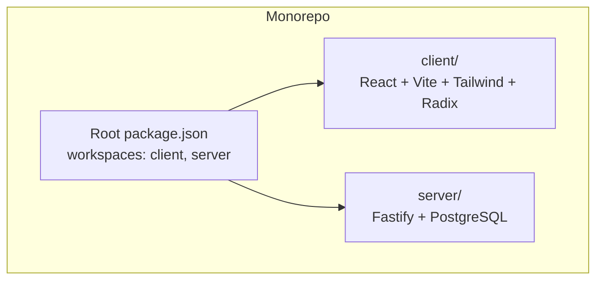
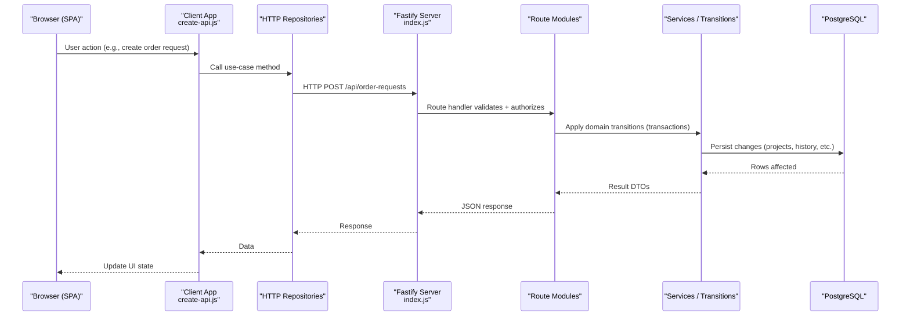
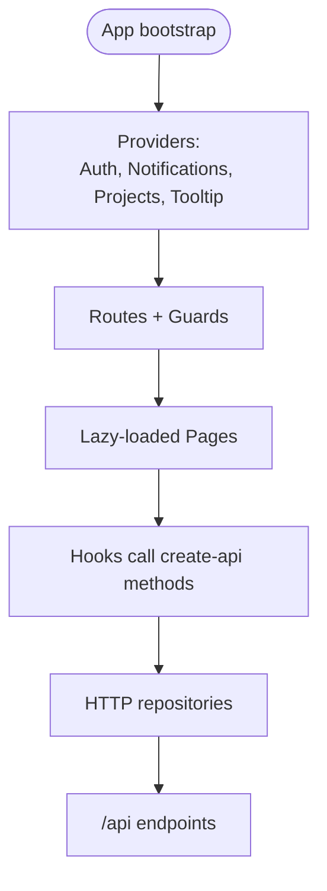
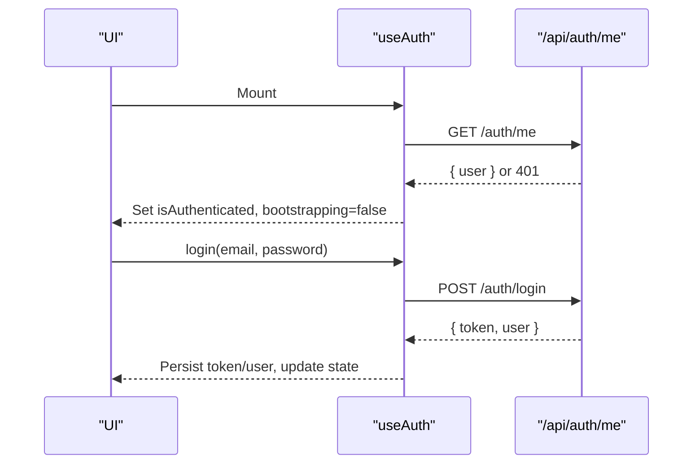
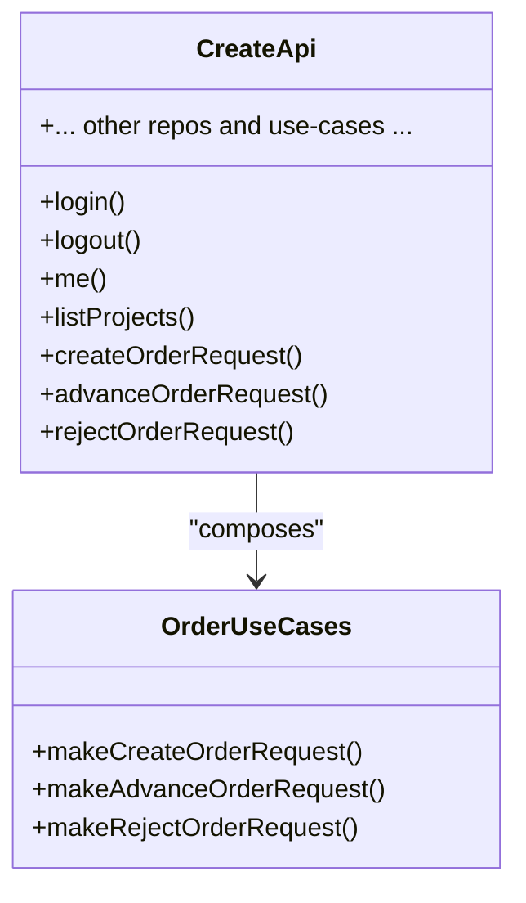
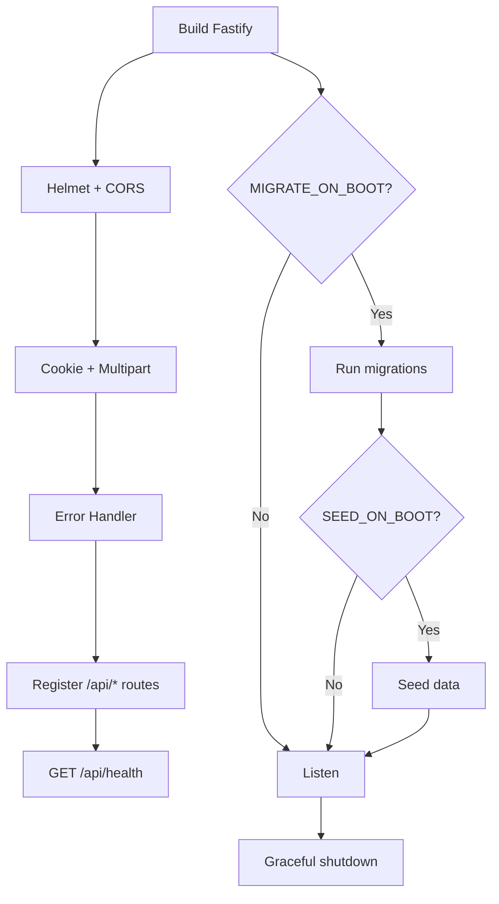
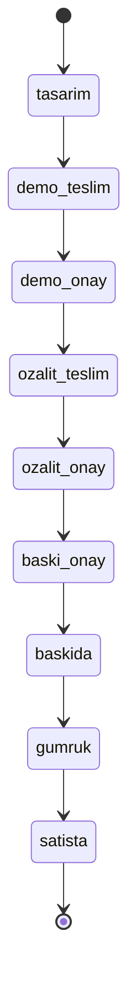
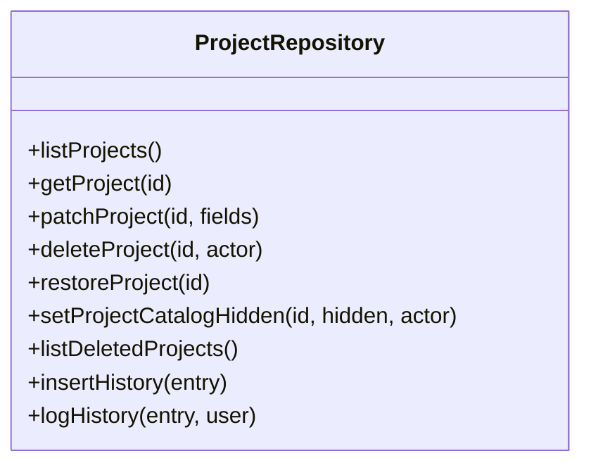
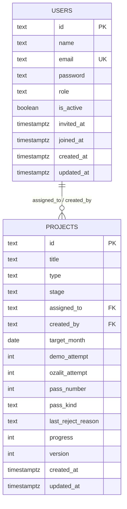
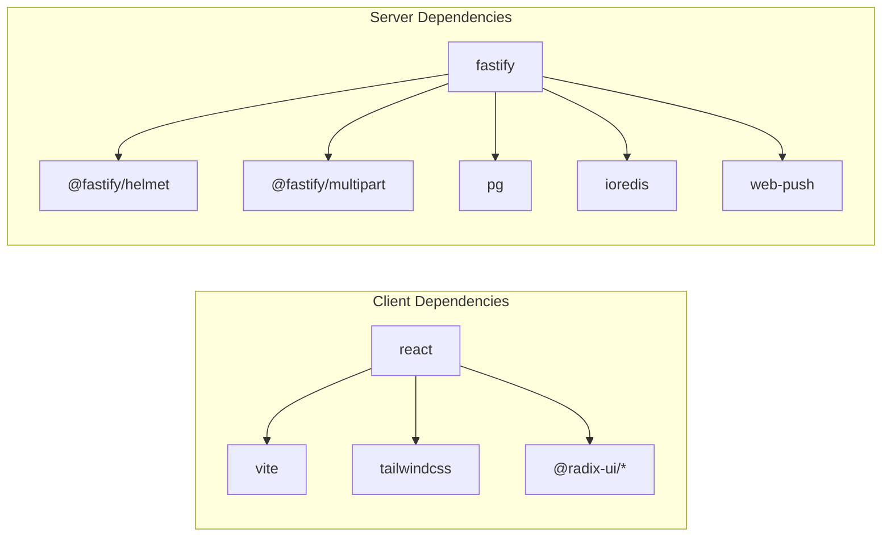

# System Architecture

<cite>
**Referenced Files in This Document**
- [package.json](file://package.json)
- [client/package.json](file://client/package.json)
- [server/package.json](file://server/package.json)
- [docker-compose.yml](file://docker-compose.yml)
- [client/src/main.jsx](file://client/src/main.jsx)
- [client/src/App.jsx](file://client/src/App.jsx)
- [client/src/hooks/useAuth.js](file://client/src/hooks/useAuth.js)
- [client/src/application/create-api.js](file://client/src/application/create-api.js)
- [client/src/domain/index.js](file://client/src/domain/index.js)
- [client/src/domain/stages.js](file://client/src/domain/stages.js)
- [client/src/application/use-cases/orders/create-order-request.js](file://client/src/application/use-cases/orders/create-order-request.js)
- [client/tailwind.config.js](file://client/tailwind.config.js)
- [server/src/index.js](file://server/src/index.js)
- [server/src/config.js](file://server/src/config.js)
- [server/src/routes/projects.js](file://server/src/routes/projects.js)
- [server/src/services/project-repository.js](file://server/src/services/project-repository.js)
- [server/db/migrations/001__users.sql](file://server/db/migrations/001__users.sql)
- [server/db/migrations/002__projects.sql](file://server/db/migrations/002__projects.sql)
</cite>

## Table of Contents
1. [Introduction](#introduction)
2. [Project Structure](#project-structure)
3. [Core Components](#core-components)
4. [Architecture Overview](#architecture-overview)
5. [Detailed Component Analysis](#detailed-component-analysis)
6. [Dependency Analysis](#dependency-analysis)
7. [Performance Considerations](#performance-considerations)
8. [Troubleshooting Guide](#troubleshooting-guide)
9. [Conclusion](#conclusion)
10. [Appendices](#appendices)

## Introduction
YZ Yayın Takip is a full-stack publishing workflow application that coordinates design, proofing, printing, and sales for books across Turkish and Chinese pipelines. It uses a monorepo with separate client and server workspaces: a React SPA built with Vite, Tailwind CSS, and Radix UI components; and a Fastify backend with PostgreSQL, domain-driven transitions, and a migration system. The system enforces role-based access, stage-gated workflows, and robust error handling to support real-world production environments.

## Project Structure
The repository is a Node.js workspace containing two primary packages:
- client: React SPA (Vite, Tailwind, Radix UI), with hooks, application use cases, infrastructure repositories, and pages.
- server: Fastify API with routes, services, domain logic, database migrations, and configuration.

**Diagram sources**
- [package.json:1-19](file://package.json#L1-L19)

**Section sources**
- [package.json:1-19](file://package.json#L1-L19)
- [client/package.json:1-57](file://client/package.json#L1-L57)
- [server/package.json:1-31](file://server/package.json#L1-L31)

## Core Components
- Frontend bootstrap and routing:
  - App shell, route guards, lazy-loaded pages, providers for auth, notifications, projects, and push.
- Authentication and session management:
  - Auth provider with local cache, bootstrapping, retry on network recovery, and logout.
- Application composition root:
  - Wires HTTP repositories and cross-aggregate use cases into a single api surface consumed by hooks/pages.
- Backend entrypoint:
  - Fastify setup, CORS, helmet, multipart, error handling, route registration, health endpoint, graceful shutdown.
- Domain models and transitions:
  - Stage definitions, pipeline rules, orderable stages, and transition functions applied in transactions.
- Data persistence:
  - PostgreSQL schema via migrations; project repository with list/detail/update/history operations.

**Section sources**
- [client/src/main.jsx:1-80](file://client/src/main.jsx#L1-L80)
- [client/src/App.jsx:1-297](file://client/src/App.jsx#L1-L297)
- [client/src/hooks/useAuth.js:1-250](file://client/src/hooks/useAuth.js#L1-L250)
- [client/src/application/create-api.js:1-203](file://client/src/application/create-api.js#L1-L203)
- [server/src/index.js:1-236](file://server/src/index.js#L1-L236)
- [server/src/domain/stages.js:1-49](file://server/src/domain/stages.js#L1-L49)
- [server/src/services/project-repository.js:1-800](file://server/src/services/project-repository.js#L1-L800)

## Architecture Overview
High-level flow from browser to database and back:

**Diagram sources**
- [client/src/application/create-api.js:1-203](file://client/src/application/create-api.js#L1-L203)
- [client/src/application/use-cases/orders/create-order-request.js:1-23](file://client/src/application/use-cases/orders/create-order-request.js#L1-L23)
- [server/src/index.js:1-236](file://server/src/index.js#L1-L236)
- [server/src/routes/projects.js:1-200](file://server/src/routes/projects.js#L1-L200)
- [server/src/services/project-repository.js:1-800](file://server/src/services/project-repository.js#L1-L800)

## Detailed Component Analysis

### Frontend Architecture (React + Vite + Tailwind + Radix)
- Bootstrap and Providers:
  - Root renders providers for auth, notifications, projects, tooltips, and push bridge.
  - Service worker registration in production for web push.
- Routing and Guards:
  - Role-based guards protect sensitive routes; lazy loading improves performance.
- Styling:
  - Tailwind configured with design tokens, brand colors, and animations.

**Diagram sources**
- [client/src/main.jsx:1-80](file://client/src/main.jsx#L1-L80)
- [client/src/App.jsx:1-297](file://client/src/App.jsx#L1-L297)
- [client/tailwind.config.js:1-88](file://client/tailwind.config.js#L1-L88)

**Section sources**
- [client/src/main.jsx:1-80](file://client/src/main.jsx#L1-L80)
- [client/src/App.jsx:1-297](file://client/src/App.jsx#L1-L297)
- [client/tailwind.config.js:1-88](file://client/tailwind.config.js#L1-L88)

### Authentication Flow
- On app start, the auth provider checks the current session via the API, retries briefly if offline, and marks bootstrapping until resolved.
- Login persists token and user; logout clears state and storage.
- Role-based guards enforce access at the route level.

**Diagram sources**
- [client/src/hooks/useAuth.js:1-250](file://client/src/hooks/useAuth.js#L1-L250)

**Section sources**
- [client/src/hooks/useAuth.js:1-250](file://client/src/hooks/useAuth.js#L1-L250)

### Application Composition Root and Use Cases
- create-api wires all HTTP repositories and composes cross-aggregate use cases (orders, handovers).
- Use cases encapsulate business rules and call the appropriate endpoints with validated payloads.

**Diagram sources**
- [client/src/application/create-api.js:1-203](file://client/src/application/create-api.js#L1-L203)
- [client/src/application/use-cases/orders/create-order-request.js:1-23](file://client/src/application/use-cases/orders/create-order-request.js#L1-L23)

**Section sources**
- [client/src/application/create-api.js:1-203](file://client/src/application/create-api.js#L1-L203)
- [client/src/application/use-cases/orders/create-order-request.js:1-23](file://client/src/application/use-cases/orders/create-order-request.js#L1-L23)

### Backend Architecture (Fastify)
- Bootstraps Fastify with security headers, CORS, multipart parsing, and strict AJV validation.
- Registers route modules under /api, sets up error handling, health endpoint, and graceful shutdown.
- Runs migrations and optional seed on boot based on environment flags.

**Diagram sources**
- [server/src/index.js:1-236](file://server/src/index.js#L1-L236)

**Section sources**
- [server/src/index.js:1-236](file://server/src/index.js#L1-L236)
- [server/src/config.js:1-122](file://server/src/config.js#L1-L122)

### Domain-Driven Design and State Machine
- Stages define the workflow for TR and CIN pipelines, including labels, orderable stages, and gates requiring full progress.
- Transition functions apply state changes within transactions, logging history and emitting notifications.

**Diagram sources**
- [server/src/domain/stages.js:1-49](file://server/src/domain/stages.js#L1-L49)

**Section sources**
- [client/src/domain/index.js:1-45](file://client/src/domain/index.js#L1-L45)
- [client/src/domain/stages.js:1-49](file://client/src/domain/stages.js#L1-L49)
- [server/src/routes/projects.js:1-200](file://server/src/routes/projects.js#L1-L200)

### Repository Pattern for Data Access
- The project repository abstracts SQL queries for listing, detail, updates, soft delete, restore, catalog visibility, and history.
- It ensures consistent shapes for the client and hydrates related data efficiently.

**Diagram sources**
- [server/src/services/project-repository.js:1-800](file://server/src/services/project-repository.js#L1-L800)

**Section sources**
- [server/src/services/project-repository.js:1-800](file://server/src/services/project-repository.js#L1-L800)

### Database Schema Organization and Migration System
- Migrations are versioned SQL files defining tables and indexes.
- Users table includes roles and lifecycle timestamps; projects table defines workflow stages and pass tracking.

**Diagram sources**
- [server/db/migrations/001__users.sql:1-35](file://server/db/migrations/001__users.sql#L1-L35)
- [server/db/migrations/002__projects.sql:1-39](file://server/db/migrations/002__projects.sql#L1-L39)

**Section sources**
- [server/db/migrations/001__users.sql:1-35](file://server/db/migrations/001__users.sql#L1-L35)
- [server/db/migrations/002__projects.sql:1-39](file://server/db/migrations/002__projects.sql#L1-L39)

## Dependency Analysis
Frontend dependencies:
- React ecosystem with Vite build tooling, Tailwind styling, Radix UI primitives, and testing utilities.

Backend dependencies:
- Fastify framework, cookie handling, helmet security, multipart uploads, bcrypt hashing, pg driver, Redis client, and web-push.

**Diagram sources**
- [client/package.json:1-57](file://client/package.json#L1-L57)
- [server/package.json:1-31](file://server/package.json#L1-L31)

**Section sources**
- [client/package.json:1-57](file://client/package.json#L1-L57)
- [server/package.json:1-31](file://server/package.json#L1-L31)

## Performance Considerations
- Client-side code splitting via lazy routes reduces initial bundle size.
- Strict AJV validation prevents silent field drops and reduces downstream errors.
- Efficient queries in project repository merge assignees and history to avoid N+1 issues.
- Graceful shutdown stops background maintenance before closing resources to prevent race conditions during redeploy.

[No sources needed since this section provides general guidance]

## Troubleshooting Guide
- Unhandled errors:
  - Custom error handler maps HttpError instances to JSON responses with correct status codes; unknown errors return a generic internal error.
- Network resilience:
  - Auth provider retries session check on cold launch and marks session unverified when unreachable, rehydrating on resume.
- Push service worker:
  - Registration failures are logged but non-fatal; notifications still appear in-app.

**Section sources**
- [server/src/index.js:125-146](file://server/src/index.js#L125-L146)
- [client/src/hooks/useAuth.js:68-162](file://client/src/hooks/useAuth.js#L68-L162)
- [client/src/main.jsx:44-63](file://client/src/main.jsx#L44-L63)

## Conclusion
YZ Yayın Takip combines a modern React SPA with a robust Fastify backend to manage complex publishing workflows. Its domain-driven transitions, repository pattern, and migration-backed schema ensure maintainability and correctness. The monorepo structure, Dockerized development stack, and clear separation of concerns enable scalable growth and reliable deployments.

[No sources needed since this section summarizes without analyzing specific files]

## Appendices

### Deployment Topology
Local development uses Docker Compose to run PostgreSQL, the Fastify server, and the Vite dev client with proxying to the API. Production deploys the client as a static SPA and the server separately, with environment-driven configuration for database, CORS, sessions, and push keys.

**Section sources**
- [docker-compose.yml:1-82](file://docker-compose.yml#L1-L82)
- [server/src/config.js:22-122](file://server/src/config.js#L22-L122)