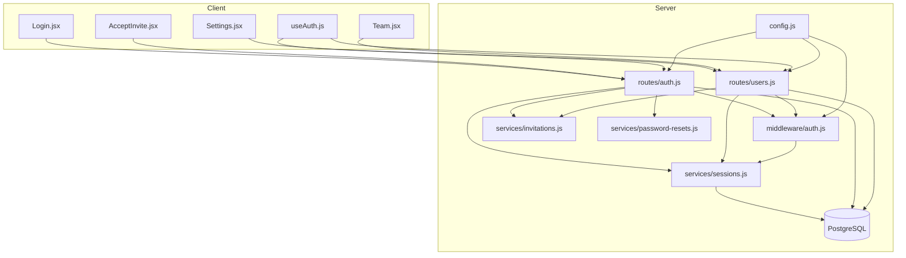
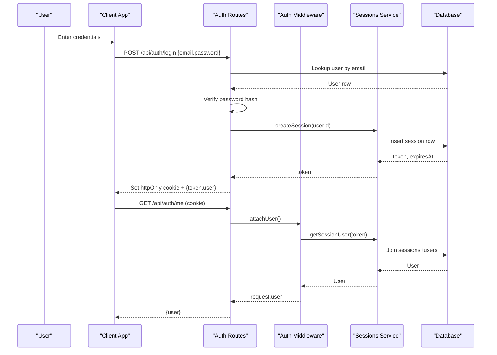
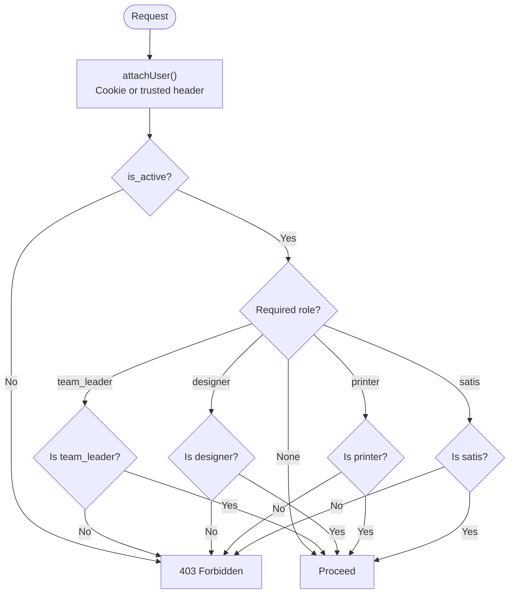
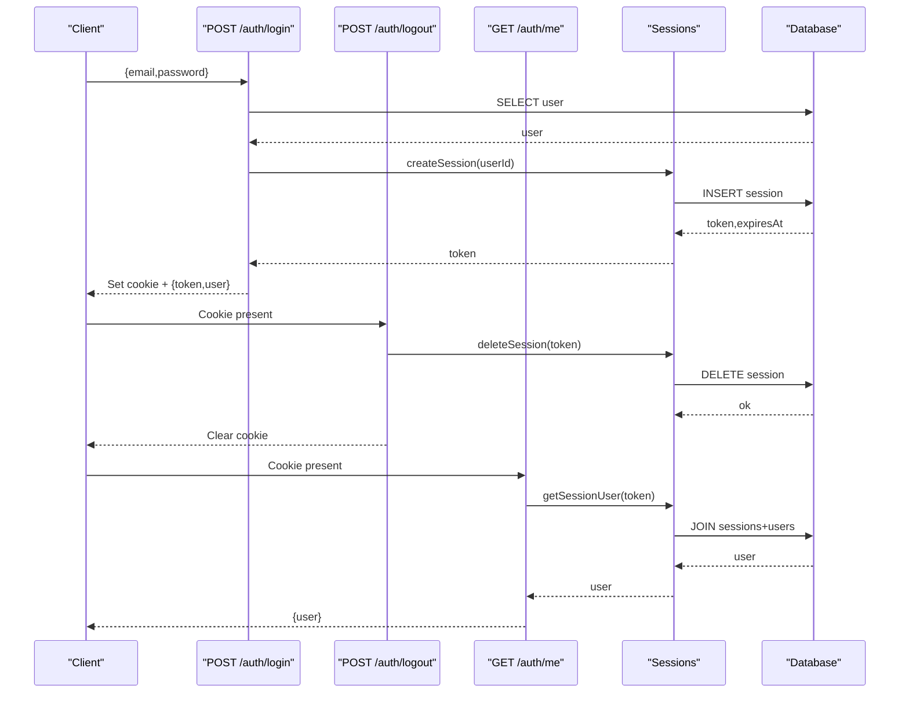
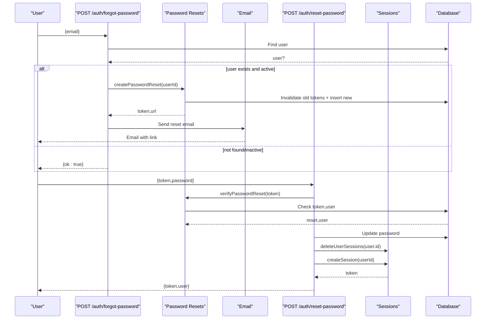
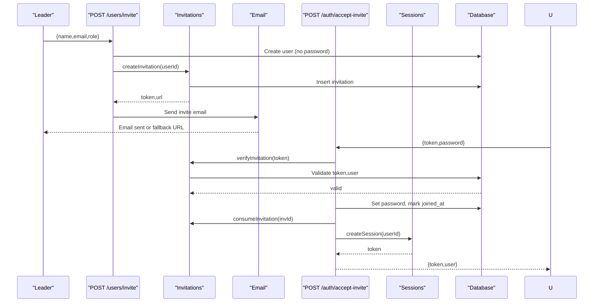
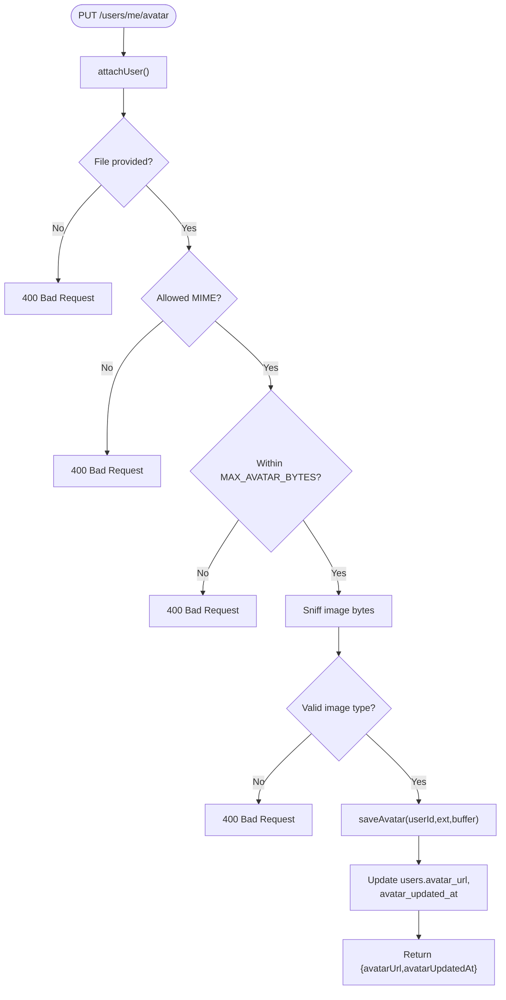
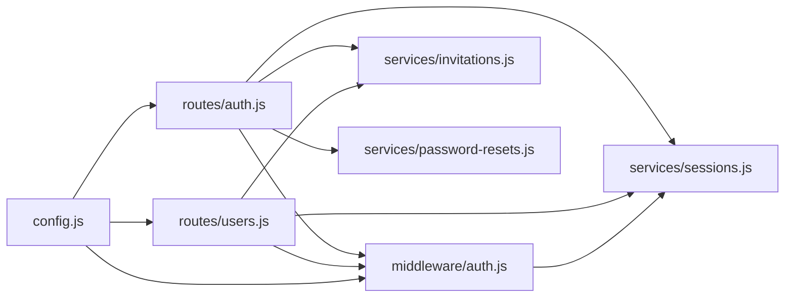

# User Management

<cite>
**Referenced Files in This Document**
- [auth.js](file://server/src/routes/auth.js)
- [users.js](file://server/src/routes/users.js)
- [auth middleware](file://server/src/middleware/auth.js)
- [sessions service](file://server/services/sessions.js)
- [invitations service](file://server/services/invitations.js)
- [password-resets service](file://server/services/password-resets.js)
- [config](file://server/src/config.js)
- [users migration](file://server/db/migrations/001__users.sql)
- [useAuth hook](file://client/src/hooks/useAuth.js)
- [Login page](file://client/src/pages/Login.jsx)
- [ForgotPassword page](file://client/src/pages/ForgotPassword.jsx)
- [AcceptInvite page](file://client/src/pages/AcceptInvite.jsx)
- [Settings page](file://client/src/pages/Settings.jsx)
- [Team page](file://client/src/pages/Team.jsx)
</cite>

## Table of Contents
1. Introduction
2. Project Structure
3. Core Components
4. Architecture Overview
5. Detailed Component Analysis
6. Dependency Analysis
7. Performance Considerations
8. Troubleshooting Guide
9. Conclusion

## Introduction
This document explains the user management and authentication system, including role-based access control (RBAC), authentication flows (login, logout, session management, password reset), invitation onboarding, profile/avatar handling, account settings, security considerations, and audit logging posture. It is designed for both technical and non-technical readers.

## Project Structure
The system is split into a backend API (Fastify server) and a frontend SPA (React). Authentication and authorization are enforced on the server with cookie sessions; the client maintains a local auth context and UI state.

**Diagram sources**
- [auth.js:58-343](file://server/src/routes/auth.js#L58-L343)
- [users.js:55-423](file://server/src/routes/users.js#L55-L423)
- [auth middleware:48-122](file://server/src/middleware/auth.js#L48-L122)
- [sessions service:29-107](file://server/services/sessions.js#L29-L107)
- [invitations service:23-106](file://server/services/invitations.js#L23-L106)
- [password-resets service:23-104](file://server/services/password-resets.js#L23-L104)
- [config:22-121](file://server/src/config.js#L22-L121)

**Section sources**
- [auth.js:58-343](file://server/src/routes/auth.js#L58-L343)
- [users.js:55-423](file://server/src/routes/users.js#L55-L423)
- [auth middleware:48-122](file://server/src/middleware/auth.js#L48-L122)
- [sessions service:29-107](file://server/services/sessions.js#L29-L107)
- [invitations service:23-106](file://server/services/invitations.js#L23-L106)
- [password-resets service:23-104](file://server/services/password-resets.js#L23-L104)
- [config:22-121](file://server/src/config.js#L22-L121)

## Core Components
- Authentication routes: login, logout, me, invite preview/accept, forgot/reset/change password, dev-login.
- Users routes: list users, invite, deactivate/reactivate, delete, avatar upload/read/delete.
- Auth middleware: attaches current user from cookie session or trusted header (dev/test), enforces active status, provides role checks.
- Sessions service: creates, validates, deletes sessions; sets httpOnly cookies with TTL.
- Invitations service: creates, verifies, consumes invitation tokens with TTL.
- Password resets service: creates one-time reset tokens with TTL, invalidates prior tokens per user.
- Client auth context: persists session, bootstraps identity via /auth/me, handles retries and offline behavior.

Key RBAC roles enforced by schema and middleware: team_leader, designer, printer, satis.

**Section sources**
- [auth.js:58-343](file://server/src/routes/auth.js#L58-L343)
- [users.js:55-423](file://server/src/routes/users.js#L55-L423)
- [auth middleware:48-122](file://server/src/middleware/auth.js#L48-L122)
- [sessions service:29-107](file://server/services/sessions.js#L29-L107)
- [invitations service:23-106](file://server/services/invitations.js#L23-L106)
- [password-resets service:23-104](file://server/services/password-resets.js#L23-L104)
- [users migration:20-32](file://server/db/migrations/001__users.sql#L20-L32)

## Architecture Overview
Authentication uses server-side sessions stored in the database and delivered via httpOnly cookies. The client stores a token locally only for backward compatibility and dev flows; production relies on cookie sessions. Role checks are centralized in middleware and applied declaratively or imperatively.

**Diagram sources**
- [auth.js:81-131](file://server/src/routes/auth.js#L81-L131)
- [auth middleware:48-82](file://server/src/middleware/auth.js#L48-L82)
- [sessions service:29-60](file://server/services/sessions.js#L29-L60)

## Detailed Component Analysis

### RBAC and Roles
- Roles: team_leader, designer, printer, satis. Enforced at the database level and checked in middleware.
- Authorization:
  - Team management endpoints require team_leader.
  - Some endpoints allow any authenticated user but scope data based on role (e.g., user list columns differ).
  - Protection prevents deactivating/deleting the last active team leader and protects the founding leader.

**Diagram sources**
- [auth middleware:48-122](file://server/src/middleware/auth.js#L48-L122)
- [users.js:33-53](file://server/src/routes/users.js#L33-L53)

**Section sources**
- [auth middleware:48-122](file://server/src/middleware/auth.js#L48-L122)
- [users.js:33-53](file://server/src/routes/users.js#L33-L53)
- [users migration:20-32](file://server/db/migrations/001__users.sql#L20-L32)

### Authentication Flow
- Login: rate-limited per IP and email; verifies user existence, active status, password; issues session cookie; returns minimal user payload.
- Logout: deletes session and clears cookie.
- Me: resolves current user from session cookie.
- Dev login: disabled in production; useful for testing.

**Diagram sources**
- [auth.js:81-131](file://server/src/routes/auth.js#L81-L131)
- [sessions service:29-60](file://server/services/sessions.js#L29-L60)

**Section sources**
- [auth.js:81-131](file://server/src/routes/auth.js#L81-L131)
- [sessions service:29-60](file://server/services/sessions.js#L29-L60)

### Password Reset Flow
- Forgot password: rate-limited per IP; always returns success to avoid enumeration; sends email if user exists and is active; creates one-time token with TTL.
- Reset password: rate-limited per IP and token; verifies token; hashes new password; invalidates other sessions; signs user in.
- Change password: requires current password unless first-time set; updates password.

**Diagram sources**
- [auth.js:208-292](file://server/src/routes/auth.js#L208-L292)
- [password-resets service:23-104](file://server/services/password-resets.js#L23-L104)

**Section sources**
- [auth.js:208-292](file://server/src/routes/auth.js#L208-L292)
- [password-resets service:23-104](file://server/services/password-resets.js#L23-L104)

### Invitation System
- Invite creation: team_leader only; creates user without password; generates invitation token with TTL; sends email; supports re-inviting deactivated users.
- Accept invite: reads token from URL; previews invitee info without consuming token; accepts by setting password and signing in.

**Diagram sources**
- [users.js:98-206](file://server/src/routes/users.js#L98-L206)
- [invitations service:23-106](file://server/services/invitations.js#L23-L106)
- [auth.js:161-196](file://server/src/routes/auth.js#L161-L196)

**Section sources**
- [users.js:98-206](file://server/src/routes/users.js#L98-L206)
- [invitations service:23-106](file://server/services/invitations.js#L23-L106)
- [auth.js:161-196](file://server/src/routes/auth.js#L161-L196)

### User Profile and Avatar Handling
- Upload: owner-only; validates MIME; content-sniffs image bytes; size limit enforced; saves file; updates user record with relative URL and timestamp.
- Read: public-ish route serves files with cache headers and ETag; supports versioned cache busting.
- Delete: owner-only; removes file and clears fields.

**Diagram sources**
- [users.js:305-359](file://server/src/routes/users.js#L305-L359)

**Section sources**
- [users.js:305-359](file://server/src/routes/users.js#L305-L359)
- [users.js:376-421](file://server/src/routes/users.js#L376-L421)

### Account Settings
- Change password: requires current password unless first-time set; enforces minimum length and difference from current.
- Logout: clears local state and calls server logout.
- Avatar management: update/remove via Settings UI; optimistic preview using object URLs; refreshes cached user.

**Section sources**
- [auth.js:301-327](file://server/src/routes/auth.js#L301-L327)
- [Settings page:110-147](file://client/src/pages/Settings.jsx#L110-L147)
- [Settings page:40-95](file://client/src/pages/Settings.jsx#L40-L95)

### Session Management and Timeouts
- Sessions are server-side with opaque tokens stored in an httpOnly cookie.
- TTL configured via environment; default 7 days.
- On password reset, all existing sessions for the user are invalidated before issuing a fresh session.
- Client bootstraps identity by calling /auth/me; handles offline retries and unverified sessions.

**Section sources**
- [sessions service:29-107](file://server/services/sessions.js#L29-L107)
- [auth.js:285-290](file://server/src/routes/auth.js#L285-L290)
- [useAuth hook:54-162](file://client/src/hooks/useAuth.js#L54-L162)

### Permission Matrix
Actions and required roles:

- List users (full roster): team_leader
- List users (basic names/avatars): any authenticated user
- Invite user: team_leader
- Deactivate user: team_leader (with protections)
- Reactivate user: team_leader
- Delete user: team_leader (with protections)
- Upload avatar: authenticated user (owner)
- Delete avatar: authenticated user (owner)
- View own profile: authenticated user
- Change own password: authenticated user
- Forgot password: any (rate-limited)
- Reset password: holder of valid token (rate-limited)
- Accept invitation: holder of valid token (rate-limited)

Notes:
- Protections prevent deactivating/deleting the last active team leader and protect the founding leader.
- Data scoping differs by role for user listing.

**Section sources**
- [users.js:63-96](file://server/src/routes/users.js#L63-L96)
- [users.js:98-206](file://server/src/routes/users.js#L98-L206)
- [users.js:208-291](file://server/src/routes/users.js#L208-L291)
- [users.js:305-421](file://server/src/routes/users.js#L305-L421)
- [auth.js:81-131](file://server/src/routes/auth.js#L81-L131)
- [auth.js:208-327](file://server/src/routes/auth.js#L208-L327)

### Security Considerations
- Password hashing: bcrypt used for passwords.
- Rate limiting:
  - Login: per IP and per email.
  - Accept invite and reset password: per IP and per token.
  - Forgot password: per IP.
  - Invite creation: per IP.
- Session security:
  - httpOnly, secure (production), sameSite lax, configurable domain/TTL.
  - Trust header auth disabled in production by configuration.
- Input validation: JSON schemas enforce presence and minimum lengths.
- Avatar safety: MIME allowlist, content sniffing, size limits.
- Enumeration protection: forgot password always returns success; no account existence leakage.
- Session invalidation: password reset invalidates all sessions for the user.

**Section sources**
- [auth.js:81-131](file://server/src/routes/auth.js#L81-L131)
- [auth.js:161-196](file://server/src/routes/auth.js#L161-L196)
- [auth.js:208-292](file://server/src/routes/auth.js#L208-L292)
- [users.js:98-206](file://server/src/routes/users.js#L98-L206)
- [users.js:305-359](file://server/src/routes/users.js#L305-L359)
- [config:41-63](file://server/src/config.js#L41-L63)

### Audit Logging
- No dedicated audit log table or endpoint was found in the analyzed codebase.
- Operational logs are emitted for errors and warnings (e.g., avatar cleanup failures, reconcile warnings).
- For compliance needs, consider adding structured audit entries for sensitive actions (invite, role changes, deletions).

**Section sources**
- [users.js:232-237](file://server/src/routes/users.js#L232-L237)
- [users.js:279-288](file://server/src/routes/users.js#L279-L288)

## Dependency Analysis
- Routes depend on middleware for authentication and role checks.
- Services encapsulate business logic for sessions, invitations, and password resets.
- Configuration centralizes runtime behavior (session cookies, CORS, SMTP, rate limiter store).
- Client depends on hooks and pages to orchestrate user interactions and maintain state.

**Diagram sources**
- [auth.js:58-343](file://server/src/routes/auth.js#L58-L343)
- [users.js:55-423](file://server/src/routes/users.js#L55-L423)
- [auth middleware:48-122](file://server/src/middleware/auth.js#L48-L122)
- [sessions service:29-107](file://server/services/sessions.js#L29-L107)
- [invitations service:23-106](file://server/services/invitations.js#L23-L106)
- [password-resets service:23-104](file://server/services/password-resets.js#L23-L104)
- [config:22-121](file://server/src/config.js#L22-L121)

**Section sources**
- [auth.js:58-343](file://server/src/routes/auth.js#L58-L343)
- [users.js:55-423](file://server/src/routes/users.js#L55-L423)
- [auth middleware:48-122](file://server/src/middleware/auth.js#L48-L122)
- [sessions service:29-107](file://server/services/sessions.js#L29-L107)
- [invitations service:23-106](file://server/services/invitations.js#L23-L106)
- [password-resets service:23-104](file://server/services/password-resets.js#L23-L104)
- [config:22-121](file://server/src/config.js#L22-L121)

## Performance Considerations
- Rate limiting reduces abuse and protects downstream services (SMTP, DB).
- Avatar read path uses ETag and conditional requests to minimize bandwidth and disk reads.
- Client-side retry strategy avoids unnecessary logout on transient network failures during bootstrap.
- Session lookup joins users and sessions; ensure indexes exist on session tokens and user IDs.

[No sources needed since this section provides general guidance]

## Troubleshooting Guide
Common issues and remedies:
- Cannot log in: check rate limit messages; verify email normalization and case; confirm user is active and has a password.
- Invite link expired or already used: request a new invite; links have TTLs (invites 7 days, resets 1 hour).
- Avatar upload fails: ensure allowed MIME types and size under 2 MB; server performs content sniffing.
- Session not persisting across tabs: verify cookie settings (secure, sameSite, domain) match your deployment; ensure HTTPS in production when secure is enabled.
- Forgot password email not received: server always returns success; check SMTP configuration and spam folders.

**Section sources**
- [auth.js:81-131](file://server/src/routes/auth.js#L81-L131)
- [auth.js:161-196](file://server/src/routes/auth.js#L161-L196)
- [auth.js:208-292](file://server/src/routes/auth.js#L208-L292)
- [users.js:305-359](file://server/src/routes/users.js#L305-L359)
- [config:47-63](file://server/src/config.js#L47-L63)

## Conclusion
The system implements a robust, secure user management and authentication flow with clear RBAC boundaries, strong session controls, and safe onboarding via invitations. Password resets and change flows are hardened with rate limiting and token lifecycle management. Avatar handling includes strict validation and caching optimizations. While audit logging is not implemented in the analyzed code, operational logs capture key error paths. For compliance and observability, consider adding explicit audit trails for sensitive operations.