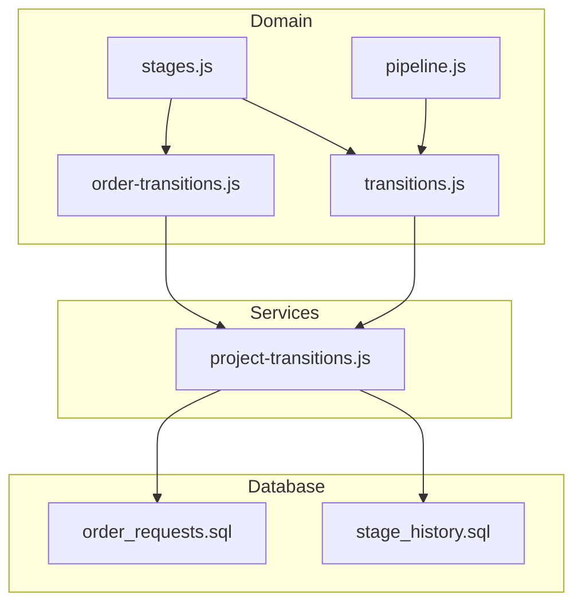
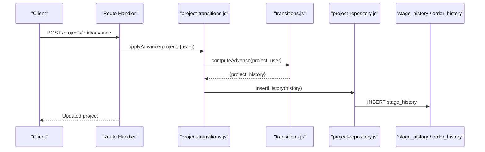
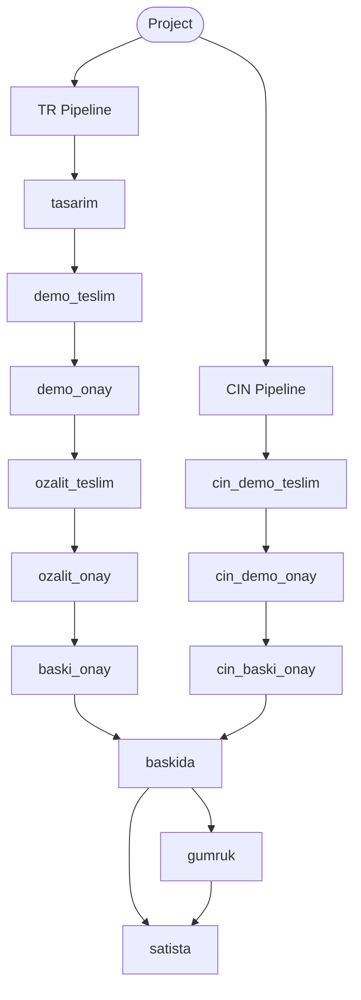
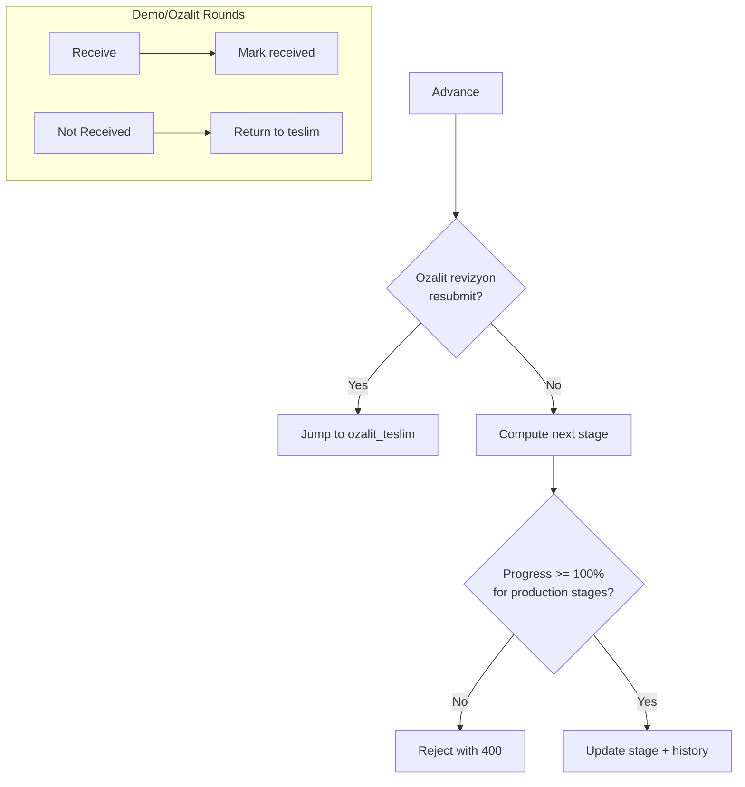
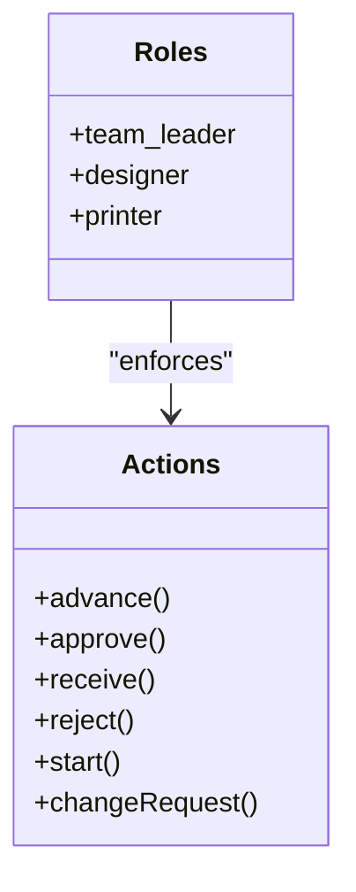
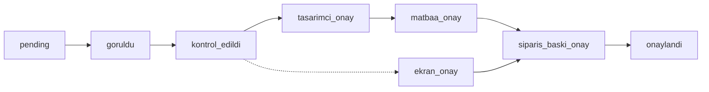
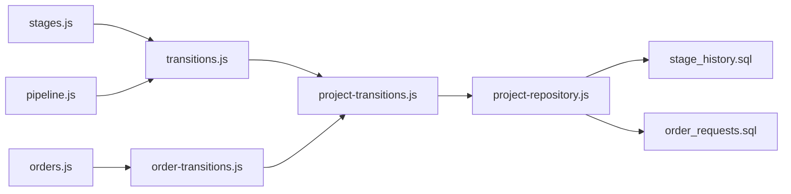

# Workflow Engine

<cite>
**Referenced Files in This Document**
- [stages.js](file://server/src/domain/stages.js)
- [pipeline.js](file://server/src/domain/pipeline.js)
- [transitions.js](file://server/src/domain/transitions.js)
- [project-transitions.js](file://server/src/services/project-transitions.js)
- [orders.js](file://client/src/domain/constants/orders.js)
- [order-transitions.js](file://server/src/domain/order-transitions.js)
- [stage_history.sql](file://server/db/migrations/007__stage_history.sql)
- [order_requests.sql](file://server/db/migrations/005__order_requests.sql)
- [project-repository.js](file://server/src/services/project-repository.js)
</cite>

## Table of Contents
1. Introduction
2. Project Structure
3. Core Components
4. Architecture Overview
5. Detailed Component Analysis
6. Dependency Analysis
7. Performance Considerations
8. Troubleshooting Guide
9. Conclusion
10. Appendices

## Introduction
This document explains the workflow engine that powers publishing pipeline management for projects and orders. It covers:
- The state machine governing project transitions across stages
- Pipeline types (TR and CIN) and their specific transition rules
- Stage definitions, allowed transitions, and validation logic
- Integration with user permissions and role-based access control
- Custom extensions and rule modifications
- Auditing, history tracking, and debugging capabilities
- Relationships between workflow states and business processes such as demo requests, proof approvals, and order processing

The engine is implemented as a set of pure functions on the server that compute next states from current state plus actor context, returning both the updated project/order and an audit entry to persist.

## Project Structure
At a high level:
- Domain constants define pipelines, stage labels, and business gates
- Transition helpers implement the state machine logic
- Service wrappers expose typed operations to routes
- Database migrations define audit tables for history

**Diagram sources**
- [stages.js:21-31](file://server/src/domain/stages.js#L21-L31)
- [pipeline.js:1-108](file://server/src/domain/pipeline.js#L1-L108)
- [transitions.js:1-120](file://server/src/domain/transitions.js#L1-L120)
- [order-transitions.js:1-160](file://server/src/domain/order-transitions.js#L1-L160)
- [project-transitions.js:1-204](file://server/src/services/project-transitions.js#L1-L204)
- [stage_history.sql:7-23](file://server/db/migrations/007__stage_history.sql#L7-L23)
- [order_requests.sql:8-35](file://server/db/migrations/005__order_requests.sql#L8-L35)

**Section sources**
- [stages.js:1-49](file://server/src/domain/stages.js#L1-L49)
- [pipeline.js:1-108](file://server/src/domain/pipeline.js#L1-L108)
- [transitions.js:1-120](file://server/src/domain/transitions.js#L1-L120)
- [order-transitions.js:1-160](file://server/src/domain/order-transitions.js#L1-L160)
- [project-transitions.js:1-204](file://server/src/services/project-transitions.js#L1-L204)
- [stage_history.sql:7-23](file://server/db/migrations/007__stage_history.sql#L7-L23)
- [order_requests.sql:8-35](file://server/db/migrations/005__order_requests.sql#L8-L35)

## Core Components
- Pipeline definitions and stage sets: TR and CIN pipelines, orderable stages, handover eligibility, and progress gates
- Transition engine: advance, approve, receive/not-receive, start/cancel/edit/change-request flows, ekran-demo digital approval
- Order mini-workflow: matbaa_onay receipt gate, multi-party approval ledger, and print-spec approval before finalization
- Audit persistence: append-only stage_history and order_history entries

Key responsibilities:
- Enforce business rules (e.g., 100% design completion before entering production stages)
- Validate roles and assignments per action
- Produce immutable audit records for every meaningful state change

**Section sources**
- [stages.js:21-49](file://server/src/domain/stages.js#L21-L49)
- [pipeline.js:14-108](file://server/src/domain/pipeline.js#L14-L108)
- [transitions.js:99-501](file://server/src/domain/transitions.js#L99-L501)
- [order-transitions.js:27-160](file://server/src/domain/order-transitions.js#L27-L160)

## Architecture Overview
The workflow engine follows a layered approach:
- Routes call service wrappers
- Services delegate to domain transition functions
- Transition functions validate inputs, enforce RBAC, compute next state, and return an audit entry
- Repository layer persists changes and history

**Diagram sources**
- [project-transitions.js:51-53](file://server/src/services/project-transitions.js#L51-L53)
- [transitions.js:99-255](file://server/src/domain/transitions.js#L99-L255)
- [project-repository.js:515-537](file://server/src/services/project-repository.js#L515-L537)

## Detailed Component Analysis

### State Machine and Pipelines
- Two pipelines:
  - TR: tasarım → demo_teslim → demo_onay → ozalit_teslim → ozalit_onay → baski_onay → baskida → satista
  - CIN: tasarım → cin_demo_teslim → cin_demo_onay → cin_baski_onay → baskida → gumruk → satista
- Stages requiring full progress (100%) include proof and production stages; demos can occur earlier
- Handover eligibility differs by pipeline: TR at baskida, CIN at gumruk

**Diagram sources**
- [stages.js:21-31](file://server/src/domain/stages.js#L21-L31)

**Section sources**
- [stages.js:21-49](file://server/src/domain/stages.js#L21-L49)
- [pipeline.js:7-12](file://server/src/domain/pipeline.js#L7-L12)

### Allowed Transitions and Validation Logic
Core transitions include:
- Advance: moves forward along the pipeline or special-case jumps (e.g., ozalit revision resubmit)
- Approve: stage-specific approvals (demo, ozalit, baski_onay), including holds when progress < 100%
- Receive/Not Received: physical delivery acknowledgments for demo and ozalit rounds
- Start/Cancel/Edit/Change Request: printer work lifecycle and leader-led corrections
- Ekran Demo Onayı: lightweight digital approval path for held demos at 100%

Validation highlights:
- Progress gates: cannot enter production stages without 100% design completion
- Role checks: team_leader, designer (assigned), printer, and sometimes dual-leader constraints
- Idempotency: some actions are safe to repeat without side effects
- Concurrency guards: e.g., preventing regression past a later stage for concurrent approvals

**Diagram sources**
- [transitions.js:99-255](file://server/src/domain/transitions.js#L99-L255)
- [transitions.js:257-371](file://server/src/domain/transitions.js#L257-L371)

**Section sources**
- [transitions.js:99-501](file://server/src/domain/transitions.js#L99-L501)
- [pipeline.js:14-63](file://server/src/domain/pipeline.js#L14-L63)

### Role-Based Access Control (RBAC)
Roles and permissions:
- team_leader: approve/reject at most stages; prepare/approve baski_onay; request ekran demo; edit product info
- designer (assigned): submit ozalit requests; acknowledge deliveries; counter-sign after leader approval
- printer: deliver proofs; mark work started; respond to change requests

Rules enforced in transitions:
- Only assigned designers can act on specific items tied to them
- Leader-first ordering for multi-party approvals (ozalit_onay and matbaa_onay)
- Rejects limited to team_leader

**Diagram sources**
- [transitions.js:54-93](file://server/src/domain/transitions.js#L54-L93)
- [transitions.js:377-501](file://server/src/domain/transitions.js#L377-L501)
- [order-transitions.js:27-160](file://server/src/domain/order-transitions.js#L27-L160)

**Section sources**
- [transitions.js:54-93](file://server/src/domain/transitions.js#L54-L93)
- [transitions.js:377-501](file://server/src/domain/transitions.js#L377-L501)
- [order-transitions.js:27-160](file://server/src/domain/order-transitions.js#L27-L160)

### Order Mini-Workflow (Sipariş)
Order steps: pending → goruldu → kontrol_edildi → tasarimci_onay → ekran_onay or matbaa_onay → siparis_baski_onay → onaylandi
- Matbaa_onay requires receipt (“Teslim Alındı”) then multi-party approval (leader-first)
- After matbaa_onay, a separate print-spec approval (siparis_baski_onay) is required before finalization
- Ozalit round parity with main pipeline: start, cancel, edit, change-request flows exist for orders

**Diagram sources**
- [orders.js:3-94](file://client/src/domain/constants/orders.js#L3-L94)
- [order-transitions.js:27-160](file://server/src/domain/order-transitions.js#L27-L160)

**Section sources**
- [orders.js:3-160](file://client/src/domain/constants/orders.js#L3-L160)
- [order-transitions.js:27-328](file://server/src/domain/order-transitions.js#L27-L328)

### Business Process Relationships
- Demo requests: triggered at demo stages; can be re-sent if held; require delivery acknowledgment before approval
- Proof approvals: ozalit_onay uses receipt gate and multi-party approvals; baski_onay requires preparation and dual leadership
- Orders: matbaa_onay mirrors ozalit_onay; siparis_baski_onay adds a final print-spec approval step

These relationships ensure that physical artifacts (demos, proofs) are acknowledged and approved by the right people before moving into production or sales.

**Section sources**
- [transitions.js:136-221](file://server/src/domain/transitions.js#L136-L221)
- [transitions.js:377-501](file://server/src/domain/transitions.js#L377-L501)
- [order-transitions.js:27-160](file://server/src/domain/order-transitions.js#L27-L160)

## Dependency Analysis
- Domain constants feed transition logic (pipelines, stage sets)
- Services wrap domain functions to provide consistent contracts to routes
- Repository layer persists history entries returned by transitions
- Order transitions are independent but mirror main pipeline patterns

**Diagram sources**
- [stages.js:21-49](file://server/src/domain/stages.js#L21-L49)
- [pipeline.js:1-108](file://server/src/domain/pipeline.js#L1-L108)
- [transitions.js:1-120](file://server/src/domain/transitions.js#L1-L120)
- [project-transitions.js:1-204](file://server/src/services/project-transitions.js#L1-L204)
- [orders.js:3-160](file://client/src/domain/constants/orders.js#L3-L160)
- [order-transitions.js:1-160](file://server/src/domain/order-transitions.js#L1-L160)
- [project-repository.js:515-537](file://server/src/services/project-repository.js#L515-L537)
- [stage_history.sql:7-23](file://server/db/migrations/007__stage_history.sql#L7-L23)
- [order_requests.sql:8-35](file://server/db/migrations/005__order_requests.sql#L8-L35)

**Section sources**
- [project-transitions.js:1-204](file://server/src/services/project-transitions.js#L1-L204)
- [project-repository.js:515-537](file://server/src/services/project-repository.js#L515-L537)

## Performance Considerations
- Transition functions are pure and fast; complexity is dominated by database writes for history
- Use idempotent operations where possible to avoid redundant work
- Batch history inserts only when necessary; each transition returns a single entry for clarity and atomicity
- Avoid unnecessary reads; pass minimal context (e.g., designerIds, teamLeaderIds) to transitions

[No sources needed since this section provides general guidance]

## Troubleshooting Guide
Common issues and diagnostics:
- Cannot advance to production stage: verify design progress is 100%; check STAGES_REQUIRING_FULL_PROGRESS
- Approval blocked: confirm role and assignment; for multi-party approvals, ensure leader-first rule and receipt gate are satisfied
- Demo/proof stuck: check delivery acknowledgment flags (demo_received, ozalit_received); use receive/not-received actions appropriately
- Order stuck at matbaa_onay: ensure matbaa_received is true and all required approvals recorded

Diagnostics:
- Inspect stage_history and order_history for the sequence of actions and actors
- Validate actor context passed to transitions (role, ids)
- Confirm pipeline type (TR vs CIN) and current stage mapping

**Section sources**
- [pipeline.js:14-63](file://server/src/domain/pipeline.js#L14-L63)
- [transitions.js:99-501](file://server/src/domain/transitions.js#L99-L501)
- [order-transitions.js:27-160](file://server/src/domain/order-transitions.js#L27-L160)
- [stage_history.sql:7-23](file://server/db/migrations/007__stage_history.sql#L7-L23)
- [order_requests.sql:24-35](file://server/db/migrations/005__order_requests.sql#L24-L35)

## Conclusion
The workflow engine provides a robust, auditable state machine for publishing pipelines across TR and CIN project types, with parallel order workflows mirroring key phases. It enforces strict business rules around progress, roles, and approvals while maintaining comprehensive history for auditing and debugging. Extensions can be added by introducing new stages, transitions, and approval rules within the existing domain/service pattern.

[No sources needed since this section summarizes without analyzing specific files]

## Appendices

### Stage Definitions and Rules Summary
- TR pipeline stages and CIN pipeline stages defined centrally
- Orderable stages allow Sales to queue orders once production is complete
- Handover eligibility depends on pipeline type
- Full progress required for proof and production stages

**Section sources**
- [stages.js:21-49](file://server/src/domain/stages.js#L21-L49)
- [pipeline.js:45-99](file://server/src/domain/pipeline.js#L45-L99)

### Custom Workflow Extensions
To extend the workflow:
- Add new stages to STAGE_PIPELINE and update labels
- Implement transition handlers in transitions.js (advance/approve/receive/etc.)
- Wrap in project-transitions.js for service exposure
- Persist history via repository layer
- Update order mini-workflow constants if applicable

**Section sources**
- [stages.js:1-49](file://server/src/domain/stages.js#L1-L49)
- [transitions.js:99-501](file://server/src/domain/transitions.js#L99-L501)
- [project-transitions.js:1-204](file://server/src/services/project-transitions.js#L1-L204)
- [orders.js:3-160](file://client/src/domain/constants/orders.js#L3-L160)

### Auditing and History Tracking
- stage_history captures project timeline with action, reason, reject_target, pass_number, done_by, note
- order_history captures order step events with signed_by_id and notes
- Repository inserts history entries returned by transitions

**Section sources**
- [stage_history.sql:7-23](file://server/db/migrations/007__stage_history.sql#L7-L23)
- [order_requests.sql:24-35](file://server/db/migrations/005__order_requests.sql#L24-L35)
- [project-repository.js:515-537](file://server/src/services/project-repository.js#L515-L537)