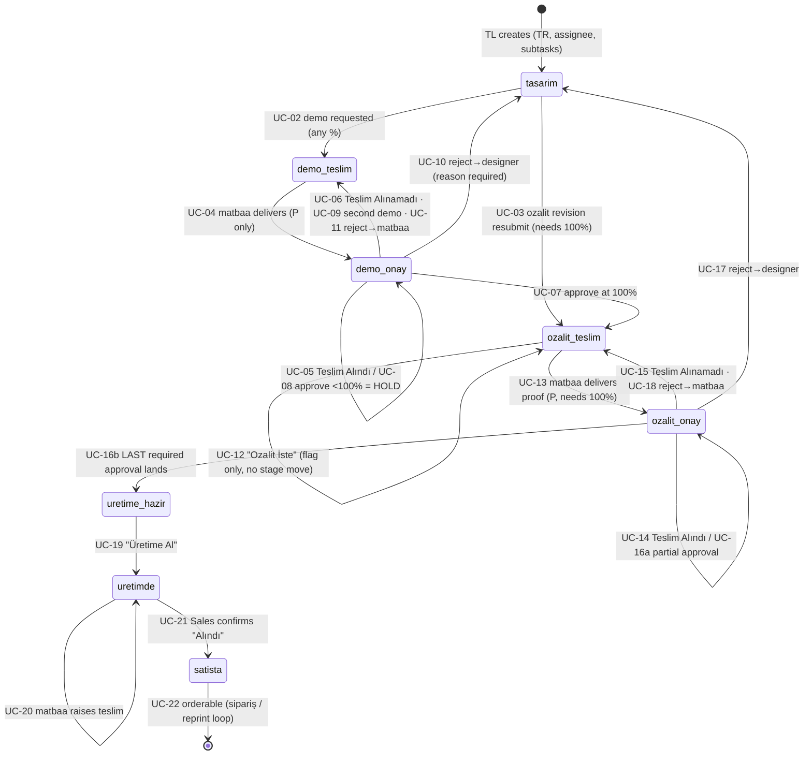

# TR Pipeline — Use-Case Scenarios

> Every path a **TR** project can take from `tasarim` to `satista`: the happy
> run, every loop-back, every hold, every "it never arrived", every refusal.
> Derived from the code, not from the diagram — `server/src/domain/transitions.js`,
> `server/src/routes/projects.js`, `server/src/routes/handovers.js`,
> `server/src/services/notifications.js`, `client/src/pages/ProjectDetail.jsx`
> (`availableActions`) and `client/src/pages/Approvals.jsx`.
>
> Companion to [TEST_SCENARIOS.md](TEST_SCENARIOS.md) §5 (which is a QA
> checklist). This file is the *narrative*: who does what, what the system does
> back, and what it refuses. Where the code and [AGENTS.md](AGENTS.md) disagree,
> the code is described and the divergence is listed in [§6](#6-where-agentsmd-and-the-code-disagree).

---
## 1. Cast, state and vocabulary

| Short | Role | Real user(s) | Where they act |
|---|---|---|---|
| **TL** | `team_leader` | Ayşenur | Dashboard, Onaylar, project detail |
| **D** | `designer` (assigned) | Aylin, Feyza, Nur, Sümeyye | Projelerim, project detail, Onaylar (ozalit only) |
| **P** | `printer` / Matbaa | Oktay, Atilla | Onaylar → "Matbaa Teslimleri", Üretime Hazır, Teslim Talepleri |
| **S** | `satis` | Esra | Teslim Onayları, Sipariş Talebi, Ürünler |

"Assigned D" always means `project.assignees` contains that user — a designer
who is *not* assigned is treated like any other unrelated user.

**Stages (TR):** `tasarim → demo_teslim → demo_onay → ozalit_teslim → ozalit_onay → uretime_hazir → uretimde → satista`

**The state that decides which branch fires:**

| Field | Meaning |
|---|---|
| `progress` | 0–100, recomputed server-side from subtasks. Gate for ozalit+ |
| `demo_attempt` / `ozalit_attempt` | Round counter → the "Demo 2" badge |
| `demo_held` | Leader approved a demo below 100% — approval banked, stage frozen |
| `demo_received` / `ozalit_received` | "Teslim Alındı" ack. **Approval is refused until true** |
| `ozalit_requested` | Leader/designer asked for the proof; the matbaa's queue keys off this |
| `reject_target = 'matbaa'` | Re-delivery lock: the matbaa may deliver again with no new request |
| `last_reject_type = 'ozalit'` | A Tasarım resubmit jumps **straight back to ozalit_teslim** |
| `subtasks[].needs_revize` | Blocks every advance out of `tasarim` until cleared |
| `origin = 'legacy'` | Backlist import — every pipeline route 400s |

---
## 2. The complete map

Three loops matter, and they are **not** the same loop:

1. **Demo loop** — `demo_teslim ⇄ demo_onay`, exempt from the 100% gate, driven
   by the matbaa's delivery and the leader's approve/reject/hold.
2. **Ozalit loop** — `ozalit_teslim ⇄ ozalit_onay`, gated at 100%, multi-party
   approval, re-delivery locked to the matbaa on a reject/not-received.
3. **Rework loop** — anything → `tasarim`, which then resumes at *the stage the
   rejection came from* (`last_reject_type` decides: demo → demo, ozalit → ozalit).

---
## 3. Narrative scenarios

### S1 — The clean run (no loops)
Ayşenur creates *"5. Sınıf Matematik Soru Bankası"*, type TR, assigns Aylin,
picks subtasks Kapak / İçerik / Sayfa Sayısı. → `tasarim`, 0%, Aylin gets an
`assignment` notification.

Aylin ticks subtasks over two weeks → 100%. She hits **Demoya Gönder**
(`tasarim → demo_teslim`); Oktay + Atilla get `demo_delivery_pending`.

Oktay prints the demo and hits **Demo'yu Teslim Et** (`demo_teslim → demo_onay`).
Ayşenur *and* Aylin get `demo_receipt_pending` — **not** an approval ping,
because nobody can approve yet.

Aylin has the demo in her hand and clicks **Teslim Alındı**. Ayşenur now gets
`demo_approval_pending` (Aylin, the actor, is not notified of her own click).

Ayşenur opens the demo sheet and clicks **Onayla** at 100% →
`demo_onay → ozalit_teslim`. Aylin gets `ozalit_requestable`.

Aylin clicks **Ozalit İste** — the stage does *not* move; `ozalit_requested`
flips true and the project appears in the matbaa's ozalit queue
(`ozalit_delivery_pending`).

Oktay delivers the proof (`ozalit_teslim → ozalit_onay`). Ayşenur + Aylin get
`ozalit_receipt_pending`; one of them clicks **Teslim Alındı** →
`ozalit_approval_pending` to the other side.

Now the multi-party round: **every active team leader and every assigned
designer** signs. Ayşenur approves ("1 onay daha bekleniyor"), Aylin approves →
set complete → `uretime_hazir`. The spec sheet is copied into Ürün Bilgileri
automatically, printers get `production_ready` linked to `/uretime-hazir`.

Oktay clicks **Üretime Al** → `uretimde` (`in_production` to TL + designers).
Printing finishes; Oktay raises a **teslim** → Esra gets `handover_request`.
Esra confirms **Alındı** → `satista`, `on_sale 🎉` to TL + designers + sales.
The book is now orderable from Ürünler.

### S2 — The hold (demo approved below 100%)
Same start, but Aylin is at 60% and Ayşenur wants to see the cover now. Demo
goes out, comes back, is received — Ayşenur clicks **Onayla**.

The project **does not move**. `demo_held = true`, history logs *"Demo onaylandı
— tasarım tamamlanmadığı için Ozalit bekleniyor"*, Aylin gets `demo_held`. The
approval is banked, not spent. On Onaylar the card stays visible with
"Tasarım tamamlanmadı — tasarımcı yeni demo gönderecek" and **no** Onayla/Reddet
button; on the dashboard the card turns green (second-cycle colour).

Aylin finishes to 100% and clicks **Demo İste** again → straight to
`demo_teslim`, `demo_attempt` becomes 2 (the round is "Demo 2", the matbaa sees
it immediately — it does *not* detour through `tasarim`). Oktay delivers, someone
marks Teslim Alındı, Ayşenur approves at 100% → `ozalit_teslim`. S1 resumes.

> A held demo can be re-sent any number of times: hold → re-send → deliver →
> hold again is a legal cycle, each round bumping `demo_attempt`.

### S3 — Demo rejected back to the designer
Demo delivered and received; Ayşenur clicks **Reddet**, writes *"Kapak rengi
marka kılavuzuna uymuyor"*, and ticks **Kapak** in the revize list.

→ `tasarim`, `demo_attempt + 1`, `last_reject_type = 'demo'`, Kapak gets
`needs_revize = true` **but stays complete** — progress does not drop, because
the work was done, it just needs a touch-up. Aylin gets `rejection`
("Revizyon gerekiyor").

Aylin tries **Demoya Gönder** before fixing the cover →
`400 Revize bekleyen alt görevler var — hepsini revize etmeden gönderemezsiniz.`
She reworks, clicks **Revize Edildi** on Kapak (`POST /subtasks/:id/revize`),
then re-sends. `last_reject_type` is `'demo'`, so she lands at `demo_teslim`
again — the full demo loop re-runs.

### S4 — The demo never arrived
Oktay marks the demo delivered, but the courier lost it. Ayşenur is stuck at
`demo_onay` with a proof she has never seen — approving would be a lie and
`computeApproval` refuses her anyway (`Önce demo "Teslim Alındı" olarak
işaretlenmelidir.`).

She clicks **Teslim Alınamadı** → back to `demo_teslim`, `demo_attempt + 1`,
all delivery/receipt fields wiped, printers pinged again. No rejection is
recorded — nobody's work was wrong.

Once anyone has clicked **Teslim Alındı**, this door closes:
`400 Demo zaten teslim alındı olarak işaretlenmiş.`

### S5 — Ozalit rejected back to the matbaa (paper/print problem)
Proof received; Ayşenur sees a registration error — the design is fine, the print
is not. She rejects with `reject_target: 'matbaa'`, reason
*"Kesim payı kaymış, yeniden basılmalı"*.

→ `ozalit_teslim`, `ozalit_attempt + 1`, `reject_target = 'matbaa'`,
**subtasks and progress untouched**, and the whole multi-party approval ledger is
wiped (a new physical proof needs everyone's signature again). The matbaa lock
means Oktay can deliver again **without** anyone clicking "Ozalit İste"
(`ozalit_delivery_pending` goes straight to the printers).

### S6 — Ozalit rejected back to the designer (design problem)
Same stage, `reject_target: 'designer'`, revize on İçerik.

→ `tasarim`, `ozalit_attempt + 1`, `last_reject_type = 'ozalit'`, ledger wiped,
`ozalit_requested = false`. Aylin gets `rejection`.

The important asymmetry: when Aylin clears the revize and advances, she does
**not** go back through the demo. `last_reject_type === 'ozalit'` routes her
straight to `ozalit_teslim` with `ozalit_requested = true`, history
*"Ozalit revizyonu tamamlandı — matbaaya gönderildi"*. If she is below 100% the
advance is refused: `Proje %100 tamamlanmadan Ozalit ve üretim aşamasına geçemez.`

### S7 — The proof never arrived (migration 035)
The ozalit twin of S4, and new: until migration 035 the ozalit leg could only say
"it never came", never "it's here". Now `ozalit_received` gates the approval.

Aylin clicks **Teslim Alınamadı** at `ozalit_onay` → `ozalit_teslim`,
`ozalit_attempt + 1`, `reject_target = 'matbaa'` (re-delivery, no new request),
approval ledger cleared. Blocked once `ozalit_received` is true.

### S8 — The stalled multi-party approval
Two active team leaders (Ayşenur + a second) and two assigned designers. The
proof is received. Ayşenur approves → history *"Ozalit onayı verildi — 3 onay
daha bekleniyor"*, stage unchanged, her card now reads "Onayınız kaydedildi —
diğer onaylar bekleniyor" and **her Reddet button disappears** (approving commits
her). The other leader can still reject. Nothing moves until every required id
has signed; approving twice is a silent no-op.

Two ways the required set changes underneath a half-finished round:
- **Assign another designer** → they are added to the required set, so the round
  needs one more signature than it did a minute ago.
- **Deactivate a leader** → they drop out of the required set, and the round can
  complete without them.

Only a reject / not-received clears a partial ledger.

---
## 4. Use-case catalogue

Format: **actor → what the server does → what it refuses**. Every message below
is the literal string the API returns.

### Tasarım

**UC-01 · Create the project** — TL, `POST /api/projects`
Type TR, assignee(s), target month, subtask list → `tasarim`, `progress 0`,
`origin 'pipeline'`. Designers get `assignment`.

**UC-02 · Request a demo** (`tasarim → demo_teslim`) — `POST /advance`
- Allowed at **any** progress — demo stages are exempt from the 100% gate.
- Blocked while any subtask has `needs_revize`.
- UI offers it to TL and assigned designers ([ProjectDetail.jsx](client/src/pages/ProjectDetail.jsx) `availableActions`); the server's generic
  advance branch has **no role check** (see [§6](#6-where-agentsmd-and-the-code-disagree)).
- → printers get `demo_delivery_pending`.

**UC-03 · Ozalit revision resubmit** (`tasarim → ozalit_teslim`) — `POST /advance`
- Fires only when `last_reject_type === 'ozalit'`; skips the demo leg entirely.
- Requires 100% → else `Proje %100 tamamlanmadan Ozalit ve üretim aşamasına geçemez.`
- Sets `ozalit_requested = true`, clears the reject fields → printers get
  `ozalit_delivery_pending`.

### Demo leg

**UC-04 · Matbaa delivers the demo** (`demo_teslim → demo_onay`) — P, `POST /advance`
- Stamps `demo_delivered_by/at` and **resets `demo_received` to false** so every
  round needs its own acknowledgement.
- Non-printer at `demo_teslim`: TL/assigned D → `Devam eden bir demo var — yeni
  demo istemeden önce mevcut demo teslim edilmeli, onaylanmalı veya
  reddedilmelidir.`; anyone else → `Tekrar demo göndermek için ekip lideri veya
  atanmış tasarımcı olmalısınız.`
- → TL + assigned designers get `demo_receipt_pending` (a receipt ask, not an
  approval ask — nobody can approve yet).

**UC-05 · "Teslim Alındı"** — TL or assigned D, `POST /receive`
- Only at `demo_onay`; **idempotent** (second call returns the project, writes no
  history, sends no notification).
- Wrong stage → `Teslim alma yalnızca demo onay aşamasında yapılabilir.`
  Wrong actor → `Teslim almayı yalnızca ekip lideri veya atanmış tasarımcı yapabilir.`
- → `demo_approval_pending` to leaders, `demo_received` to designers, actor excluded.

**UC-06 · "Teslim Alınamadı"** — TL or assigned D, `POST /demo-not-received`
- `demo_onay → demo_teslim`, `demo_attempt + 1`, delivery + receipt + held fields wiped.
- After an ack → `Demo zaten teslim alındı olarak işaretlenmiş.`
- → printers get `demo_delivery_pending`.

**UC-07 · Approve the demo at 100%** (`demo_onay → ozalit_teslim`) — `POST /approve`
- Server allows **TL or printer**; the UI only ever offers it to the leader.
- Refused before receipt: `Önce demo "Teslim Alındı" olarak işaretlenmelidir.`
- Wrong role → `Demo onayını yalnızca ekip lideri veya matbaa yapabilir.`
- → designers get `ozalit_requestable` ("Demo onaylandı — ozalit isteyebilirsiniz").

**UC-08 · Approve the demo below 100% = HOLD** — same call, `progress < 100`
- Stage frozen, `demo_held = true`, approve logged with from = to.
- → designers get `demo_held`. The UI then hides Onayla/Reddet until a new demo
  is sent (the server would still accept a second approve; the product rule is
  "finish the design and send Demo 2").

**UC-09 · Send the second (third, …) demo** (`demo_onay → demo_teslim`) — TL or assigned D, `POST /advance`
- **Requires `demo_held === true`.** A demo that is merely delivered and awaiting
  a decision cannot be duplicated → `Devam eden bir demo var — …`
- `demo_attempt + 1`, held/delivery fields cleared → printers pinged.

**UC-10 · Reject the demo → designer** (`demo_onay → tasarim`) — TL only, `POST /reject`
- `reason` is mandatory (schema + domain); `revizeIds` flag subtasks
  `needs_revize` while leaving them complete → **progress does not drop**.
- `demo_attempt + 1`, `last_reject_type = 'demo'`.
- Non-leader → `Reddi yalnızca ekip lideri yapabilir.` Body `stage` ≠ current
  stage → `409`.
- → designers get `rejection`.

**UC-11 · Reject the demo → matbaa** (`demo_onay → demo_teslim`) — TL only
- `reject_target: 'matbaa'` sends it back for re-delivery with the design
  untouched; `demo_attempt + 1`. Real but undocumented in AGENTS.md's TR diagram.

### Ozalit leg

**UC-12 · "Ozalit İste"** (`ozalit_teslim`, no stage change) — TL or assigned D, `POST /advance`
- Sets `ozalit_requested = true`; history *"Ozalit istendi — matbaa teslimi bekleniyor"*.
- Twice → `Ozalit zaten istendi — matbaa teslimi bekleniyor.`
- Unassigned designer / satis → `Yalnızca ekip lideri veya atanmış tasarımcı ozalit isteyebilir.`
- → printers get `ozalit_delivery_pending`.

**UC-13 · Matbaa delivers the proof** (`ozalit_teslim → ozalit_onay`) — P, `POST /advance`
- Requires `ozalit_requested` **or** the matbaa lock (`reject_target === 'matbaa'`),
  else `Önce ekip lideri veya tasarımcı ozalit istemelidir.`
- Requires 100%. Clears `ozalit_requested`, resets `ozalit_received`.
- → TL + assigned designers get `ozalit_receipt_pending`.

**UC-14 · Ozalit "Teslim Alındı"** — TL or assigned D, `POST /ozalit-receive`
- Idempotent; one acknowledgement unblocks the whole multi-party round (there is
  only one physical proof).
- → the other side gets `ozalit_approval_pending`.

**UC-15 · Ozalit "Teslim Alınamadı"** — TL or assigned D, `POST /ozalit-not-received`
- → `ozalit_teslim`, `ozalit_attempt + 1`, `reject_target = 'matbaa'`, ledger wiped.
- After an ack → `Ozalit zaten teslim alındı olarak işaretlenmiş.`

**UC-16 · Multi-party ozalit approval** — every active TL **and** every assigned D, `POST /approve`
- (a) Partial: approval recorded, stage held, history *"Ozalit onayı verildi — N
  onay daha bekleniyor"*. Re-approving is a no-op.
- (b) Last required signature → `uretime_hazir`, ledger cleared, and
  `captureProductInfoFromSpec` copies the approved sheet into Ürün Bilgileri
  (without it a finished book can reach production with no spec and Sales can
  never order it).
- Refused before receipt: `Önce ozalit "Teslim Alındı" olarak işaretlenmelidir.`
  Printer or unassigned designer → `Ozalit onayını yalnızca ekip lideri veya
  atanmış tasarımcı yapabilir.`
- → printers get `production_ready` → `/uretime-hazir`; TL + designers get the
  same event linked to the project (two emissions, because a printer-guarded
  route would dead-end a leader's tap).

**UC-17 · Reject the ozalit → designer** (`ozalit_onay → tasarim`) — TL only
`ozalit_attempt + 1`, `last_reject_type = 'ozalit'`, ledger + `ozalit_requested`
cleared, revize flags applied. Resumes via UC-03.

**UC-18 · Reject the ozalit → matbaa** (`ozalit_onay → ozalit_teslim`) — TL only
`ozalit_attempt + 1`, matbaa lock set, design untouched, ledger wiped.

### Production and handover

**UC-19 · "Üretime Al"** (`uretime_hazir → uretimde`) — `POST /advance`
UI offers it to the printer only; the server's generic branch has no role check.
→ TL + designers get `in_production`.

**UC-20 · Raise the teslim** — P, `POST /api/handovers`
- TR eligibility is exactly `uretimde` (`HANDOVER_ELIGIBLE_STAGE.TR`); anything
  else is refused by `assertHandoverEligible`.
- Non-printer → `Yalnızca matbaa teslim oluşturabilir.` Second pending request →
  `Bu proje için zaten bekleyen bir teslim talebi var.` (also a partial unique
  index, so the race can't create two).
- Stage does not move; history logs `handover_request` → Sales gets
  `handover_request`.

**UC-21 · Confirm "Alındı"** — S, `PATCH /api/handovers/:id/confirm`
- The **only** way into `satista`. Handover → `received`, project → `satista`,
  history event `handover_confirm`.
- Non-sales → `Alındı onayını yalnızca satış verebilir.` Already resolved →
  `Bu teslim zaten sonuçlandırılmış.`
- → TL + designers + sales get `on_sale`.

**UC-22 · Life after satista**
From `uretime_hazir` onward the project is orderable (`ORDERABLE_STAGES`) if it
has a non-empty product spec and hasn't been delisted (`catalog_hidden`). A
Sales order starts the sipariş mini-workflow and flips `pass_kind` to `reprint`
— a separate pipeline, out of scope here.

---
## 5. Refusals, edges and API-only possibilities

**Hard refusals (any actor).**

| Attempt | Result |
|---|---|
| Advance out of `tasarim` with an unrevized subtask | `400 Revize bekleyen alt görevler var…` |
| Enter `ozalit_teslim` / `ozalit_onay` / `uretime_hazir` / `uretimde` below 100% | `400 Proje %100 tamamlanmadan…` |
| `advance` from `uretimde` toward `satista` | `400 Satışta aşamasına yalnızca Satış ekibi teslimi onayladığında geçilir.` |
| Any transition on `origin = 'legacy'` | `400 Kayıtlı ürün pipeline üzerinde ilerletilemez…` (and `availableActions` returns `[]`, so the SPA never offers the button) |
| `reject` with `stage` ≠ the project's current stage | `409` — no stage-skipping via a crafted body |
| `reject` with an empty reason | `400` (schema `required`, max 2000 chars) |
| Concurrent writes | `patchProject` bumps `version`; transitions run inside `withTx` + `SELECT … FOR UPDATE`, so two leaders approving at once serialize instead of racing |

**Demo stages are exempt from the 100% gate — deliberately.** A demo is a review
checkpoint; the gate starts where paper meets the press. The consequence is that
a project can legally sit at `demo_onay` with 20% progress, and the *only*
approval outcome there is a hold.

**Progress never falls on a rejection.** `applyRevize` sets `needs_revize` and
keeps `is_done` — so a rejected project stays at 100% and the gate stays open;
what blocks it is the resubmit guard, not the percentage.

**API-only possibilities** (legal server-side, not surfaced in the UI — worth
knowing when reading history rows that look impossible):

- **The printer can approve the demo.** `canApproveAt` allows `printer` at
  `demo_onay`, which advances TR to `ozalit_teslim`. The Onaylar page only gives
  the matbaa a "Demo'yu Teslim Et" button, so this never happens through the app.
- **The leader can reject at a non-onay stage.** `canRejectAt` returns true for
  `team_leader` at *every* stage. Rejecting at `uretime_hazir` or `uretimde`
  therefore dumps the project back to `tasarim` with `last_reject_type = 'demo'`
  and `demo_attempt + 1` — a plausible "undo production" escape hatch, but an
  undocumented one that a client bug could trigger by accident.
- **`tasarim → demo_teslim` and `uretime_hazir → uretimde` have no server-side
  role guard.** Both fall through `computeAdvance`'s generic branch, which never
  looks at `actor`. Today the SPA is the only enforcement.
- **A held demo carries a stale `demo_received = true`** between UC-09 and the
  matbaa's next delivery (the re-send branch clears the delivery fields but not
  the receipt one). Harmless — UC-04 resets it before anyone can approve — but
  it is why the flag can't be trusted as "a proof is in someone's hands".

---
## 6. Where AGENTS.md and the code disagree

Found while writing this file; each is a one-line fix in [AGENTS.md](AGENTS.md),
not a code change:

1. **Ozalit onay is not single-step.** The TR diagram says *"✓ Ayşenur approves →
   Üretime Hazır"*; `computeOzalitOnayApproval` requires **every active team
   leader and every assigned designer**. [TEST_SCENARIOS.md](TEST_SCENARIOS.md) §5 repeats the old rule.
2. **Ozalit now has a receipt gate.** AGENTS.md's Rejection Rule still says
   *"ozalit approval has no receipt gate (unlike demo — this is intentional)"*;
   migration `035__ozalit_received.sql` added `ozalit_received` and
   `computeOzalitOnayApproval` refuses without it.
3. **A demo re-send needs a hold.** AGENTS.md says the second demo is *"allowed at
   any progress and any held-state"*; the code requires `demo_held === true` and
   otherwise answers *"Devam eden bir demo var…"*.
4. **Demo rejection can target the matbaa.** AGENTS.md presents the matbaa/designer
   target choice as ozalit-only, but `computeRejection` allows it at `demo_onay`
   too (`demo_onay → demo_teslim`).
5. **"Onayla/Reddet stay blocked until received"** is only half true: the server
   blocks *approve*; *reject* has no receipt gate and is hidden by the client
   alone.
6. Minor: AGENTS.md's schema block gives `handovers.status CHECK (…'confirmed')`,
   while migration `006__handovers.sql` and the confirm route use `'received'`.
